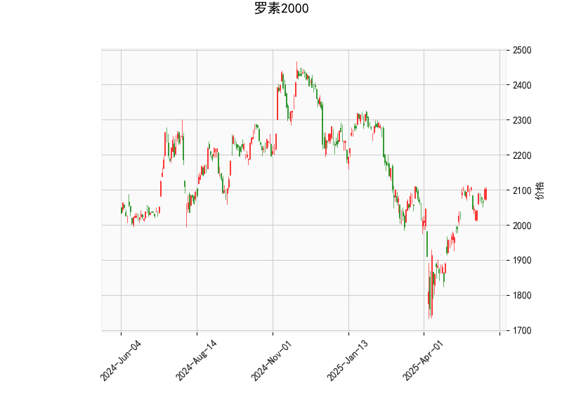

# 罗素2000指数技术分析结果分析

## 1. 技术指标详细解读
基于提供的罗素2000指数数据，我们可以从多个技术指标入手，对当前市场态势进行分析。以下是对各指标的逐一解释及其含义：

- **当前价格（2102.981）**：指数当前位于2102.981点，这是一个相对较高的水平，与布林带中轨（2002.59）相比，价格处于中上位置，暗示短期内可能维持上行趋势，但也接近上轨（2186.01），需警惕潜在回调风险。
  
- **RSI（60.57）**：RSI（相对强弱指数）当前值为60.57，处于中性偏强区域（一般RSI超过70视为超买，低于30视为超卖）。这一数值表明市场强势，但已接近超买阈值，可能暗示短期内存在修正或回调压力。如果RSI继续上升，将进一步确认强势；反之，若回落，可能触发卖出信号。

- **MACD指标**：
  - MACD线（25.24）高于信号线（24.93），且MACD直方图（0.31）为正值。这是一个典型的看涨信号，表明短期动量向上（MACD线上穿信号线）。然而，直方图值较小（仅0.31），显示上行动能虽存在但不强劲。如果MACD直方图继续扩大，将强化多头趋势；若回落至负值，可能转为看跌。

- **布林带（Bollinger Bands）**：
  - 上轨（2186.01）、中轨（2002.59）和下轨（1819.17）。当前价格（2102.98）位于中轨和上轨之间，表明指数处于相对波动率较低的区间，但接近上轨，这往往预示价格可能触及阻力位并回调。布林带整体收窄可能表示市场即将出现突破（向上或向下），需密切关注价格行为。

- **K线形态（['CDLGAPSIDESIDEWHITE', 'CDLLONGLINE']）**：
  - 'CDLGAPSIDESIDEWHITE'：这表示一个带有价格间隙的白实体蜡烛（通常为阳线），暗示强势上涨和买盘主导。间隙（gap）往往反映市场情绪急剧变化，可能预示进一步上行，但也需注意间隙可能被后续填补，导致回调。
  - 'CDLLONGLINE'：这代表一个长线形态（如长阳线或长阴线），显示强烈的价格运动方向。目前结合其他指标，likely为长阳线，强化了短期多头信号。但长线形态也可能预示过度延伸，增加反转风险。

总体而言，这些指标显示罗素2000指数当前处于一个温和看涨态势。RSI和MACD支持上行，K线形态反映强势买入，但布林带位置提醒潜在过热风险。市场可能在短期内延续上涨，但超买信号（如RSI逼近70）增加了不确定性。

## 2. 近期可能存在的投资或套利机会和策略判断
基于上述技术分析，我们可以评估罗素2000指数的近期投资机会。罗素2000作为小型股指数，通常对经济复苏和市场情绪敏感。目前的指标显示潜在上行空间，但也伴随回调风险。以下是针对可能机会和策略的分析：

### 可能存在的投资机会
- **多头机会**：指标整体偏向看涨，尤其是MACD的上行和K线强势形态，暗示短期内指数可能进一步上涨（例如向布林带上轨2186.01逼近）。如果经济数据向好（如就业报告或通胀数据），这将放大机会。预计上行目标在2150-2200点区间。
  
- **回调机会**：RSI接近超买和价格接近布林带上轨，可能引发技术性回调（例如回落到中轨2000附近）。这为逢低买入或波段交易提供机会，尤其适合风险厌恶型投资者。
  
- **套利机会**：罗素2000指数的期货或期权市场可能存在价差套利。例如：
  - **期现套利**：如果现货指数与期货价格出现偏差（如由于市场情绪导致的短期脱节），投资者可通过同时买卖现货和期货来锁定无风险收益。
  - **跨市场套利**：罗素2000与大盘指数（如S&P 500）之间可能存在相关性套利机会。如果罗素2000相对大盘被低估（当前RSI和MACD显示其强势），则可构建多头罗素2000和空头大盘的组合。
  - 总体风险：套利机会依赖市场流动性，目前小盘股市场波动较大，需注意成交量和波动率。

### 推荐投资策略
- **短期多头策略**：建议在当前价格附近买入或加仓，目标价位设在2180-2200点（基于布林带上轨）。止损位可设在下轨1819附近或RSI跌破55时。结合MACD信号，若直方图继续扩大，可追加头寸；若RSI超过70，则考虑部分获利了结。
  
- **风险管理策略**：采用波段交易，避免全仓买入。监控经济事件（如美联储会议），并设置动态止损（例如当价格跌破中轨时退出）。RSI和MACD的背离（如MACD直方图转负）可作为卖出信号。
  
- **套利策略**：对于经验丰富的投资者，可探索期权策略，如买入看涨期权（Call Option）以放大多头收益，或构建价差套利（如买入罗素2000期货的同时卖出相关ETF）。但需注意市场波动率（IV），当前布林带收窄可能导致波动放大。
  
- **整体风险提示**：罗素2000指数易受宏观因素影响（如利率变化或地缘政治事件），当前技术面虽看涨，但超买风险较高。建议结合基本面分析（如企业盈利数据），并控制仓位在30-50%以降低潜在损失。

总之，近期罗素2000指数可能存在短期上行投资机会，但需警惕回调风险。策略应以数据驱动，结合风险控制执行。