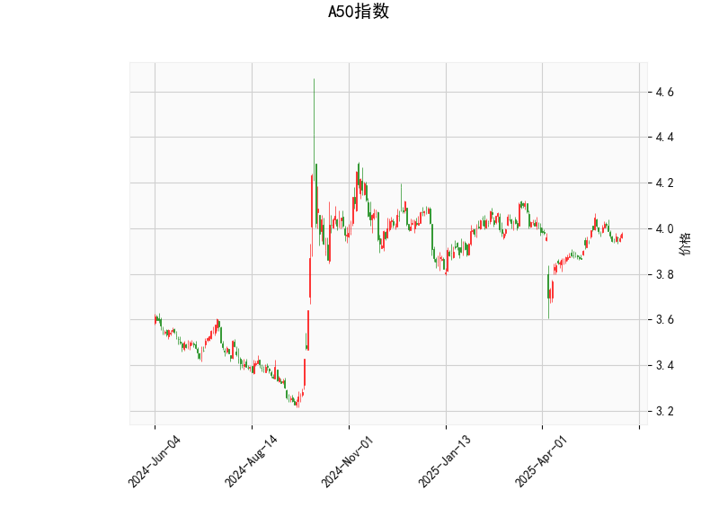

### A50指数技术分析

#### 1. 对技术分析结果的详细分析
以下是对A50指数当前技术指标的分析，基于提供的实时数据。整体来看，指标显示出混合信号，市场可能处于相对平衡状态，但需注意潜在的短期波动。

- **当前价格（3.974）**:
  - 当前价格位于3.974，处于中性水平。相比布林带的中间带（3.948）和下带（3.769），价格略高于中间带，但远低于上带（4.127）。这表明价格在布林带范围内波动，市场可能缺乏强烈的趋势方向，短期内可能维持震荡或小幅上行。

- **RSI（53.50）**:
  - RSI值约为53.50，处于中性区域（一般RSI在30-70之间被视为中性）。这表示A50指数当前没有明显的超买或超卖信号，市场动量相对稳定。RSI高于50暗示轻微的看涨势头，但尚未达到超买阈值（70以上），因此短期内可能继续积累动能。

- **MACD指标**:
  - MACD线（0.009）低于信号线（0.014），且MACD直方图（-0.005）为负值。这是一个典型的看跌信号，表明短期动量可能转向负面。MACD直方图的负值显示卖出压力正在增加，潜在的趋势逆转风险。如果MACD线继续下行，可能预示价格进一步回调。

- **布林带（Bollinger Bands）**:
  - 上带（4.127）、中间带（3.948）和下带（3.769）显示价格（3.974）位于中间带附近。这反映出市场波动性较低（带宽较窄），价格处于一个相对稳定的区间。价格接近中间带通常被视为中性，但如果价格向上突破上带（4.127），可能触发看涨信号；反之，向下触及下带（3.769）可能引发看跌。

- **K线形态（CDLBELTHOLD）**:
  - K线形态显示为“CDLBELTHOLD”，这是一种看涨的“腰带线”模式（Belt Hold），通常出现在趋势反转或巩固阶段。该形态暗示多头控制力增强，短期内可能出现向上突破。然而，在其他指标（如MACD的看跌信号）不支持的情况下，这可能只是一个暂时的反弹信号，需要结合市场整体环境验证。

总体评估：A50指数的技术指标呈现出矛盾特征。RSI和K线形态略微偏向看涨，而MACD显示看跌警告，布林带则保持中性。市场可能处于一个关键节点，如果外部因素（如经济数据或全球事件）出现，短期趋势可能向任何方向倾斜。投资者应密切关注MACD是否企稳，以及价格是否突破布林带上带。

#### 2. 近期可能存在的投资或套利机会和策略判断
基于上述分析，A50指数的近期机会主要围绕技术指标的混合信号展开。以下是针对潜在投资和套利机会的判断，以及相应的策略建议。需注意，市场不确定性较高，建议结合基本面分析和风险管理进行操作。

- **潜在投资机会**:
  - **看涨机会**：K线形态的看涨信号（如CDLBELTHOLD）暗示短期反弹可能。如果价格向上突破布林带上带（4.127），这可能触发多头入场，目标价位可设在4.150附近。RSI的中性水平也支持小幅买入，但需等待MACD直方图转正作为确认。
  - **看跌机会**：MACD的负直方图和价格接近中间带表明潜在回调风险。如果价格跌破中间带（3.948）并向下带（3.769）靠拢，短期卖出或做空机会可能出现，目标价位在3.700左右。这适合风险偏好较高的投资者。
  - **整体风险**：当前市场缺乏强烈趋势，机会更多是短期交易而非长期投资。RSI未超买意味着上行空间有限，而MACD的看跌信号增加了下行风险。

- **潜在套利机会**:
  - **跨品种或跨市场套利**：A50指数作为中国A50股指期货的代表，可能存在与相关ETF（如A50 ETF）或全球股指（如恒生指数）的价格差异。如果A50现货与期货价格出现偏差（如期货溢价或折价），投资者可通过现货-期货套利获利。例如，如果期货价格高于现货且MACD显示看跌，可在期货市场卖出空头，同时在现货市场买入对冲。
  - **波动率套利**：布林带的窄幅表明波动率较低，这可能适合期权策略。如果预期短期波动增加（如基于K线形态的反弹），可通过买入看涨期权（Call Option）或卖出看跌期权（Put Option）来捕捉波动率扩张的机会。当前价格在中带附近，适合中性策略，如铁蝶式（Iron Butterfly）期权套利，以较低风险获利。
  - **挑战**：套利机会依赖市场效率和流动性，A50指数的全球相关性较高（如受中美贸易影响），可能出现突发事件干扰。

- **推荐策略**:
  - **短期交易策略**：采用“突破交易”法——如果价格突破布林带上带，买入多头；如果跌破下带，卖出空头。结合RSI监控动量，避免在MACD负值时入场。止损位可设在当前价格的2-3%范围内，以控制风险。
  - **风险管理策略**：由于指标矛盾，建议使用“均值回归”策略——在价格偏离中间带时（如跌向下带）买入，并在回归时获利。同时，分配资金比例（例如，总仓位不超过20%用于A50相关交易），并设置动态止盈止损。
  - **综合建议**：如果市场环境稳定（如无重大经济事件），可偏向看涨策略；否则，采取观望或轻仓操作。长期投资者应等待MACD和RSI的进一步确认，再考虑大额入场。最终，策略需根据个人风险承受能力和实时市场数据调整。