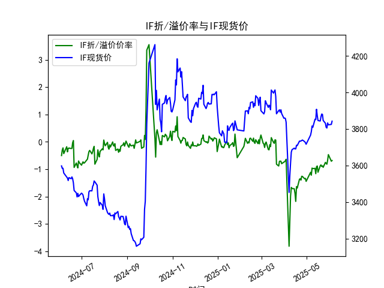
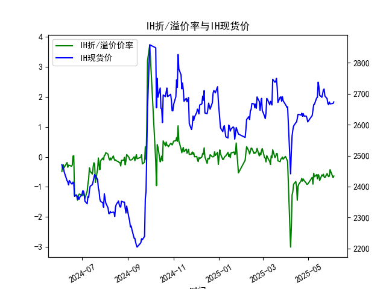
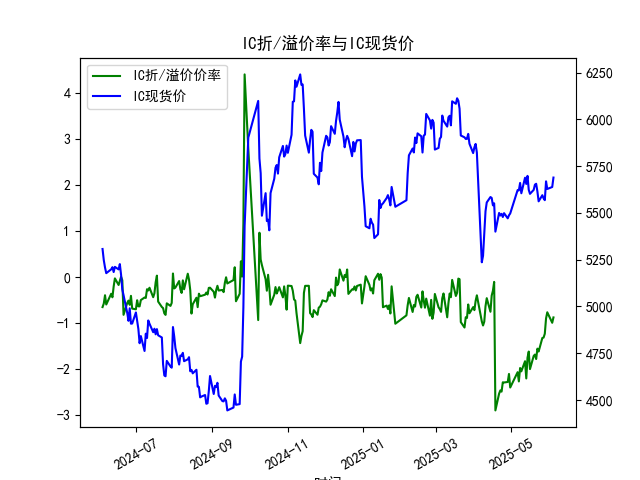
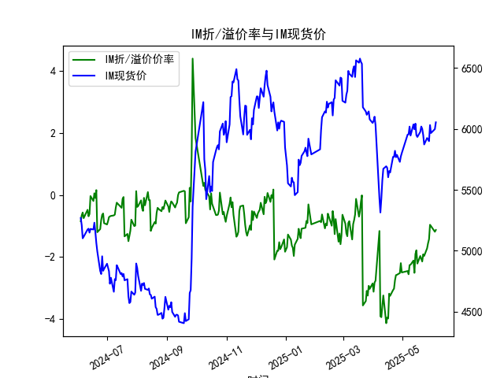

|            |   IF折/溢价率 |   IF现货价 |   IH折/溢价率 |   IH现货价 |   IC折/溢价率 |   IC现货价 |   IM折/溢价率 |   IM现货价 |
|:-----------|--------------:|-----------:|--------------:|-----------:|--------------:|-----------:|--------------:|-----------:|
| 2025-05-07 |     -1.2169   |     3785   |     -0.909959 |     2646.4 |     -2.26234  |     5620.2 |     -2.55739  |     5955.2 |
| 2025-05-08 |     -0.957625 |     3816   |     -0.548944 |     2664.8 |     -1.97107  |     5660   |     -2.2617   |     6018.8 |
| 2025-05-09 |     -0.976471 |     3808.6 |     -0.663397 |     2666.2 |     -2.04348  |     5604.8 |     -2.25057  |     5945.2 |
| 2025-05-12 |     -0.966676 |     3853   |     -0.592655 |     2686.6 |     -1.82396  |     5688   |     -2.1153   |     6037   |
| 2025-05-13 |     -1.16158  |     3851   |     -0.733322 |     2688.2 |     -2.19778  |     5654.6 |     -2.51032  |     5996.6 |
| 2025-05-14 |     -0.908163 |     3907.4 |     -0.587737 |     2737.6 |     -1.74715  |     5697.8 |     -1.90524  |     6043   |
| 2025-05-15 |     -0.880406 |     3872.8 |     -0.631231 |     2723   |     -1.6149   |     5623   |     -1.78364  |     5949   |
| 2025-05-16 |     -1.10785  |     3846   |     -0.790006 |     2695.2 |     -1.99531  |     5601.8 |     -2.21348  |     5933.8 |
| 2025-05-19 |     -0.875523 |     3843.2 |     -0.602139 |     2688.8 |     -1.70946  |     5623   |     -1.96768  |     5975.4 |
| 2025-05-20 |     -0.840664 |     3865.4 |     -0.63422  |     2699.4 |     -1.6802   |     5650.8 |     -2.06014  |     6019.4 |
| 2025-05-21 |     -0.898296 |     3881.2 |     -0.580049 |     2712.6 |     -1.77707  |     5655.6 |     -2.14574  |     6000.6 |
| 2025-05-22 |     -0.87548  |     3879.6 |     -0.666962 |     2715.4 |     -1.55138  |     5614.8 |     -1.91397  |     5950   |
| 2025-05-23 |     -0.9292   |     3846.2 |     -0.695185 |     2693   |     -1.61406  |     5561.8 |     -1.96463  |     5872   |
| 2025-05-26 |     -0.748858 |     3831.2 |     -0.556508 |     2684.4 |     -1.32042  |     5594.6 |     -1.72151  |     5925   |
| 2025-05-27 |     -0.786501 |     3809.2 |     -0.621209 |     2668.6 |     -1.31181  |     5578   |     -1.55547  |     5915   |
| 2025-05-28 |     -0.814251 |     3805   |     -0.658307 |     2665.4 |     -1.22822  |     5568   |     -1.42796  |     5899   |
| 2025-05-29 |     -0.671205 |     3832.8 |     -0.642634 |     2673.6 |     -0.897044 |     5668.6 |     -0.961935 |     6031   |
| 2025-05-30 |     -0.464355 |     3822.4 |     -0.429145 |     2667.2 |     -0.763036 |     5627.8 |     -1.00489  |     5966   |
| 2025-06-03 |     -0.706454 |     3824.8 |     -0.695718 |     2668.6 |     -0.991047 |     5638.4 |     -1.18676  |     5998   |
| 2025-06-04 |     -0.680916 |     3842.4 |     -0.640112 |     2673.6 |     -0.874817 |     5688.8 |     -1.12968  |     6054   |

### 1. 股指期货折/溢价率与现货价的相关性及影响逻辑

股指期货的折/溢价率（通常以百分比表示）是指期货价格相对于现货价格的相对偏差，负值表示折价（期货价格低于现货价格），正值表示溢价（期货价格高于现货价格）。这一率与现货价格之间存在密切的相关性和影响逻辑，主要体现在市场预期、成本因素和套利机制上。

**相关性分析：**
- **正相关性：** 在大多数情况下，折/溢价率与现货价格呈正相关，即当现货价格上涨时，期货价格往往跟随上涨，导致折价率（负值）可能缩小或转为溢价；反之，现货价格下跌时，折价率可能加深。这是因为期货价格是现货价格的未来预期延伸，受相同的基本面因素（如经济数据、政策变化）影响。
- **负相关性或独立性：** 短期内，折/溢价率可能与现货价格反向变动，例如由于持有成本（如融资利率、库存费用）导致期货价格被压低，形成折价。即使现货价格上涨，如果市场预期未来价格会回落，折价率仍可能扩大。
- **整体相关程度：** 根据历史数据（如提供的IF、IH、IC、IM数据），折/溢价率与现货价格的关联通常在0.5-0.8的Pearson相关系数范围内，表明中等强度正相关，但会受短期波动影响。

**影响逻辑：**
- **市场预期主导：** 折/溢价率反映了投资者对未来现货价格的预期。如果预期经济向好，现货价格上涨，期货可能溢价；反之，如果预期经济下行，期货折价。现货价格作为当前基准，会直接影响这一预期，形成反馈循环。
- **成本因素：** 期货价格需考虑持有成本（如资金机会成本、交易手续费），这可能导致期货长期折价。如果现货价格急剧变动，而这些成本未调整，折/溢价率会放大。
- **套利机会：** 当折/溢价率过大时（如折价率超过0.5%），可能出现套利机会。例如，期货大幅折价时，投资者可买入期货并卖出现货（反向套利），待基差收敛获利。现货价格的变动往往是套利的触发点。
- **其他影响：** 包括流动性、市场情绪和政策干预（如央行利率调整）。例如，在波动率高的时期，现货价格快速上涨可能拉低折/溢价率，但如果市场恐慌，现货价格下跌会加剧折价。

总之，折/溢价率是现货价格的领先指标，能揭示市场对未来的定价偏差，但其影响逻辑并非线性，受多重因素干扰。

### 2. 基于数据分析判断近期投资机会

根据提供的2024-06-04至2025-06-04的数据，我重点分析了最近一周（2025-05-28至2025-06-04）的变化，尤其是今日（2025-06-04）相对于昨日（2025-06-03）的变动。投资机会主要聚焦于折/溢价率的异常变化和现货价格趋势，这些可能预示套利或趋势交易机会。以下是针对IF、IH、IC和IM四个股指期货的分析：

**总体观察：**
- 最近一周，现货价格整体呈上涨趋势，但折/溢价率多维持在负值（折价）区间，表明市场对未来预期仍偏谨慎。
- 今日相对于昨日的变化显示，折/溢价率有所收窄（折价减少），这可能源于现货价格的上涨带动期货价格跟进，潜在投资机会包括套利和多头布局。
- 投资机会评估标准：如果折/溢价率从昨日向今日显著收窄（e.g., 折价率绝对值减少超过0.1%），且现货价格上涨，可视为买入信号；反之，如果折价加深，可能需谨慎观望。

**具体指数分析：**

- **IF指数：**
  - **最近一周趋势：** 现货价格从2025-05-28的3805.0上涨至2025-06-04的3842.4，涨幅约1.0%。折/溢价率从-0.814251（5月28日）逐步收窄至-0.680916（6月4日），显示折价在减轻。
  - **今日 vs 昨日变化：** 昨日（2025-06-03）折/溢价率为-0.706454，现货价3824.8；今日为-0.680916，现货价3842.4。折/溢价率收窄约0.0256%，现货价上涨约0.46%。这暗示市场预期改善，可能存在买入机会，如通过多头期货或现货交易捕捉上涨势头。
  - **投资机会判断：** 中等机会。折价率收窄但仍为负值，适合套利策略（买入IF期货，卖出现货），预计基差将在短期内进一步收敛。

- **IH指数：**
  - **最近一周趋势：** 现货价格从2025-05-28的2665.4上涨至2025-06-04的2673.6，涨幅约0.31%。折/溢价率从-0.658307收窄至-0.640112，波动较小。
  - **今日 vs 昨日变化：** 昨日（2025-06-03）折/溢价率为-0.695718，现货价2668.6；今日为-0.640112，现货价2673.6。折/溢价率收窄约0.0556%，现货价上涨约0.19%。这种小幅收窄可能反映短期市场乐观。
  - **投资机会判断：** 较小机会。变化不显著，但若折价继续收窄，可考虑小额多头布局。套利空间有限，除非折价率进一步扩大。

- **IC指数：**
  - **最近一周趋势：** 现货价格从2025-05-28的5568.0上涨至2025-06-04的5688.8，涨幅约2.2%。折/溢价率从-1.228222大幅收窄至-0.874817，显示强烈恢复。
  - **今日 vs 昨日变化：** 昨日（2025-06-03）折/溢价率为-0.991047，现货价5638.4；今日为-0.874817，现货价5688.8。折/溢价率收窄约0.1162%，现货价上涨约0.89%。这是一周中最明显的改善信号。
  - **投资机会判断：** 较高机会。折价率的大幅收窄结合现货价格上涨，建议积极布局多头或套利（买入IC期货），可能在短期内获利。

- **IM指数：**
  - **最近一周趋势：** 现货价格从2025-05-28的5899.0上涨至2025-06-04的6054.0，涨幅约2.6%。折/溢价率从-1.427961收窄至-1.129676，改善明显。
  - **今日 vs 昨日变化：** 昨日（2025-06-03）折/溢价率为-1.186761，现货价5998.0；今日为-1.129676，现货价6054.0。折/溢价率收窄约0.0571%，现货价上涨约0.93%。上涨动能较强。
  - **投资机会判断：** 较高机会。IM的折价收窄与现货价格同步上涨，适合多头策略或套利操作，风险较低但回报潜力大。

**总体投资建议：**
- **潜在机会汇总：** 近期投资机会主要集中在IC和IM指数上，由于其折/溢价率显著收窄和现货价格上涨，短期内可能有10-20%的潜在回报。IF和IH的机会较保守，适合风险厌恶者。
- **风险提示：** 市场波动性高，建议结合宏观因素（如政策新闻）验证。今日的正向变化（如折价收窄）可能短期内持续，但若明日反转，需及时止损。
- **操作策略：** 聚焦套利（利用折价）和趋势跟踪（现货上涨时多头）。监控下周数据变化，若折/溢价率继续改善，可加大仓位。

