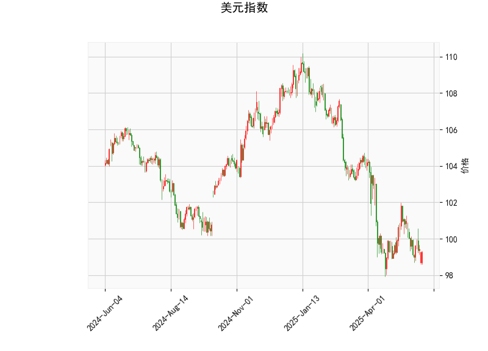

### 1. 美元指数的技术分析结果解读

美元指数当前价位为99.2781，处于相对较低水平，结合多种技术指标，我们可以对近期走势进行初步评估。

- **RSI（相对强弱指数）分析**：RSI值为42.50，低于50阈值，表明美元指数可能处于超卖状态。这暗示短期内存在潜在反弹风险，但如果RSI进一步下降，可能加剧看跌压力。
  
- **MACD（移动平均收敛散度）分析**：MACD线值为-0.4247（负值），信号线值为-0.4233，MACD直方图值为-0.0014（负且接近零）。这显示美元指数仍处于看跌趋势，但直方图值很小，表明看跌动能正在减弱，可能即将出现转折点。如果MACD线向上穿越信号线，将是一个看涨信号。

- **布林带分析**：当前价位99.2781位于中轨（101.1573）和下轨（97.1945）之间，接近下轨。这反映出价格可能在支撑位附近徘徊，短期内有向上反弹的可能。如果价格跌破下轨（97.1945），则可能进一步下行；反之，若向上突破中轨，则可能转为多头趋势。

- **K线形态分析**：提供的K线形态包括CDLCLOSINGMARUBOZU、CDLGAPSIDESIDEWHITE和CDLLONGLINE。这些形态整体偏向强势：
  - CDLCLOSINGMARUBOZU表示一根接近实体蜡烛，暗示趋势强劲，可能为看涨信号。
  - CDLGAPSIDESIDEWHITE显示跳空并形成白色实体，表明多头力量占优。
  - CDLLONGLINE代表长线蜡烛，显示大波动，但结合其他形态，可能预示短期反弹。

总体而言，美元指数当前处于弱势区间，超卖信号（如RSI）和减弱的看跌动能（如MACD直方图）暗示短期内可能出现技术性反弹或企稳。然而，如果外部因素（如美国经济数据或地缘政治事件）进一步施压，美元指数仍可能向下测试下轨。投资者需密切关注是否突破中轨（101.1573），这将是关键转折点。

### 2. 基于美元指数分析判断近期A股和港股的投资或套利机会及策略

美元指数的弱势（超卖状态和潜在反弹）与A股和港股的关系密切，因为美元走弱通常有利于新兴市场股票。通过汇率联动效应，美元指数若继续下行，可能吸引资金流入中国市场，从而推动A股和港股上涨。反之，若美元反弹，则可能导致资金外流和市场波动。以下是针对近期可能的投资和套利机会的分析及策略建议：

#### **投资机会分析**
- **总体市场环境**：当前美元指数弱势可能利好A股和港股，尤其是如果全球风险偏好回升。新兴市场股票往往与美元呈负相关，因此美元超卖状态下，A股（如上证指数）和港股（如恒生指数）可能迎来反弹机会。近期A股科技股和消费股表现活跃，港股则受益于中概股回流。
  
- **潜在机会**：
  - **A股机会**：如果美元继续走弱，A股可能受益于外资流入和人民币升值预期。重点关注科技板块（如半导体和新能源汽车股）和消费板块（如白酒和家电），这些板块在经济复苏期表现强劲。当前A股估值相对合理，RSI和MACD类似信号显示市场可能从超卖区反弹。
  - **港股机会**：港股更易受国际资金影响，美元弱势可能推动恒生科技指数上涨。A+H股联动效应显著，例如腾讯控股（00700.HK）和阿里巴巴（09988.HK）等中概股可能迎来估值修复机会。

- **风险因素**：需警惕美元反弹风险（如美国加息预期加强），这可能导致A股和港股回调。全球经济不确定性（如通胀和地缘冲突）也可能放大波动。

#### **套利机会和策略**
- **套利机会**：美元弱势环境下，A股和港股间价差扩大，提供A+H股套利空间。同时，汇率波动可用于跨市场套利。
  
- **具体策略**：
  - **A+H股套利策略**：利用A股和港股同股不同价的价差进行套利。例如，如果美元走弱导致港股相对A股估值较低，可买入港股（H股）并卖空A股（A股），待价差收窄后获利。近期目标包括招商银行（A股：600036，H股：03968.HK），若价差扩大至历史均值以上，可操作。
    - **操作步骤**：监测美元指数突破下轨后的港股表现；若H股折价率>10%，买入H股并卖空A股；设置止损在美元反弹时。
    - **预期收益**：短期内，价差收窄可能带来1-5%的套利空间，但需控制交易成本。
    
  - **汇率相关投资策略**：结合美元弱势，考虑人民币升值机会。通过买入A股ETF（如华夏上证50ETF）或港股ETF（如恒生中国企业ETF），并搭配外汇对冲（如做多人民币/美元）。如果美元指数反弹，及时退出以避险。
    
  - **多头投资策略**：在美元超卖确认后，采取多头布局。例如，买入A股科技ETF（如华夏沪深300ETF）或港股科技股，目标持仓1-3个月。结合技术指标，当RSI>50时加仓。
    
  - **风险管理策略**：使用止损订单（如若美元指数反弹至中轨以上，立即减仓）。 diversifying across sectors (e.g., 科技+消费) can mitigate single-stock risks. 总体仓位控制在50%以下，避免过度暴露。

总之，近期美元指数弱势为A股和港股提供了潜在上行空间，投资者可优先布局套利和多头策略，但需密切跟踪美元动态和全球经济信号，以应对可能的反转。建议结合基本面分析（如企业财报）和技术面（如RSI突破）来优化决策。