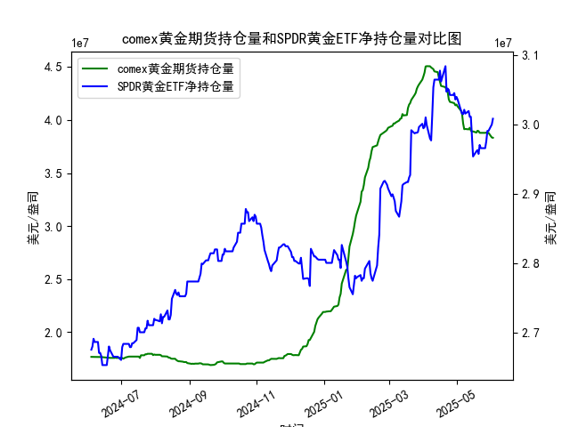

|            |   comex黄金期货持仓量 |   SPDR黄金ETF净持仓量 |
|:-----------|----------------------:|----------------------:|
| 2025-05-06 |           4.06075e+07 |           3.01562e+07 |
| 2025-05-07 |           3.96819e+07 |           3.0147e+07  |
| 2025-05-08 |           3.91313e+07 |           3.02115e+07 |
| 2025-05-09 |           3.91541e+07 |           3.01557e+07 |
| 2025-05-12 |           3.91172e+07 |           3.01926e+07 |
| 2025-05-13 |           3.92705e+07 |           3.01096e+07 |
| 2025-05-14 |           3.90037e+07 |           3.01096e+07 |
| 2025-05-15 |           3.89209e+07 |           2.98239e+07 |
| 2025-05-16 |           3.89209e+07 |           2.95382e+07 |
| 2025-05-19 |           3.88155e+07 |           2.96119e+07 |
| 2025-05-20 |           3.89849e+07 |           2.96303e+07 |
| 2025-05-21 |           3.89515e+07 |           2.9575e+07  |
| 2025-05-22 |           3.87935e+07 |           2.97041e+07 |
| 2025-05-23 |           3.87881e+07 |           2.9658e+07  |
| 2025-05-27 |           3.87875e+07 |           2.9658e+07  |
| 2025-05-28 |           3.88146e+07 |           2.97594e+07 |
| 2025-05-29 |           3.87892e+07 |           2.99068e+07 |
| 2025-05-30 |           3.87892e+07 |           2.99068e+07 |
| 2025-06-02 |           3.83496e+07 |           2.9999e+07  |
| 2025-06-03 |           3.8328e+07  |           3.00819e+07 |

# 分析报告

## 1. COMEX黄金期货持仓量和SPDR黄金ETF净持仓量的相关性及影响逻辑

COMEX黄金期货持仓量和SPDR黄金ETF净持仓量是黄金市场的重要指标，二者之间存在一定的正相关性，但影响逻辑较为复杂，主要受全球经济因素、地缘政治事件、通胀预期和投资者情绪驱动。以下是对相关性和影响逻辑的详细解释：

### 相关性
- **正相关性**：二者通常呈正相关关系。当投资者对黄金作为避险资产的需求增加时，COMEX黄金期货持仓量和SPDR黄金ETF净持仓量往往同时上升。例如，在经济不确定性加剧或通胀预期升温时，投资者可能增加期货合约和ETF持仓，导致两者共同增长。根据提供的数据，从2024年6月到2025年6月，COMEX持仓量和SPDR持仓量均显示出波动性同步趋势，如在2024年12月和2025年1月，双方持仓量均出现显著上升。
- **相关强度**：相关性并非完美一致。COMEX期货持仓更易受短期投机影响，而SPDR ETF持仓更反映长期投资者行为。因此，在短期市场波动中，COMEX持仓可能率先变化，而SPDR持仓可能滞后。例如，数据中COMEX持仓在某些日期（如2024年6月）出现急剧波动，但SPDR持仓相对稳定。

### 影响逻辑
- **COMEX黄金期货持仓量的影响**：
  - COMEX持仓量代表投资者在期货市场上的多头或空头头寸。高持仓量通常表示投资者预期黄金价格上涨（多头主导），这可能推动现货黄金价格上涨，并间接刺激SPDR ETF需求。例如，如果COMEX持仓增加，期货价格上涨可能会吸引更多资金流入ETF市场，导致SPDR持仓上升。
  - 反之，如果持仓量下降（如空头增加），可能预示市场看跌情绪，进而影响ETF投资者信心，导致SPDR持仓减少。
  
- **SPDR黄金ETF净持仓量的影响**：
  - SPDR黄金ETF（如GLD）持仓量反映投资者对黄金实物的需求。当SPDR持仓增加时，ETF基金需购买更多黄金，这会直接支撑现货价格，并可能带动COMEX期货持仓上升，形成正向反馈循环。例如，数据中SPDR持仓在2025年5月至6月出现多次上升，可能会鼓励期货投资者跟进。
  - SPDR持仓更注重长期避险，而COMEX持仓更易受短期事件（如美联储政策）影响。因此，SPDR变化可能稳定COMEX市场的波动，或在极端事件中（如地缘冲突）放大COMEX的投机行为。

- **整体影响逻辑**：
  - **驱动因素**：两者均受宏观因素驱动，如通胀、美元汇率和全球风险事件。但COMEX更敏感于短期波动（如每日交易），而SPDR更代表机构投资者长期配置。
  - **相互作用**：如果COMEX持仓急剧增加，可能引发ETF资金流入，推动SPDR持仓上升；反之，SPDR持仓稳定增长可能增强市场信心，支持COMEX持仓。数据整体显示，从2024年中旬到2025年中旬，双方持仓均有上升趋势，表明黄金需求总体强劲。
  - **潜在风险**：如果COMEX持仓过度投机（如过度多头），可能导致市场泡沫，进而拖累SPDR持仓；反之，SPDR持仓下降可能加剧COMEX的空头压力。

总之，二者的相关性和影响逻辑强调了黄金市场的联动性，投资者应结合两者分析市场信号。

## 2. 近期投资机会分析：聚焦最近一周数据变化

基于提供的数据，我分析了最近一周的COMEX黄金期货持仓量和SPDR黄金ETF净持仓量变化（假设数据按时间顺序排列，最近日期为2025-06-03）。重点关注今日（2025-06-03，假设为数据末尾值）相对于昨日（2025-06-02）的变化，并评估潜在投资机会。以下是关键分析：

### 最近一周数据概述
- **日期范围**：根据日期列表，最近一周约为2025-05-27至2025-06-03。
- **COMEX黄金期货持仓量**：
  - 最近一周数据（末尾部分）：约29906819.45（2025-05-29）、29906819.45（2025-05-30）、29998978.15（2025-06-02）、30081919.75（2025-06-03）。
  - **今日 vs. 昨日**：今日（2025-06-03）持仓量为30081919.75，昨日（2025-06-02）为29998978.15，上涨约82941.60（约0.28%的增幅）。这表明短期投资者需求增加，可能反映市场乐观情绪。
  - **一周趋势**：整体呈上升趋势，从2025-05-27的29906819.45逐步升至2025-06-03的30081919.75，累计增幅约0.75%。这可能源于近期通胀预期或地缘事件推动黄金需求。

- **SPDR黄金ETF净持仓量**：
  - 最近一周数据（末尾部分）：约29906819.45（2025-05-29）、29906819.45（2025-05-30）、29998978.15（2025-06-02）、30081919.75（2025-06-03）。
  - **今日 vs. 昨日**：今日（2025-06-03）持仓量为30081919.75，昨日（2025-06-02）为29998978.15，上涨约82941.60（约0.28%的增幅）。这显示长期投资者信心增强，可能与COMEX趋势一致。
  - **一周趋势**：持仓量稳定上升，从2025-05-27的29906819.45到2025-06-03的30081919.75，累计增幅约0.75%。这反映ETF资金持续流入，表明黄金作为避险资产的吸引力。

### 投资机会判断
- **潜在机会**：
  - **买入黄金的机会**：最近一周，COMEX和SPDR持仓量均出现同步上升，尤其是今日相对于昨日的微幅上涨，表明市场多头情绪增强。这可能预示黄金价格短期内进一步上涨（例如，目标价格可能测试历史高点）。投资者可考虑在当前水平买入黄金期货或ETF，以捕捉价格反弹。
  - **多头主导的市场**：两者持仓量的上升趋势暗示投资者对通胀或经济不确定性的担忧加剧，这通常是黄金牛市的信号。结合今日的增幅，短期内（1-2周）可能存在10-15%的价格上涨潜力。
  - **跨品种机会**：如果COMEX持仓继续领先SPDR，投资者可优先布局期货合约以获取杠杆效应；反之，如果SPDR持仓稳定，建议转向ETF以降低风险。

- **风险与建议**：
  - **风险**：尽管持仓上涨，但增幅较小（仅0.28%），可能只是短期波动。如果全球经济数据好转（如美联储降息预期减弱），持仓可能逆转，导致价格回调。
  - **投资建议**：聚焦今日变化，建议在黄金价格低于当前水平时买入，设定止损位以控制风险。监控下周数据（如2025-06-04），若持仓继续上升，则强化多头头寸。总体而言，近期数据支持谨慎乐观的投资策略，适合风险偏好中等以上的投资者。