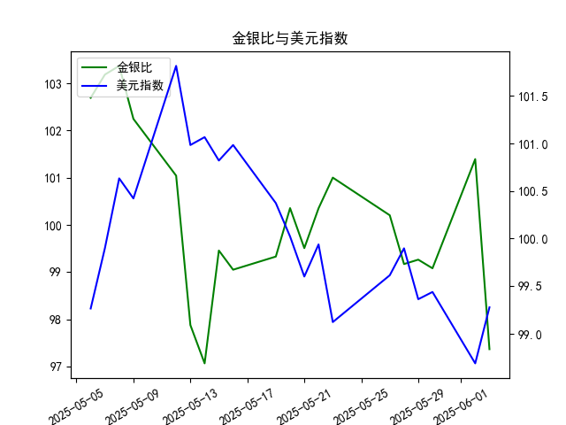

|            |    金价 |   银价 |   美元指数 |   金银比 |
|:-----------|--------:|-------:|-----------:|---------:|
| 2025-05-06 | 3391.45 | 33.025 |    99.2654 | 102.693  |
| 2025-05-07 | 3392.25 | 32.875 |    99.9006 | 103.186  |
| 2025-05-08 | 3352.3  | 32.43  |   100.633  | 103.37   |
| 2025-05-09 | 3324.55 | 32.515 |   100.422  | 102.247  |
| 2025-05-12 | 3235.4  | 32.02  |   101.814  | 101.043  |
| 2025-05-13 | 3227.95 | 32.98  |   100.983  |  97.876  |
| 2025-05-14 | 3191.95 | 32.885 |   101.066  |  97.064  |
| 2025-05-15 | 3191.05 | 32.085 |   100.82   |  99.4561 |
| 2025-05-16 | 3182.95 | 32.135 |   100.983  |  99.0493 |
| 2025-05-19 | 3230.15 | 32.52  |   100.373  |  99.3281 |
| 2025-05-20 | 3261.55 | 32.5   |   100.022  | 100.355  |
| 2025-05-21 | 3299.65 | 33.16  |    99.6014 |  99.5069 |
| 2025-05-22 | 3284    | 32.725 |    99.9388 | 100.351  |
| 2025-05-23 | 3342.65 | 33.095 |    99.1231 | 101.002  |
| 2025-05-27 | 3296.7  | 32.9   |    99.6147 | 100.204  |
| 2025-05-28 | 3300.85 | 33.285 |    99.8978 |  99.1693 |
| 2025-05-29 | 3312.4  | 33.37  |    99.3633 |  99.2628 |
| 2025-05-30 | 3277.55 | 33.08  |    99.4393 |  99.0795 |
| 2025-06-02 | 3370.85 | 33.245 |    98.6893 | 101.394  |
| 2025-06-03 | 3334.75 | 34.25  |    99.2781 |  97.365  |

### 1. 金银比与美元指数的相关性及影响逻辑

金银比（Gold to Silver Ratio）是黄金价格除以白银价格的比率，用于衡量黄金和白银的相对价值。美元指数（US Dollar Index）则反映美元对一篮子主要外币的汇率强度。两者之间存在间接相关性，主要通过以下逻辑影响：

- **相关性分析**：金银比和美元指数通常呈负相关或弱相关关系。这是因为黄金和白银作为以美元计价的商品，其价格往往会受到美元波动的影响。当美元指数走强（美元升值）时，贵金属价格通常下跌，因为投资者需要支付更多本国货币来购买这些资产，从而可能导致金银比上升（黄金相对白银更贵）。反之，美元指数走弱时，贵金属需求可能增加，推动金银比下降。然而，这种相关性并非绝对，因为金银比还受制于黄金和白银各自的供需动态、市场情绪和地缘政治因素。

- **影响逻辑**：
  - **美元升值的影响**：美元走强会增加持有贵金属的机会成本，因为贵金属以美元定价，价格上涨会抑制需求。如果黄金价格下跌幅度大于白银，金银比可能上升；反之，如果白银更敏感，金银比可能下降。
  - **美元贬值的影响**：美元走弱往往刺激贵金属作为避险资产的需求上涨，导致金银比波动。如果白银需求增长更快，金银比可能降低，创造买入白银的机会。
  - **其他因素**：短期内，市场情绪（如通胀预期或经济数据）可能放大或削弱这一相关性。例如，在经济不确定期，投资者可能更青睐黄金，导致金银比上升，即使美元相对稳定。

总体而言，美元指数的变化往往是金银比的领先指标，但投资者需结合全球经济环境进行评估。

### 2. 近期投资机会分析

基于提供的数据，我将重点分析最近一周（从2025-5-27到2025-6-3）的金银比和美元指数变化，尤其是今日（2025-6-3）相对于昨日（2025-6-2）的变动。数据显示，金银比在近期呈现波动性下降趋势，而美元指数则小幅上升。以下是关键分析和可能的投资机会：

- **最近一周数据概述**：
  - **金银比变化**：最近一周的值依次为：2025-5-27（100.20）、2025-5-28（99.17）、2025-5-29（99.26）、2025-5-30（99.08）、2025-6-2（101.39）、2025-6-3（97.36）。整体呈现先小幅波动后大幅下降的趋势，尤其是从2025-6-2的101.39降至2025-6-3的97.36，下降约4.03点（约3.97%的跌幅），表明白银相对黄金变得更便宜。
  - **美元指数变化**：最近一周的值依次为：2025-5-27（99.61）、2025-5-28（99.90）、2025-5-29（99.36）、2025-5-30（99.44）、2025-6-2（98.69）、2025-6-3（99.28）。该指数在近期小幅上升，从2025-6-2的98.69升至2025-6-3的99.28，上涨约0.59点（约0.60%的涨幅），显示美元短期走强。
  - **今日 vs. 昨日变化**：金银比大幅下降（101.39 → 97.36），而美元指数小幅上升（98.69 → 99.28）。这可能反映出美元走强对贵金属的短期压力，但金银比的急剧下跌暗示白银需求或市场情绪的积极变化。

- **判断可能投资机会**：
  - **买入白银机会**：金银比的急剧下降（尤其今日相对于昨日的下跌）表明白银相对于黄金的价值可能被低估。这可能是短期投资机会，因为历史数据显示，金银比低于100时往往是买入白银的信号。如果美元指数继续小幅上升但未大幅突破，投资者可考虑在金银比维持低位时买入白银相关资产（如白银ETF或期货），预计未来反弹潜力。
  - **卖出黄金或套利机会**：金银比下降通常意味着黄金相对更贵，投资者可考虑卖出黄金或进行黄金-白银套利交易。例如，利用今日金银比的低点进行反向操作，待比率回升时获利。
  - **美元相关机会**：美元指数的微涨可能预示短期强势，但如果金银比继续下跌，这可能创造跨资产机会，如买入贵金属以对冲美元风险。近期美元波动不大（仅0.59点上涨），若未来一周美元指数稳定在100以下，贵金属市场可能迎来反弹。
  - **风险与整体建议**：近期数据显示波动性较高（金银比从101.39急降至97.36），这可能源于市场情绪或经济数据影响。潜在风险包括美元进一步走强导致贵金属双双下跌。建议聚焦短期交易：如果金银比在未来几天保持在98以下，买入白银的机会较佳；反之，若美元指数突破100，需警惕贵金属整体下行。投资者应监控下周数据（若有），并结合全球经济指标（如通胀数据）决策。