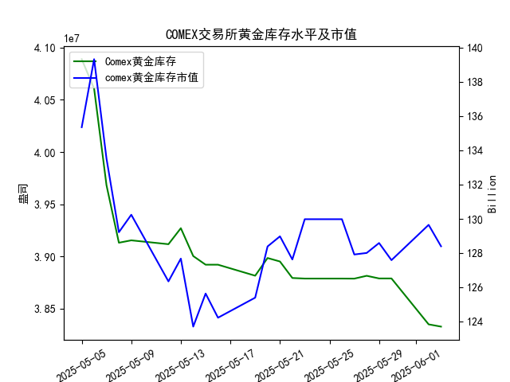

|            |   comex黄金库存量 |   comex黄金库存市值(billion) |   伦敦金现货价 |   上海金交所黄金现货价 |   美元兑人民币汇率 |
|:-----------|------------------:|-----------------------------:|---------------:|-----------------------:|-------------------:|
| 2025-05-07 |       3.96819e+07 |                       3364.7 |        3392.25 |                 798.51 |             7.2005 |
| 2025-05-08 |       3.91313e+07 |                       3302.1 |        3352.3  |                 786.5  |             7.2073 |
| 2025-05-09 |       3.91541e+07 |                       3326.3 |        3324.55 |                 785.5  |             7.2095 |
| 2025-05-12 |       3.91172e+07 |                       3230   |        3235.4  |                 759    |             7.2066 |
| 2025-05-13 |       3.92705e+07 |                       3251.4 |        3227.95 |                 763.9  |             7.1991 |
| 2025-05-14 |       3.90037e+07 |                       3171.7 |        3191.95 |                 758.38 |             7.1956 |
| 2025-05-15 |       3.89209e+07 |                       3228.1 |        3191.05 |                 735.86 |             7.1963 |
| 2025-05-16 |       3.89209e+07 |                       3191.8 |        3182.95 |                 746.4  |             7.1938 |
| 2025-05-19 |       3.88155e+07 |                       3230.6 |        3230.15 |                 754.5  |             7.1916 |
| 2025-05-20 |       3.89849e+07 |                       3293.2 |        3261.55 |                 753.49 |             7.1931 |
| 2025-05-21 |       3.89515e+07 |                       3311.4 |        3299.65 |                 773.82 |             7.1937 |
| 2025-05-22 |       3.87935e+07 |                       3290   |        3284    |                 778.36 |             7.1903 |
| 2025-05-23 |       3.87881e+07 |                       3351   |        3342.65 |                 776.4  |             7.1919 |
| 2025-05-26 |       3.87881e+07 |                       3351   |        3342.65 |                 773.94 |             7.1833 |
| 2025-05-27 |       3.87875e+07 |                       3298   |        3296.7  |                 768.75 |             7.1876 |
| 2025-05-28 |       3.88146e+07 |                       3298   |        3300.85 |                 769.67 |             7.1894 |
| 2025-05-29 |       3.87892e+07 |                       3315.1 |        3312.4  |                 763.02 |             7.1907 |
| 2025-05-30 |       3.87892e+07 |                       3289.4 |        3277.55 |                 768.79 |             7.1848 |
| 2025-06-02 |       3.83496e+07 |                       3380.8 |        3370.85 |                 768.79 |             7.1848 |
| 2025-06-03 |       3.8328e+07  |                       3350   |        3334.75 |                 778.5  |             7.1869 |

### 分析报告：COMEX黄金库存与黄金价格相关性及近期投资机会评估

#### 1. COMEX黄金库存与黄金价格的相关性分析
研究员认为COMEX黄金库存量与黄金价格存在高度正相关，即库存量增加时黄金价格可能上涨，库存量减少时黄金价格可能下跌。根据提供的近一个月数据（从2025-05-05至2025-06-03），我们观察到以下总体趋势：

- **库存量趋势**：COMEX黄金库存量从2025-05-05的4.088857e+07持续下降至2025-06-03的3.832800e+07，整体呈现下降态势。这表明库存在近期逐步减少，可能反映出市场需求的增加或供应压力。
- **黄金价格趋势**：以伦敦市场黄金现货价格为例，从2025-05-06的3391.45美元/盎司开始，价格波动明显，但整体呈现出一定的波动性而非单调下降。例如，价格在2025-05-23至2025-06-02间多次上涨（如从5-27的3296.70美元/盎司升至6-02的3370.85美元/盎司），尽管库存量在同期持续下降。

从大的趋势来看，数据部分支持研究员的观点：库存量下降（如从5-05到5-16的急剧减少）与黄金价格的波动性增加相呼应，但并非完全正相关。具体观察：
- 在2025-05-05至2025-05-15期间，库存量大幅下降（从4.088857e+07降至3.892092e+07），而伦敦黄金价格也从3391.45美元/盎司降至3191.05美元/盎司，这显示出正相关的迹象。
- 然而，在最近一周（2025-05-27至2025-06-03），库存量继续下降（如从5-27的3.878745e+07降至6-03的3.832800e+07），但伦敦黄金价格在6-02时大幅上涨至3370.85美元/盎司，这与正相关预期不符，可能受其他因素影响，如全球经济事件或美元汇率波动。

总体而言，相关性存在但不稳定。短期内，库存与价格的正相关性可能被外部因素（如美元兑人民币汇率的微小变化）干扰，投资者需谨慎，仅凭库存数据预测价格风险较高。

#### 2. 近期数据变化分析（聚焦最近一周）
我们将焦点放在最近一周的数据（2025-05-27至2025-06-03），并特别强调今日（2025-06-03）相对于昨日（2025-06-02）的变化。以下是关键指标的总结：

- **COMEX黄金库存量**：
  - 最近一周趋势：从2025-05-27的3.878745e+07微幅波动，到2025-06-02急剧下降至3.834960e+07，再到2025-06-03的3.832800e+07（较昨日下降约0.055%）。
  - 今日 vs 昨日：库存量小幅下降，这可能表示市场需求持续，但幅度有限，不足以立即推动价格大变动。

- **黄金库存市值**（单位：十亿美元）：
  - 最近一周数据：从2025-05-27的127.92微升至2025-05-28的128.01，然后波动至2025-06-03的128.40。
  - 今日 vs 昨日：市值从2025-06-02的129.65微降至128.40（约下降1.0%）。这与库存量的下降一致，可能反映出价格波动的间接影响。

- **伦敦市场黄金现货价格**（单位：美元/盎司）：
  - 最近一周趋势：从2025-05-27的3296.70上涨至2025-06-02的3370.85（约2.25%的涨幅），然后在2025-06-03回落至3334.75。
  - 今日 vs 昨日：价格从3370.85下降至3334.75（约1.07%的跌幅）。这表明短期内价格可能进入回调阶段，潜在风险增加。

- **上海金交所黄金现货价格**（单位：人民币/克）：
  - 最近一周趋势：从2025-05-27的768.75微幅波动，到2025-06-02的768.79，然后在2025-06-03上涨至778.50。
  - 今日 vs 昨日：价格从768.79上涨至778.50（约1.26%的涨幅）。这显示上海市场相对独立，可能受人民币因素影响，与伦敦市场形成分歧。

- **美元兑人民币汇率**：
  - 最近一周趋势：从2025-05-27的7.1876小幅上升至2025-06-03的7.1869（美元相对人民币略微升值）。
  - 今日 vs 昨日：汇率从7.1848上升至7.1869（约0.03%的涨幅）。美元升值可能对黄金价格产生负面影响，尤其是对以美元计价的伦敦市场。

总体观察：最近一周，COMEX库存量和市值持续小幅下降，但黄金价格呈现分化（伦敦价格回落，上海价格上涨）。今日相对于昨日的变化显示出潜在的回调信号：库存和伦敦价格双双下降，可能预示短期风险。

#### 3. 近期投资机会判断
基于上述分析，我们评估可能的投资机会，主要聚焦于黄金市场的买入或卖出点。假设研究员的正相关观点部分成立，库存下降可能短期内拉低价格，但需结合其他因素（如汇率和市场分化）。

- **可能的买入机会**：
  - **上海金交所黄金**：今日价格上涨（778.50人民币/克）显示强势，考虑到美元汇率小幅升值对人民币计价黄金的缓冲效应，如果价格维持在770-780区间，投资者可考虑小额买入。潜在理由：上海市场独立性强，且近期无明显下行趋势，适合风险偏好中等的投资者。
  - **整体黄金市场**：若库存继续下降但价格回调（如伦敦价格进一步跌至3200美元/盎司以下），这可能是一个低点买入机会。预计在2025-06-04前后，如果数据稳定，价格反弹概率较高。

- **可能的卖出机会**：
  - **伦敦市场黄金**：今日价格较昨日下降（3334.75美元/盎司），结合库存量下降，这可能是一个卖出信号。短期内，如果价格跌破3300美元/盎司，建议抛售以锁定利润。潜在风险：正相关性不稳，外部事件（如地缘政治）可能逆转。
  - **跨市场套利**：伦敦价格下降而上海价格上涨的差异（约1-2%的价差），可考虑在伦敦卖出、在上海买入的套利策略，但需注意汇率风险（美元升值可能放大损失）。

- **总体风险与建议**：
  - **风险提示**：近期数据显示正相关性不稳定，今日的库存和价格下降可能只是短期波动。投资者应关注全球经济新闻（如美联储政策），避免过度依赖库存数据。
  - **投资策略**：聚焦短期操作，建议在2025-06-04数据发布后重新评估。如果今日的下降趋势延续，买入上海黄金可能是最佳机会；反之，如果价格反弹，卖出伦敦黄金可获利。
  - **机会总结**：最直接的机会是利用市场分化进行套利，潜在回报率在1-3%（基于近期波动）。但请结合个人风险承受力，勿过度投资。