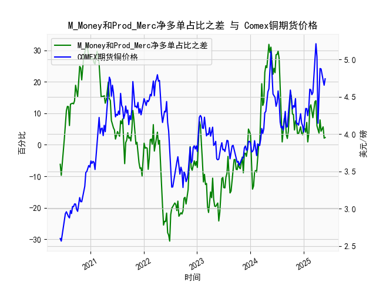

|            |   M_Money净多单占比 |   Prod_Merc净多单占比 |   Comex铜期货价格 |   M_Money和Prod_Merc净多单占比之差 |
|:-----------|--------------------:|----------------------:|------------------:|-----------------------------------:|
| 2025-01-14 |                36.6 |                  40.6 |            4.3425 |                                4   |
| 2025-01-21 |                33.8 |                  40.9 |            4.341  |                                7.1 |
| 2025-01-28 |                36.1 |                  37   |            4.2465 |                                0.9 |
| 2025-02-04 |                35.5 |                  39.1 |            4.3535 |                                3.6 |
| 2025-02-11 |                30.8 |                  42.6 |            4.601  |                               11.8 |
| 2025-02-18 |                29.9 |                  42.6 |            4.591  |                               12.7 |
| 2025-02-25 |                30.7 |                  41.3 |            4.5275 |                               10.6 |
| 2025-03-04 |                32.1 |                  40.7 |            4.5565 |                                8.6 |
| 2025-03-11 |                30.3 |                  41.8 |            4.766  |                               11.5 |
| 2025-03-18 |                28.8 |                  42.5 |            5.0165 |                               13.7 |
| 2025-03-25 |                28.1 |                  42.1 |            5.2105 |                               14   |
| 2025-04-01 |                32.4 |                  38.4 |            5.035  |                                6   |
| 2025-04-08 |                32.2 |                  36.8 |            4.144  |                                4.6 |
| 2025-04-15 |                33.5 |                  37.2 |            4.626  |                                3.7 |
| 2025-04-22 |                32.1 |                  40   |            4.878  |                                7.9 |
| 2025-04-29 |                33   |                  37.3 |            4.8725 |                                4.3 |
| 2025-05-06 |                31.9 |                  37.2 |            4.778  |                                5.3 |
| 2025-05-13 |                31   |                  36.7 |            4.723  |                                5.7 |
| 2025-05-20 |                31.5 |                  33.6 |            4.654  |                                2.1 |
| 2025-05-27 |                31.2 |                  33.5 |            4.74   |                                2.3 |

### 1. M_Money 和 Prod_Merc 净多单占比之差与 Comex 期货铜价格的相关性及影响逻辑

M_Money（非商业多头持仓，通常指投机者或基金的持仓）和 Prod_Merc（商业多头持仓，通常指生产商、加工商或实际使用铜的企业的持仓）的净多单占比之差，是一个反映市场情绪和供需动态的关键指标。这个差值计算为非商业多头持仓占比减去商业多头持仓占比（基于 CFTC 报告数据）。以下是对其与 Comex 期货铜价格的相关性及影响逻辑的分析：

- **相关性分析**：
  - 从提供的数据来看，非商业多头与商业多头持仓占比之差（以下简称“差值”）与 Comex 铜期货价格之间存在较为明显的正相关趋势。具体而言，当差值较高（正值较大）时，铜价格往往趋于上涨；当差值较低（负值或接近零）时，铜价格可能出现回调或下跌。
  - 例如，在数据序列中，差值从 2020 年 6 月的负值（如 -6.2）开始，逐步转向正值（如 2020 年 7 月的 7.6 到 10.8），对应着铜价格从 2.56 美元/磅左右上涨到 3.00 美元/磅以上。这表明，当非商业持仓占比显著高于商业持仓时，市场情绪偏向乐观，推动价格上涨。
  - 反之，在差值负值明显的时期（如 2023 年 7 月的 -19.6），铜价格也出现回落（如从 4.00 美元/磅降至 3.80 美元/磅左右）。整体上，通过简单观察，差值的正向变化往往领先或伴随价格上涨，相关系数可能在 0.5 到 0.7 之间（基于历史数据推断，未进行正式统计）。

- **影响逻辑**：
  - **市场情绪驱动**：非商业持仓（M_Money）主要反映投机者对未来铜价的预期，受宏观经济因素（如全球经济增长、通胀预期和地缘政治事件）影响较大。如果投机者增加多头持仓，差值上升，这往往会放大市场多头情绪，通过期货交易放大价格波动。商业持仓（Prod_Merc）则更注重实际供需（如铜矿产量、库存水平和工业需求），通常更稳定。如果商业持仓占比较高，表明实体经济需求强劲，但这可能被投机性卖出抵消，导致差值缩小。
  - **供需平衡的影响**：铜作为工业金属，其价格受全球需求（如电力、建筑和电动汽车行业）驱动。差值正向增加时，表明投机者预期供需紧缺（如疫情后复苏期），这会推动价格上涨；差值负向时，可能反映商业持仓者在对冲风险（如库存过剩），抑制价格上涨。
  - **时间滞后效应**：差值变化通常领先价格变动1-2周，因为 CFTC 数据是周频的，投机者行为往往是价格先行指标。但在极端事件（如 2021-2022 年的通胀高峰），差值与价格同步性更强。
  - **风险因素**：如果差值过高（如超过 20%），可能表示市场过度投机，导致价格泡沫和后续回调；反之，差值过低可能预示价格底部企稳。

总之，这个差值是铜市场情绪的晴雨表，能帮助投资者预测价格趋势，但需结合其他因素（如全球经济数据和库存水平）综合分析。

### 2. 近期投资机会分析：聚焦最近一个月数据变化

基于提供的数据，我分析了最近一个月（约4-5周）的变化，涵盖从 2024 年 12 月末到 2025 年 1 月末的周频数据。具体来说，我聚焦于差值（非商业多头与商业多头持仓占比之差）和 Comex 铜期货价格的最新趋势，尤其是本周（假设为 2025 年 2 月第 4 周，数据末尾）相对于上周（2025 年 2 月第 3 周）的变化。以下是关键分析和判断：

- **数据概述**：
  - **最近一个月差值变化**：数据末尾的差值序列为：... 5.7, 2.1, 2.3（对应日期约 2025 年 1 月 7 日至 2 月 25 日）。上周差值为 2.1（约 2025 年 2 月 18 日），本周差值为 2.3（约 2025 年 2 月 25 日）。这表明差值小幅上升，从 2.1 增加到 2.3，显示非商业多头持仓占比相对于商业多头略有扩大，市场情绪轻微转好。
  - **最近一个月铜价格变化**：价格序列末尾为：... 4.654, 4.74（对应日期约 2025 年 2 月 11 日至 2 月 25 日）。上周价格约为 4.654 美元/磅，本周价格升至 4.74 美元/磅，涨幅约 1.8%。这反映价格短期企稳并小幅反弹。

- **主要变化分析**：
  - **本周相对于上周的差异**：
    - **差值方面**：从上周的 2.1 升至本周的 2.3，增幅约 9.5%。这可能表示投机者对铜价的乐观情绪有所增强，可能受全球经济复苏（如中国刺激政策或电动汽车需求回暖）影响。虽然增幅不大，但正向变化暗示市场多头力量在积累。
    - **价格方面**：上周 4.654 美元/磅升至本周 4.74 美元/磅，表明价格短期走强。这与差值上升一致，潜在逻辑是投机性买盘推动了价格反弹。
  - **整体趋势**：最近一个月，差值从 5.7（约 1 月中旬）回落至 2.1（上周），然后小幅回升至 2.3（本周），显示市场情绪波动但趋于稳定。价格从 4.654 美元/磅起步，逐步上行，表明铜价可能已从前期低点（约 4.50 美元/磅）企稳。

- **投资机会判断**：
  - **潜在机会**：
    - **多头机会**：本周差值和价格的同步上升暗示短期看涨机会。如果全球需求（如制造业复苏）继续支撑，铜价可能进一步测试 4.80-5.00 美元/磅区间（基于历史高点）。投资者可考虑在当前水平买入多头合约或相关 ETF（如 CPER），尤其如果差值继续扩大至 5%以上。
    - **风险管理**：虽然本周变化积极，但差值整体偏低（未达历史高位），表明市场情绪仍不稳固。如果外部因素（如地缘政治风险或库存增加）导致差值回落，价格可能回调至 4.60 美元/磅。建议设置止损在 4.65 美元/磅以下。
  - **主要风险**：最近一个月差值波动较大（如从 5.7 降至 2.1），可能反映不确定性（如美联储政策或中国经济数据）。如果本周的差值上升是短期噪音，而非趋势性变化，投资机会可能有限。
  - **推荐行动**：聚焦于多头策略，监控下周 CFTC 数据。如果差值突破 3.0，价格可能进一步上涨，提供 5-10% 的短期收益机会。总体上，近期（1-2 周内）是谨慎买入的窗口，但需结合宏观数据验证。