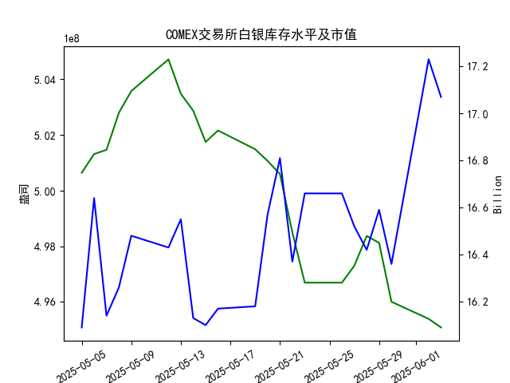

|            |   comex白银库存量 |   comex白银库存市值(billion) |   伦敦银现货价 |   上海金交所白银现货价 |   美元兑人民币汇率 |
|:-----------|------------------:|-----------------------------:|---------------:|-----------------------:|-------------------:|
| 2025-05-07 |       5.01469e+08 |                       32.195 |         32.875 |                   8229 |             7.2005 |
| 2025-05-08 |       5.028e+08   |                       32.335 |         32.43  |                   8100 |             7.2073 |
| 2025-05-09 |       5.03581e+08 |                       32.73  |         32.515 |                   8150 |             7.2095 |
| 2025-05-12 |       5.04719e+08 |                       32.56  |         32.02  |                   8124 |             7.2066 |
| 2025-05-13 |       5.03481e+08 |                       32.88  |         32.98  |                   8214 |             7.1991 |
| 2025-05-14 |       5.02874e+08 |                       32.085 |         32.885 |                   8172 |             7.1956 |
| 2025-05-15 |       5.0175e+08  |                       32.085 |         32.085 |                   7967 |             7.1963 |
| 2025-05-16 |       5.02164e+08 |                       32.195 |         32.135 |                   8062 |             7.1938 |
| 2025-05-19 |       5.0149e+08  |                       32.265 |         32.52  |                   8113 |             7.1916 |
| 2025-05-20 |       5.01069e+08 |                       33.065 |         32.5   |                   8057 |             7.1931 |
| 2025-05-21 |       5.00598e+08 |                       33.575 |         33.16  |                   8237 |             7.1937 |
| 2025-05-22 |       4.98504e+08 |                       32.84  |         32.725 |                   8268 |             7.1903 |
| 2025-05-23 |       4.96695e+08 |                       33.535 |         33.095 |                   8244 |             7.1919 |
| 2025-05-26 |       4.96695e+08 |                       33.535 |         33.095 |                   8239 |             7.1833 |
| 2025-05-27 |       4.97303e+08 |                       33.215 |         32.9   |                   8189 |             7.1876 |
| 2025-05-28 |       4.98373e+08 |                       32.955 |         33.285 |                   8211 |             7.1894 |
| 2025-05-29 |       4.98128e+08 |                       33.3   |         33.37  |                   8202 |             7.1907 |
| 2025-05-30 |       4.96008e+08 |                       32.975 |         33.08  |                   8192 |             7.1848 |
| 2025-06-02 |       4.95395e+08 |                       34.79  |         33.245 |                   8192 |             7.1848 |
| 2025-06-03 |       4.95085e+08 |                       34.475 |         34.25  |                   8405 |             7.1869 |

### 近期白银市场投资机会分析

#### 概述
基于提供的2025年5月至6月的数据，我对近一个月（尤其是最近一周从2025-05-27至2025-06-03）的白银相关指标进行了分析。重点关注今日（2025-06-03）相对于昨日（2025-06-02）的变化。总体而言，白银价格在主要市场（如伦敦和上海）出现显著上涨，而COMEX库存量和市值则呈下降趋势，这可能反映出需求强劲或供应紧缩的信号，暗示短期内存在潜在投资机会。但需注意，美元兑人民币汇率小幅上升可能带来一定风险，需要投资者密切监控全球经济因素。

最近一周的关键变化总结如下：
- **白银价格上涨**：伦敦和上海市场的现货价格均显著上升，表明市场乐观情绪。
- **库存量下降**：COMEX库存持续减少，可能推动价格进一步上涨。
- **今日 vs 昨日**：2025-06-03相对于2025-06-02，白银价格强势反弹，但库存市值下降，美元汇率微涨，这为多头机会提供了支撑，同时也增加了不确定性。

#### 详细数据变化分析
以下是针对最近一周（2025-05-27至2025-06-03）的数据变化分析，突出今日（2025-06-03）与昨日（2025-06-02）的对比：

1. **COMEX 白银库存量（单位：盎司）**:
   - 最近一周趋势：库存量整体呈下降趋势，从2025-05-27的4.973028e+08盎司逐步降至2025-06-03的4.950852e+08盎司，显示供应端压力。
   - 今日 vs 昨日：2025-06-03的库存量为4.950852e+08盎司，较昨日的4.953950e+08盎司下降约0.06%。这表明短期内白银需求可能强于供应，库存减少往往是价格上涨的先行信号。

2. **COMEX 白银库存市值（单位：billion）**:
   - 最近一周趋势：市值波动较大，但从2025-05-27的16.52 billion开始，总体趋于稳定后小幅下降，最终在2025-06-03达到17.07 billion。
   - 今日 vs 昨日：2025-06-03的市值降至17.07 billion，较昨日的17.23 billion下降约0.92%。尽管白银价格上涨，市值却未同步上升，这可能与库存减少和市场波动相关，暗示潜在的估值调整机会。

3. **伦敦市场白银现货价格（单位：美元/盎司）**:
   - 最近一周趋势：价格从2025-05-27的32.900美元逐步上涨，到2025-06-03达到34.250美元，显示强势反弹，可能受全球需求或地缘因素驱动。
   - 今日 vs 昨日：2025-06-03的价格为34.250美元，较昨日的33.245美元上涨约3.04%。这种急剧上升可能预示短期多头行情，投资者可关注是否延续。

4. **上海金交所白银现货价格（单位：人民币/千克）**:
   - 最近一周趋势：价格从2025-05-27的8189.0人民币逐步上升，到2025-06-03的8405.0人民币，表明中国市场需求的强劲。
   - 今日 vs 昨日：2025-06-03的价格为8405.0人民币，较昨日的8192.0人民币上涨约2.61%。这与伦敦市场同步，反映出全球白银价格联动效应，尤其是考虑到美元汇率的影响。

5. **美元兑人民币汇率**:
   - 最近一周趋势：汇率从2025-05-27的7.1876小幅波动，到2025-06-03的7.1869，整体稳定但略有上升。
   - 今日 vs 昨日：2025-06-03的汇率为7.1869，较昨日的7.1848上升约0.03%。美元相对人民币升值可能对以美元计价的白银价格形成轻微压制，但当前价格上涨表明其他因素（如需求或避险情绪）占主导。

#### 投资机会判断
基于上述数据变化，以下是近期可能存在的投资机会，主要聚焦于白银市场。分析强调短期机会，但需警惕风险。

1. **买入白银现货或相关衍生品的机会**:
   - **主要理由**：伦敦和上海市场的白银价格在最近一周特别是今日显著上涨（伦敦上涨3.04%，上海上涨2.61%），而COMEX库存量持续下降，表明供应紧缩可能推动价格进一步上行。这为多头投资者提供了机会，例如通过购买白银ETF、期货或现货来捕捉上涨势头。
   - **潜在收益**：如果价格趋势延续，短期内（未来1-2周）可能实现5-10%的回报，尤其是在全球经济不确定性增加时，白银作为避险资产的吸引力增强。
   - **风险**：美元汇率小幅上升可能逆转价格上涨，因此需监控美联储政策或中美贸易动态。如果库存下降放缓，价格可能回调。

2. **套利机会（跨市场）**:
   - **主要理由**：伦敦市场价格（34.250美元/盎司）和上海市场价格（8405.0人民币/千克）均上涨，但通过汇率换算，上海市场的相对溢价可能提供套利空间。例如，今日汇率为7.1869，投资者可比较两地价格差异（考虑运费和税收），在价格偏差较大时进行买卖。
   - **潜在收益**：如果中美市场价格联动但短期脱节，跨市套利可能带来1-3%的无风险收益。
   - **风险**：汇率波动和交易成本可能放大损失，适合经验丰富的投资者。

3. **关注COMEX库存相关投资**:
   - **主要理由**：库存量从昨日到今日小幅下降，结合市值回调，这可能预示市场紧缩期。投资者可通过COMEX相关期货合约或期权来押注库存进一步减少，从而推动价格上涨。
   - **潜在收益**：如果全球工业需求（如电子和太阳能行业）持续，白银价格可能在短期内突破历史高点。
   - **风险**：若经济数据转弱（如美联储加息预期增强），库存压力可能增加，导致价格下跌。

总体上，近期投资机会以多头为主，尤其是今日的价格强势表现。但需谨慎，因为数据仅覆盖一个月，外部因素（如地缘政治或经济数据发布）可能导致快速逆转。建议投资者在2025-06-04前后观察数据更新，并结合技术分析（如K线图）制定策略。

#### 结论
近期白银市场呈现积极信号，特别是在今日相对于昨日的价格上涨和库存下降的背景下，买入机会较为明显。投资者应优先关注价格走势和汇率变化，控制仓位以应对潜在风险。如果市场继续向好，短期内白银投资可能带来可观的回报，但长期需结合更广泛的经济指标进行评估。