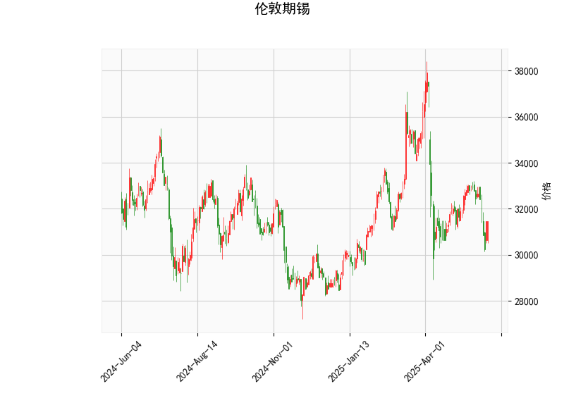

# 伦敦期锡技术分析结果详解

## 1. 对技术分析结果的分析
以下是对提供的伦敦期锡技术指标的详细解读，这些指标 collectively 反映了当前市场的技术面状况。整体来看，指标显示出市场可能处于弱势或超卖状态，但尚未出现明显的反转信号。

### 关键指标概述
- **当前价格 (Current Price)**: 31450.0  
  当前价格位于布林带的中下部区域（具体见下文），表明价格处于相对中性的位置，但较近期均值略低。这可能暗示短期内存在下行压力或潜在反弹机会。

- **RSI (Relative Strength Index)**: 44.22  
  RSI 是一个衡量价格动量超买/超卖的指标，通常在30-70区间内中性。当前RSI为44.22，接近30的超卖阈值，这表示市场可能已从近期过度卖出中恢复，但尚未进入超买状态。RSI的这一水平暗示价格可能有短期反弹潜力，尤其如果伴随其他指标的确认。

- **MACD (Moving Average Convergence Divergence)**:  
  - MACD线: -302.95  
  - Signal线: -157.59  
  - Histogram: -145.36  
  MACD是用于识别趋势变化的动量指标。当前MACD线低于Signal线，且整体值为负，这是一个典型的看跌信号，表明短期趋势可能偏向下行。Histogram的负值进一步强化了卖出压力，但其幅度相对稳定，暗示下行动能尚未显著加速。如果MACD线向上交叉Signal线，将是潜在的买入信号。

- **布林带 (Bollinger Bands)**:  
  - 上轨 (Upper Band): 37007.67  
  - 中轨 (Middle Band): 32950.6  
  - 下轨 (Lower Band): 28893.53  
  布林带用于衡量价格波动范围。当前价格（31450.0）位于中轨（32950.6）和下轨（28893.53）之间，接近中轨下方。这表明价格处于布林带的收缩或中性区域，波动性可能较低。如果价格进一步接近下轨，可能触发超卖反弹；反之，如果突破上轨，将是强势买入信号。目前的定位显示市场可能在积累动能，等待突破方向。

- **K线形态 (K线形态)**: Closing Marubozu  
  Closing Marubozu 是一种强势K线形态，通常表示价格以强势方式收盘，几乎没有上影线或下影线。如果是上升Closing Marubozu，暗示强势买盘；如果是下降形态，则表示强势卖盘。基于当前其他指标（如MACD的负值），这可能是一个下降形态，反映了近期卖方主导的市场。但需结合后续K线验证其持续性。

### 整体市场解读
从以上指标来看，伦敦期锡当前处于一个弱势但不极端的态势：RSI显示轻微超卖，MACD强调下行趋势，布林带暗示价格在相对低位徘徊，而K线形态可能强化了短期卖压。总体市场情绪偏向中性偏空，投资者需警惕进一步下行风险，但RSI的反弹迹象可能预示短期修正机会。如果外部因素（如全球经济数据或锡矿供应变化）介入，市场可能快速逆转。

## 2. 近期可能存在的投资或套利机会和策略
基于上述分析，以下是对近期投资或套利机会的判断。需强调，这些建议是基于技术面，仅供参考；实际决策应结合基本面、风险管理及市场流动性。伦敦期锡作为大宗商品，其机会往往与全球工业需求（如电子和建筑行业）相关。

### 可能存在的投资机会
- **短期反弹机会**:  
  RSI接近超卖水平（44.22），结合价格接近布林带下轨，这可能预示着价格反弹的潜在空间。例如，如果价格回升至中轨（32950.6）以上，投资者可考虑买入多头头寸，目标上看轨（37007.67）。这适合短期交易者，但需等待RSI升至50以上作为确认信号。

- **逢低布局机会**:  
  当前MACD负值表明下行趋势，但如果K线形态出现反转（如后续形成看涨形态），这可能是一个逢低买入的窗口。假设全球锡需求稳定，价格跌至下轨附近（28893.53）时，可视为低风险买入点，预期10-15%的反弹。

- **套利机会**:  
  由于伦敦期锡是全球市场的一部分，跨市场套利（如伦敦金属交易所与上海期货交易所的价差）可能存在。例如，如果伦敦期锡价格相对上海期货低估（当前价31450.0低于历史均值），投资者可通过正向套利（在伦敦买入、待价差收敛后卖出）获利。但需注意，当前指标偏空，可能导致价差扩大，因此逆势套利风险较高。

### 推荐投资策略
- **保守策略（适合风险厌恶者）**:  
  - **观察等待**: 监控RSI是否反弹至50以上，或MACD是否向上交叉Signal线。若出现，考虑小仓位买入多头，止损设在下轨（28893.53）下方。目标价位可设在中轨（32950.6）或上轨（37007.67）。  
  - **套利组合**: 如果伦敦期锡与相关商品（如铜或铝）的价差异常（如锡相对铜过低），可构建跨商品套利头寸，但需实时跟踪全球库存数据。

- **积极策略（适合经验丰富者）**:  
  - **趋势跟踪**: 基于MACD的看跌信号，短期内可布局空头头寸（卖出期货），目标下探至下轨。若价格反弹，快速止盈。  
  - **波段交易**: 利用布林带进行买卖。价格触及下轨时买入，触及上轨时卖出。同时结合K线形态，避免在下降Closing Marubozu后立即入场。  
  - **风险管理**: 所有策略均应设置止损（如5-10%的价格波动），并控制仓位不超过总资金的20%。此外，关注外部事件（如地缘政治或经济数据发布），这些可能放大或逆转技术信号。

### 风险与注意事项
- **市场风险**: 技术指标可能滞后于基本面变化，如锡矿供应中断或全球需求下降，可能加剧下行趋势。  
- **时机不确定性**: 当前指标未显示强烈反转信号，投资者应耐心等待确认（如RSI向上突破）。  
- **建议**: 结合多元数据（如经济指标和新闻）进行决策，并咨询专业顾问。总体而言，近期机会更多偏向短期交易而非长期持有。