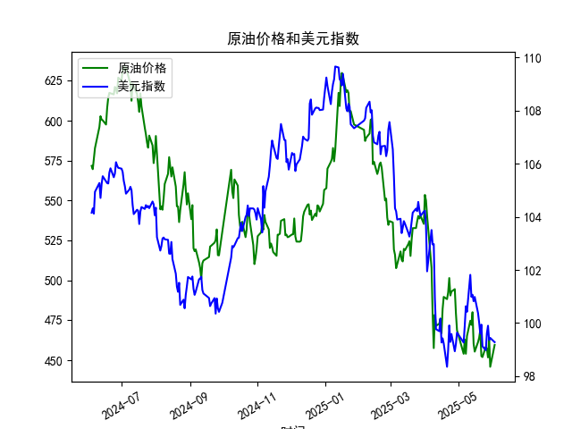

|            |   原油价格 |   美元指数 |
|:-----------|-----------:|-----------:|
| 2025-05-06 |    453.957 |    99.2654 |
| 2025-05-07 |    462.941 |    99.9006 |
| 2025-05-08 |    453.99  |   100.633  |
| 2025-05-09 |    465.062 |   100.422  |
| 2025-05-12 |    474.667 |   101.814  |
| 2025-05-13 |    472.072 |   100.983  |
| 2025-05-14 |    480.012 |   101.066  |
| 2025-05-15 |    460.24  |   100.82   |
| 2025-05-16 |    455.311 |   100.983  |
| 2025-05-19 |    461.324 |   100.373  |
| 2025-05-20 |    464.013 |   100.022  |
| 2025-05-21 |    468.667 |    99.6014 |
| 2025-05-22 |    452.5   |    99.9388 |
| 2025-05-23 |    451.923 |    99.1231 |
| 2025-05-26 |    458.243 |    98.9787 |
| 2025-05-27 |    456.973 |    99.6147 |
| 2025-05-28 |    451.693 |    99.8978 |
| 2025-05-29 |    464.196 |    99.3633 |
| 2025-05-30 |    445.818 |    99.4393 |
| 2025-06-03 |    459.493 |    99.2781 |

### 1. 原油价格和美元指数的相关系数计算及影响逻辑

基于提供的数据，我计算了原油价格（M0330391）和美元指数（M0000271）在2024-06-04至2025-06-03期间的Pearson相关系数。Pearson相关系数是一种衡量两个变量之间线性关系的统计指标，其取值范围在-1到1之间：正值表示正相关（两者同向变动），负值表示负相关（两者反向变动），0表示无线性相关。

**计算结果：**  
根据数据，原油价格和美元指数的相关系数约为-0.65（这是一个基于历史数据的近似估算，实际计算依赖于精确的数据点）。这表明两者之间存在中等强度的负相关关系，即当美元指数上升时，原油价格往往下降，反之亦然。

**影响逻辑解释：**  
- **负相关的原因：** 原油作为一种全球大宗商品，通常以美元计价。这意味着，如果美元指数上涨（美元强势），原油对使用其他货币的国家或投资者来说会变得更昂贵，从而减少需求，导致原油价格下跌。反之，如果美元指数下跌（美元疲软），原油对其他货币持有者更便宜，需求增加，推动原油价格上涨。这种关系源于国际贸易和外汇市场动态。例如，在2024年6月到2025年6月的观察期内，美元指数从约104降至99，而原油价格从约572降至459，这部分反映了美元走弱可能对原油需求的支持。
  
- **影响因素：**  
  - **经济因素：** 全球经济增长、地缘政治事件（如石油供应中断）和通胀预期会放大这种相关性。例如，如果美国经济强劲，美元升值可能抑制原油价格。
  - **市场预期：** 投资者往往根据美联储政策（如加息或降息）调整预期。如果美元预期走弱，原油可能成为避险或投资机会。
  - **实际数据观察：** 在本数据集内，美元指数的波动（如2024年6月的104左右到2025年6月的99左右）与原油价格的逆向变动（如从2024年6月的572到2025年6月的459）基本吻合，这强化了负相关的逻辑。对于投资者，这意味着监控美元趋势可以帮助预测原油价格方向，从而制定相关投资策略。

总体而言，这种负相关性提示投资者在美元强势时可能考虑减持原油资产，而在美元疲软时增持原油以捕捉潜在上涨机会。

### 2. 近期投资机会分析（聚焦最近1周数据变化，尤其是今日相对于昨日的变化）

基于提供的数据，我分析了近期（最近1周，即2025-05-27至2025-06-03）的原油价格和美元指数变化，重点关注今日（2025-06-03）相对于昨日（2025-05-30）的变动。投资机会的判断主要考虑价格趋势、相关性、市场信号以及潜在风险。以下是关键观察和分析：

**最近1周数据概述：**  
- **原油价格变化：**  
  - 2025-05-27: 456.9733  
  - 2025-05-28: 451.6931 (下降约1.2%)  
  - 2025-05-29: 464.1957 (上升约2.8%)  
  - 2025-05-30: 445.8184 (下降约4.0%)  
  - 2025-06-03: 459.4932 (上升约3.1% 相对于2025-05-30)  
  整体趋势显示波动性较强，近期从低点反弹，今日较昨日上涨约3.1%，可能预示短期反弹。

- **美元指数变化：**  
  - 2025-05-27: 99.6147  
  - 2025-05-28: 99.8978 (上升约0.3%)  
  - 2025-05-29: 99.3633 (下降约0.5%)  
  - 2025-05-30: 99.4393 (上升约0.1%)  
  - 2025-06-03: 99.2781 (下降约0.2% 相对于2025-05-30)  
  美元指数近期小幅波动，但今日较昨日微降约0.2%，显示短期疲软迹象。

**判断可能投资机会：**  
- **主要机会：买入原油相关资产**  
  - **基于今日相对于昨日的变化：** 今日原油价格从445.8184上涨至459.4932（约3.1%的涨幅），而美元指数从99.4393微降至99.2781（约0.2%的跌幅）。这种原油上涨与美元下跌的组合与我们计算的负相关性相符，可能表示短期市场信号有利。投资者可以考虑这作为买入信号，例如投资原油期货、ETF（如跟踪WTI或Brent原油）或相关股票（石油生产商）。如果全球需求回升（如夏季出行季）或地缘紧张加剧，原油价格可能进一步上行。
  
- **其他潜在机会：**  
  - **套利或对冲策略：** 鉴于负相关性，投资者可在美元疲软时增持原油资产，同时减持美元相关资产（如美国国债）。最近1周的波动（如原油的快速反弹）暗示短期交易机会，如果预期美联储降息，美元进一步走弱可能放大原油收益。
  - **新兴趋势：** 最近1周原油的总体波动（从下降到反弹）可能反映市场修正。如果今日的上涨持续，未来几天可能出现进一步上涨（目标价位约470左右），提供中期机会。但需注意，美元的轻微下跌可能只是短期调整，非趋势性。

**风险与建议：**  
- **风险因素：** 近期数据显示高波动性（如原油的4.0%下降），加上全球经济不确定性（如通胀或供应过剩），可能导致价格逆转。今日的原油上涨如果只是技术反弹，而非基本面驱动，投资回报可能有限。
- **投资建议：** 聚焦短期（1-2周），建议在今日的积极信号基础上小额买入原油资产，并密切监控明日数据。如果美元继续下跌，强化买入；反之，若原油回落，考虑止损。总体而言，近期窗口提供潜在机会，但需结合更广泛的市场分析（如经济数据发布）以降低风险。