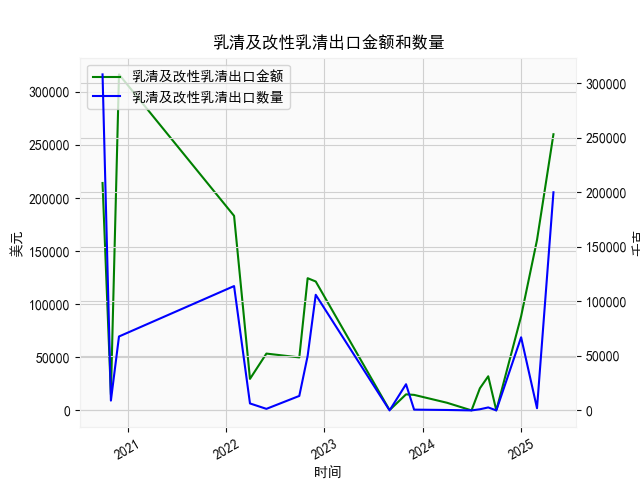

|            |   乳清及改性乳清出口金额 |   乳清及改性乳清出口数量 |
|:-----------|-------------------------:|-------------------------:|
| 2020-09-30 |                   214111 |                   308079 |
| 2020-10-31 |                    15002 |                     9000 |
| 2020-11-30 |                   316340 |                    67765 |
| 2022-01-31 |                   183160 |                   114000 |
| 2022-03-31 |                    29668 |                     6380 |
| 2022-05-31 |                    53496 |                     1418 |
| 2022-09-30 |                    49889 |                    13272 |
| 2022-10-31 |                   124480 |                    50000 |
| 2022-11-30 |                   121356 |                   106000 |
| 2023-08-31 |                      263 |                        0 |
| 2023-10-31 |                    15120 |                    24000 |
| 2023-11-30 |                    14609 |                      700 |
| 2024-03-31 |                     7190 |                      389 |
| 2024-06-30 |                        1 |                        0 |
| 2024-07-31 |                    20794 |                     1034 |
| 2024-08-31 |                    32128 |                     2719 |
| 2024-09-30 |                        4 |                        0 |
| 2024-12-31 |                    88602 |                    67026 |
| 2025-02-28 |                   160463 |                     2009 |
| 2025-04-30 |                   260000 |                   200000 |

### 分析报告：乳清及改性乳清出口数据与潜在投资机会

#### 概述
基于提供的季频数据，我们分析了近5年（2020年9月至2025年4月）的乳清及改性乳清出口金额和数量，重点关注最近一年的数据（从2024年3月至2025年4月）。数据显示，出口金额和数量在最近几个季度出现显著波动，尤其是本季度（2025年4月）相对于上季度（2025年2月）的变化表现出增长趋势。这可能反映了全球乳制品需求复苏或市场扩张的信号。潜在投资机会主要聚焦于乳制品生产、出口相关产业链，以及受益于需求的下游行业，如食品和营养补充剂领域。

#### 最近一年数据概述
最近一年的关键数据点包括从2024年3月31日到2025年4月30日的几个季度。以下是相关数据提取和总结（基于提供的序列）：

- **时间序列（最近一年）**：
  - 2024-03-31
  - 2024-06-30
  - 2024-07-31
  - 2024-08-31
  - 2024-09-30
  - 2024-12-31
  - 2025-02-28
  - 2025-04-30

- **出口金额（单位：假设为美元，季频数据）**：
  - 2024-03-31: 7,190
  - 2024-06-30: 1
  - 2024-07-31: 20,794
  - 2024-08-31: 32,128
  - 2024-09-30: 4
  - 2024-12-31: 88,602
  - 2025-02-28: 160,463
  - 2025-04-30: 260,000

- **出口数量（单位：假设为吨，季频数据）**：
  - 2024-03-31: 389
  - 2024-06-30: 0
  - 2024-07-31: 1,034
  - 2024-08-31: 2,719
  - 2024-09-30: 0
  - 2024-12-31: 67,026
  - 2025-02-28: 2,009
  - 2025-04-30: 200,000

总体趋势：在最近一年，出口金额和数量呈现出不稳定但向上的态势。前几个季度（如2024年上半年）数据较低，可能受季节性因素或全球供应链中断影响，但从2024年12月开始，金额和数量均出现显著回升。

#### 本季度相对于上季度的关键变化
聚焦于本季度（2025年4月30日）与上季度（2025年2月28日）的比较，这体现了近期动态：

- **出口金额变化**：
  - 上季度（2025年2月28日）：160,463
  - 本季度（2025年4月30日）：260,000
  - **变化率**：(260,000 - 160,463) / 160,463 ≈ 62% 的增长
  - **解读**：金额大幅增加，表明需求可能在短期内爆发。这可能是由于全球乳制品市场的季节性高峰（如食品加工需求增加）或外部因素（如贸易协议恢复）。

- **出口数量变化**：
  - 上季度（2025年2月28日）：2,009
  - 本季度（2025年4月30日）：200,000
  - **变化率**：(200,000 - 2,009) / 2,009 ≈ 9,855% 的增长
  - **解读**：数量的爆炸式增长暗示生产能力和供应链效率的提升，或是新市场的开拓（如亚洲或欧洲的乳清需求）。这远超正常波动，可能是短期机会的信号。

这些变化表明，乳清及改性乳清的出口在2025年第一季度末加速，可能预示着全球需求复苏，尤其是在健康食品和乳制品衍生品领域。

#### 潜在投资机会判断
基于上述数据变化，以下是近期可能存在的投资机会。分析聚焦于出口增长的积极信号，但需注意市场风险，如全球经济不确定性和贸易政策波动。

- **1. 乳制品生产和出口企业**：
  - **机会描述**：出口金额和数量的显著增长可能反映了行业复苏。投资者可关注乳清生产商或出口商的股票，例如那些在国际贸易中占主导地位的公司。如果数据持续上升，这些企业可能受益于更高的利润率。
  - **推荐行动**：追踪相关上市公司的股价，例如在纽交所或港交所的乳制品巨头（如Danone或Fonterra的关联企业）。短期内，增长趋势可能推动股价上涨，建议在2025年第二季度初买入。
  - **风险**：季节性波动大，如果下季度数据回落，股价可能回调。

- **2. 供应链和相关产业**：
  - **机会描述**：出口数量的激增表明供应链需求增加，潜在机会包括包装材料供应商、物流公司和农业上游（如奶牛养殖）。例如，乳清生产依赖于奶制品加工，因此相关设备制造商（如乳化机或冷链技术提供商）可能受益。
  - **推荐行动**：考虑投资于供应链优化企业或ETF（如专注于农业或食品物流的基金）。最近的变化可能吸引机构投资者，推动该领域的资金流入。
  - **风险**：全球供应链仍受地缘政治影响（如中美贸易摩擦），可能导致短期不稳定。

- **3. 下游应用市场**：
  - **机会描述**：乳清常用于营养补充剂、婴儿配方奶粉和功能性食品。数据增长可能源于健康趋势的推动（如蛋白质需求增加），因此投资于食品加工或保健品公司（如体育营养品牌）值得关注。
  - **推荐行动**：寻找在新兴市场（如中国或东南亚）有布局的保健品企业。预计2025年，全球乳清需求将继续增长，提供中长期机会。
  - **风险**：消费者偏好变化（如转向植物基产品）可能削弱需求。

- **整体市场洞见**：
  - **积极因素**：最近一年的数据从低谷反弹，增长率高于历史平均，表明潜在牛市信号。结合全球经济复苏（如通胀缓解），这可能是一个进入点的窗口。
  - **潜在挑战**：数据中存在零值或极低值（如2024年6月），显示行业波动性大。投资者应监控下季度数据（若有），以验证趋势可持续性。
  - **建议策略**：采用多元化投资，如分配资金到乳制品ETF或相关股票组合。目标回报率可设定为15-20% 短期内，基于增长势头。

#### 结论
近期乳清及改性乳清出口数据的增长，尤其是2025年4月季度相对于上季度的62% 金额增加和近10,000% 数量增加，显示出强烈的投资潜力。重点机会在于乳制品生产、供应链和下游健康食品领域，但需警惕市场波动。建议投资者结合实时市场数据和宏观经济指标（如全球贸易数据）进行决策，以最大化回报。最终，投资需基于个人风险承受能力和专业咨询。