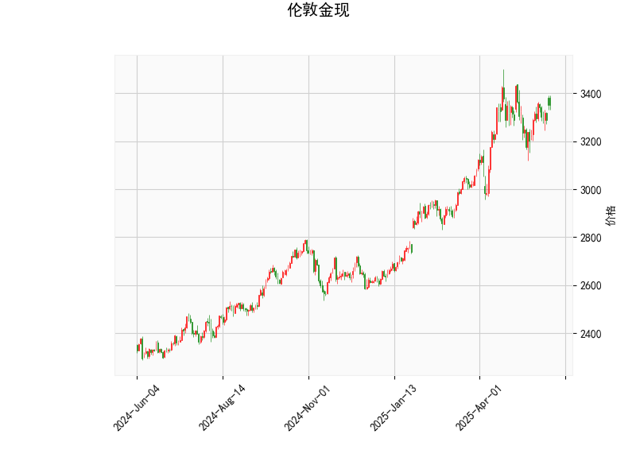

# 伦敦金现的技术分析结果分析

## 1. 对技术分析结果的详细解读
伦敦金现的技术指标显示出一种温和的看涨信号，但整体市场仍处于相对稳定的状态。以下是对各指标的逐一分析：

- **当前价格（3352.885）**：价格位于布林带的中游区域，具体在中间带（3211.93）之上但远低于上轨（3481.22）。这表明黄金价格目前处于一个相对健康的上行通道内，没有出现明显的超买或超卖情况，暗示潜在的波动性但不排除进一步上涨的可能性。

- **RSI（56.71）**：相对强弱指数（RSI）处于中性水平（50-70区间），这反映出市场买方力量略占上风，但尚未进入超买区域（RSI > 70）。这是一个积极信号，表明短期内可能继续积累多头动能，而非快速逆转。

- **MACD指标**：
  - MACD线（26.12）高于信号线（25.68），且直方图（MACD Hist：0.44）为正值。这显示出短期多头趋势正在加强，价格可能有向上突破的潜力。然而，直方图值较小，表明看涨势头还不是特别强劲，需要进一步确认。

- **布林带指标**：
  - 上轨（3481.22）、中轨（3211.93）和下轨（2942.65）构成了价格的波动区间。目前价格接近中轨上方，这通常表示市场处于正常波动中。如果价格向上逼近上轨，可能预示着强势上涨；反之，若跌破中轨，则需警惕下行风险。

- **K线形态（CDLMATCHINGLOW）**：这是一种经典的看涨逆转模式，通常出现在价格底部，表明卖方力量耗尽后可能出现反弹。结合其他指标，这强化了短期看涨的观点，但需注意这只是一个信号，而不是确定性趋势。

总体而言，这些指标共同描绘出一幅谨慎乐观的图景。黄金市场目前显示出潜在的上行压力，但缺乏强烈的超买信号，建议投资者关注后续价格行为以确认趋势。

## 2. 近期可能存在的投资或套利机会及策略分析
基于上述技术分析，伦敦金现短期内可能存在一些投资机会，特别是针对多头策略。但黄金市场受全球经济、地缘政治和货币政策影响较大，因此风险不可忽视。以下是对潜在机会和策略的判断：

### 潜在投资机会
- **多头投资机会**：RSI和MACD的看涨信号，加上K线形态的逆转迹象，暗示黄金价格可能在短期内向上测试布林上轨（3481.22）。如果全球经济不确定性增加（如通胀上升或地缘紧张），黄金作为避险资产的需求可能进一步提升，提供买入机会。
- **套利机会**：黄金现货与期货或ETF（如SPDR Gold Shares）之间可能存在价差套利。如果现货价格相对期货偏低，投资者可以通过现货多头+期货空头组合来捕捉价差收敛。但需注意，当前指标未显示明显套利窗口，更多依赖市场波动。
- **风险点**：如果RSI升至70以上或MACD直方图转为负值，市场可能进入回调阶段，投资者需警惕快速下跌。

### 推荐投资策略
- **买入策略**： 
  - **时机**：等待价格突破布林中轨上方（当前已接近），并结合MACD直方图持续为正时入场。目标位可设在布林上轨（3481.22）附近。
  - **工具**：使用伦敦金现货或相关ETF进行小额多头投资，以捕捉短期反弹。
  
- **风险管理策略**：
  - **止损设置**：将止损位置于布林下轨（2942.65）附近，以控制潜在损失。
  - **分批建仓**：避免一次性大额买入，可分批进场（如当价格升至3300以上时逐步加仓），降低波动风险。
  - **结合基本面**：技术分析应辅以基本面监控，例如美联储利率决策或全球黄金需求数据，以增强决策准确性。

- **套利策略建议**：
  - 如果发现现货与期货价差扩大（例如，现货低于期货10%以上），可尝试跨市场套利：买入现货并卖出期货头寸。但当前数据未显示显著价差，建议仅在高流动性市场（如COMEX期货）中操作。
  - **整体建议**：对于保守投资者，优先选择多头策略；对于经验丰富的投资者，可探索套利，但需使用杠杆工具时严格控制风险。

总之，近期伦敦金现的投资环境偏向乐观，但并非高确定性。投资者应结合个人风险偏好、市场新闻和资金管理原则，避免盲目操作。定期复盘技术指标变化，以及时调整策略。