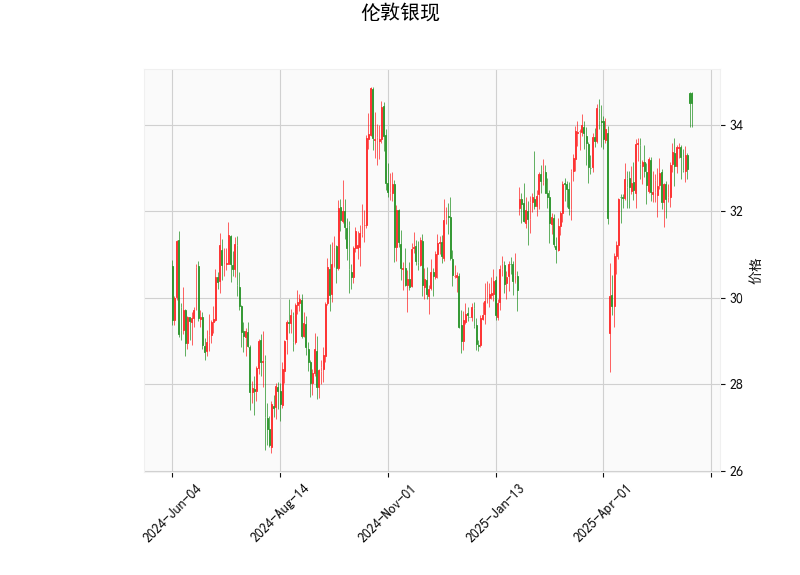

### 伦敦银现技术分析结果解读

#### 1. 对技术指标的详细分析
基于提供的伦敦银现（XAG/USD）技术分析数据，我们可以从多个角度解读当前的市场状况。以下是对各指标的逐一分析：

- **当前价格（34.497）**：  
  当前价格位于34.497美元，处于布林带的上部区域（Upper Band为34.849）。这表明银价近期可能处于强势上涨阶段，但也接近潜在的阻力位。如果价格继续上行，可能测试Upper Band；反之，如果出现回调，价格可能回落至中轨（Middle Band，32.958）附近。

- **RSI（63.33）**：  
  RSI（相对强弱指数）衡量市场的超买或超卖状态，目前值为63.33，处于中性偏上区域（RSI高于70通常被视为超买）。这暗示市场有一定的买入动能，但已接近超买边缘，短期内可能面临修正风险。例如，如果RSI进一步上升，可能引发获利了结；反之，如果RSI回落至50以下，则可能预示新的买入机会。

- **MACD指标（MACD线：0.324，Signal线：0.177，Histogram：0.147）**：  
  MACD指标显示正向信号，MACD线高于Signal线，且Histogram值为正（0.147），这通常表示短期移动平均线向上穿越长期移动平均线，预示着看涨趋势。整体来看，MACD的这一形态支持多头（买入）主导，但Histogram的正值相对较小，表明上涨动能可能正在减弱。如果MACD线与Signal线发生死叉（MACD线下穿Signal线），则可能转为看跌信号。

- **布林带（Upper Band：34.849，Middle Band：32.958，Lower Band：31.066）**：  
  布林带反映了价格的波动范围，目前价格（34.497）接近Upper Band，表明市场波动性较高且可能处于上行通道的上限。Middle Band（32.958）作为20期移动平均线的近似值，充当中性支撑位。如果价格回落至Middle Band附近，可能出现支撑；反之，如果突破Upper Band，则可能延续上涨趋势。但整体布林带扩张（Upper和Lower之间的距离较大），提示市场不确定性增加，投资者需警惕潜在的反转。

- **K线形态（CDLMATCHINGLOW）**：  
  CDLMATCHINGLOW模式表示两个连续的K线（蜡烛）在低点附近形成匹配，这通常被视为看涨信号，暗示市场可能已触及短期底部并准备反弹。该形态常出现于下跌趋势末期，结合当前其他指标（如MACD的正向信号），它强化了潜在的上行机会。但需注意，这是一个短期信号，如果后续K线出现负面形态（如下降吞没），则可能失效。

总体而言，这些指标显示伦敦银现当前处于一个**温和看涨趋势**中。RSI和布林带的上行位置提示潜在超买风险，而MACD和K线形态则提供买入支撑。市场可能正处于关键转折点，需密切关注后续价格行为。

#### 2. 近期可能的投资或套利机会及策略分析
基于上述技术分析，伦敦银现短期内存在一定的投资机会，但也伴随回调风险。以下是对潜在机会的判断及相应策略建议：

- **投资机会判断**：  
  **看涨机会主导**：MACD的正向信号和CDLMATCHINGLOW形态表明，银价可能在短期内继续上行，尤其如果全球经济数据（如通胀或地缘政治事件）利好贵金属。当前价格接近布林带上沿，RSI未进入超买区，暗示仍有上行空间（例如向35美元附近测试）。然而，RSI的63.33值和价格逼近Upper Band增加了回调可能性，因此机会更适合短期交易者，而非长期持有者。  
  **套利机会潜在**：银现货市场常与期货、期权或其他贵金属（如黄金）相关联。当前的技术指标显示波动性较高，可能存在跨市场套利机会，例如如果银现货价格与期货价格出现偏差（如由于流动性差异），投资者可通过现货买入和期货卖出锁定价差。但需注意，基于单一现货数据，套利机会较难量化；更适合在低波动期（如价格回落至Middle Band）操作。

- **投资策略建议**：  
  - **买入（Long）策略**：  
    如果RSI回落至55-60区间（当前63.33），可考虑在价格回调至Middle Band（32.958）附近买入，目标设在Upper Band（34.849）以上。结合MACD信号，当Histogram扩大（>0.2）时加强买入信心。风险控制：设置止损在Lower Band（31.066）下方，以防范突发下跌。  
    *适用场景*：适合乐观型投资者，在全球需求（如工业或饰品）上升时执行。  

  - **卖出（Short）策略**：  
    如果RSI突破70（当前已接近），或价格触及Upper Band（34.849）但未突破，可考虑短线卖出，目标回落至Middle Band。MACD若出现死叉信号，则强化卖出时机。  
    *适用场景*：适合风险厌恶者，在市场超买或经济数据疲软时操作。  

  - **区间交易策略**：  
    利用布林带的波动范围进行高抛低吸：在Lower Band（31.066）附近买入，在Upper Band（34.849）附近卖出。这种策略可捕捉短期波动，但需监控K线形态变化（如若CDLMATCHINGLOW失败，转为区间震荡）。  
    *适用场景*：市场无明显趋势时，适合经验丰富的交易者。  

  - **套利策略**：  
    如果发现银现货与相关资产（如COMEX银期货）价格偏差，可进行现货-期货套利（例如，现货买入+期货卖出）。当前的技术指标显示潜在波动性，可在RSI中性（50-60）时入场，以锁定价差收益。风险：汇率波动（如美元 strengthening）可能放大损失，因此结合基本面分析（如美联储政策）是关键。  
    *适用场景*：专业机构投资者，在低利率环境下执行。  

**总体风险提醒**：  
投资伦敦银现需关注外部因素，如地缘政治事件、通胀数据或美元走势，这些可能放大技术信号的不确定性。建议结合基本面分析，控制仓位（不超过总资金的10-20%），并使用技术工具（如移动止损）管理风险。短期内，机会大于风险，但需警惕RSI超买引发的回调。