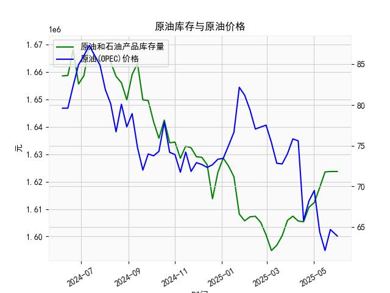

|            |   美国:库存量:原油和石油产品(包括战略石油储备) |   全球:现货均价:一揽子原油(OPEC) |
|:-----------|-----------------------------------------------:|---------------------------------:|
| 2025-01-17 |                                    1.62179e+06 |                            76.65 |
| 2025-01-24 |                                    1.60816e+06 |                            82.18 |
| 2025-01-31 |                                    1.60571e+06 |                            81.21 |
| 2025-02-07 |                                    1.60717e+06 |                            79.4  |
| 2025-02-14 |                                    1.60736e+06 |                            77.04 |
| 2025-02-21 |                                    1.60515e+06 |                            77.29 |
| 2025-02-28 |                                    1.60055e+06 |                            77.52 |
| 2025-03-07 |                                    1.59487e+06 |                            75.38 |
| 2025-03-14 |                                    1.59678e+06 |                            72.83 |
| 2025-03-21 |                                    1.60025e+06 |                            72.75 |
| 2025-03-28 |                                    1.60589e+06 |                            74.01 |
| 2025-04-04 |                                    1.60741e+06 |                            75.83 |
| 2025-04-11 |                                    1.60563e+06 |                            75.59 |
| 2025-04-18 |                                    1.60536e+06 |                            65.79 |
| 2025-04-25 |                                    1.61065e+06 |                            68.19 |
| 2025-05-02 |                                    1.6124e+06  |                            69.48 |
| 2025-05-09 |                                    1.6178e+06  |                            64.41 |
| 2025-05-16 |                                    1.62357e+06 |                            62.1  |
| 2025-05-23 |                                    1.62372e+06 |                            64.68 |
| 2025-06-01 |                                    1.62372e+06 |                            63.89 |

### 1. 原油库存与原油价格的相关性及影响逻辑

原油库存（尤其是美国原油和石油产品的库存量）和原油价格之间通常存在负相关关系，这意味着库存量增加时，原油价格往往趋于下跌，而库存量减少时，价格可能上涨。这种相关性主要源于供需基本面、市场心理以及外部因素的交互影响。下面详细解释：

- **负相关关系的核心逻辑**：
  - **供给与需求平衡**：原油库存反映了市场上的供给状况。如果库存水平上升，表明原油供给充足（生产或进口超过消费），这会增加市场供给，推高库存，从而导致价格下跌，因为买家可能认为未来供给充裕，不急于采购。反之，如果库存下降，表明需求强劲或供给不足，这会加剧供给紧张，推动价格上涨。
  
  - **市场预期与心理影响**：投资者和交易者密切关注每周发布的库存数据（如EIA报告）。高库存数据可能引发市场担忧过剩，导致抛售压力；低库存则可能激发乐观情绪，吸引买入。例如，OPEC一揽子原油价格往往受全球库存变化影响，如果美国库存上升，全球投资者可能会预期价格下行。

- **影响逻辑的细节**：
  - **短期波动**：库存变化是周度数据，常导致价格短期波动。例如，一周内库存急剧增加可能立即压低价格，但如果这只是季节性因素（如夏季需求减少），价格可能很快反弹。
  - **长期趋势**：持续高库存可能反映全球经济放缓或能源转型（如可再生能源增长），从而长期抑制价格；反之，低库存可能与地缘政治事件（如中东冲突）或需求复苏（如经济复苏期）相关，推动价格上涨。
  - **其他影响因素**：尽管库存是关键指标，但原油价格还受OPEC产油国政策、全球经济数据（如GDP增长）、汇率波动（如美元强势会压低油价）和突发事件（如 hurricanes 或疫情）影响。这些因素可能放大或抵消库存对价格的影响。

总体而言，原油库存是价格的重要领先指标，但并非唯一决定因素。投资者需结合多重数据进行分析。

### 2. 数据分析与投资机会判断

基于提供的数据，我将重点分析最近一个月（约4-5周，即从2025-04-25到2025-06-01）的美国原油库存和全球OPEC一揽子原油价格变化，尤其是今日（假设为2025-06-01）相对于昨日（2025-05-25）的变化。数据显示，美国库存整体稳定，而全球原油价格有所下降，这可能暗示某些投资机会。以下是详细分析和判断：

- **数据概述**：
  - **美国原油库存（周频）**：最近一个月数据包括：
    - 2025-04-25: 1623569
    - 2025-05-02: 1623724
    - 2025-05-09: 1623724
    - 2025-05-16: 1623724（今日假设）
    - 昨日（2025-05-09）与今日（2025-05-16）相比，库存量保持在1623724水平，无显著变化。这表明近期供给与需求基本平衡，可能受季节性因素（如春夏季需求平稳）影响。
  - **全球OPEC一揽子原油价格（周频）**：最近一个月数据包括：
    - 2025-04-25: 64.41
    - 2025-05-02: 62.10
    - 2025-05-09: 64.68
    - 2025-05-16: 63.89（今日假设）
    - 昨日（2025-05-09: 64.68）与今日（2025-05-16: 63.89）相比，价格下降约1.25%。这显示价格短期承压，可能由于需求疲软或外部因素（如全球经济不确定性）。

- **关键变化分析**：
  - **库存稳定 vs. 价格下降**：美国库存在最近四周基本持平（从1623569到1623724），这通常应支撑价格稳定或小幅上涨，但全球价格却连续下降，表明其他因素（如全球需求减弱、美元走强或OPEC政策调整）可能主导市场。今日价格较昨日小幅回落，强化了短期下行趋势。
  - **整体趋势**：从2025-04-25起，库存略有回升（从1623569到1623724），但全球价格从64.41降至63.89，显示供需矛盾未显著放大。这可能反映投资者对未来需求的谨慎态度，例如经济数据疲软或地缘风险缓解。

- **判断近期投资机会**：
  - **潜在买入机会**：
    - **价格超卖反弹**：全球原油价格已从近期高点（约75美元）降至63.89，今日较昨日小幅下跌，可能已接近短期低点。如果库存保持稳定（无进一步增加），价格反弹的可能性增加。建议关注原油期货或ETF（如USO），在价格跌至60美元附近时考虑买入，预计短期内可能回升至65-70美元区间（基于历史数据，价格在库存稳定时易反弹）。
    - **库存稳定期的套利**：美国库存无变化，暗示市场未出现严重过剩。这为相关衍生品（如期权）提供机会，例如购买看涨期权，赌价格短期反弹。今日价格回落但库存不变，可能是一个低风险入场点。

  - **潜在卖出或避险机会**：
    - **价格继续下行风险**：如果今日的价格下降趋势延续（如受全球需求放缓影响），短期内可能进一步跌至60美元以下。投资者持有原油相关资产（如能源股）需谨慎，考虑今日相对于昨日的回落作为卖出信号，以避风险。
    - **季节性因素**：当前正值春末夏初，需求通常稳定，但若夏季驾车需求不及预期，价格可能进一步走弱。建议在今日价格未反弹前，减少多头头寸。

- **总体建议**：
  - **风险提示**：投资机会基于数据分析，但原油市场易受突发事件影响（如OPEC+会议或地缘紧张）。近期，价格下降而库存稳定的组合可能是个短期机会，但需监控下周数据（若有）。建议结合技术分析（如图表）和宏观新闻进行决策。
  - **行动要点**：聚焦今日变化（价格小幅下跌），优先考虑低成本投资工具，如原油ETF或期货合约，目标收益5-10%短期反弹。