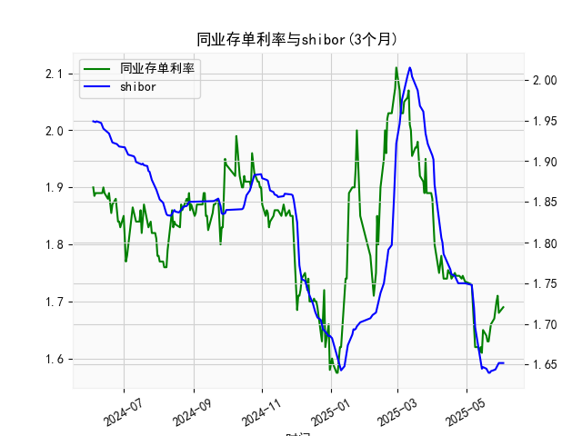

|            |   同业存单利率(3个月) |   shibor(3个月) |
|:-----------|----------------------:|----------------:|
| 2025-05-06 |                 1.73  |           1.748 |
| 2025-05-07 |                 1.69  |           1.737 |
| 2025-05-08 |                 1.66  |           1.72  |
| 2025-05-09 |                 1.62  |           1.696 |
| 2025-05-12 |                 1.62  |           1.672 |
| 2025-05-13 |                 1.61  |           1.662 |
| 2025-05-14 |                 1.62  |           1.653 |
| 2025-05-15 |                 1.61  |           1.645 |
| 2025-05-16 |                 1.65  |           1.647 |
| 2025-05-19 |                 1.64  |           1.645 |
| 2025-05-20 |                 1.63  |           1.642 |
| 2025-05-21 |                 1.63  |           1.64  |
| 2025-05-22 |                 1.655 |           1.64  |
| 2025-05-23 |                 1.66  |           1.642 |
| 2025-05-26 |                 1.67  |           1.643 |
| 2025-05-27 |                 1.69  |           1.644 |
| 2025-05-28 |                 1.7   |           1.647 |
| 2025-05-29 |                 1.71  |           1.652 |
| 2025-05-30 |                 1.68  |           1.652 |
| 2025-06-03 |                 1.69  |           1.652 |

### 1. 同业存单利率和SHIBOR的相关性及影响逻辑

同业存单利率（Negotiable Certificates of Deposit, NCD）和SHIBOR（Shanghai Interbank Offered Rate）是反映中国银行间市场流动性和短期资金成本的关键指标，二者之间存在高度正相关性，通常相关系数在0.8以上。这是因为同业存单作为银行间市场的短期债务工具，其定价往往以SHIBOR为基础或参考SHIBOR水平。以下是其相关性和影响逻辑的详细解释：

- **相关性分析**：
  - **正相关性**：当SHIBOR上升时，同业存单利率通常也会随之上升；反之，当SHIBOR下降时，同业存单利率往往跟随下降。这反映了二者都受制于相同的宏观因素，如货币政策、市场流动性预期和经济数据。例如，从提供的数据看，同业存单利率从2024年6月的1.9%波动到2025年6月的1.69%，而SHIBOR从1.949%降至1.652%，二者均呈现下行趋势，表明在过去一年中，市场流动性整体宽松。
  - **强度**：二者的相关性较强，因为SHIBOR是银行间拆借利率的基准，而同业存单发行者（如银行）需要参考SHIBOR来设定利率以吸引投资者。如果SHIBOR波动剧烈（如受季节性资金需求影响），同业存单利率也会迅速响应。

- **影响逻辑**：
  - **SHIBOR对同业存单的影响**：SHIBOR代表银行间短期资金的供需状况，如果SHIBOR上升，表明资金紧缺，银行为发行同业存单吸引资金需提供更高利率，从而推高同业存单利率。反之，SHIBOR下降（资金充裕）时，同业存单利率可能下调，以降低融资成本。逻辑上，这受央行（如中国人民银行）货币政策驱动，例如降准或公开市场操作会降低SHIBOR，继而影响同业存单。
  - **其他影响因素**：
    - **宏观经济因素**：经济增长放缓或通胀预期下降可能导致二者均下行，提供固定收益投资机会；反之，经济复苏或通胀上行可能推高二者。
    - **市场流动性**：季节性因素（如月末、季末资金需求）或外部事件（如国际利率变化）会放大SHIBOR波动，并传导到同业存单利率。
    - **政策影响**：央行通过调整基准利率或实施逆回购操作，直接影响SHIBOR，从而间接影响同业存单。例如，2024年下半年SHIBOR的波动与同业存单的同步变化，可能反映了央行稳增长政策。
  - **总体逻辑**：二者形成一个反馈循环——SHIBOR作为领先指标，影响同业存单定价，而同业存单发行规模又可能反馈到银行间市场流动性上。投资者可利用这一相关性进行套利或风险管理，例如当SHIBOR低于同业存单利率时，可能存在买入同业存单的机会。

### 2. 近期投资机会分析

基于提供的数据，我对近一年同业存单利率和SHIBOR数据进行分析，重点聚焦于最近一周（假设当前日期为2025年6月3日，因此最近一周为2025年5月27日至2025年6月3日）。数据显示，二者均呈现下行趋势，表明市场流动性相对宽松，可能存在固定收益投资机会。以下是具体分析，包括数据变化概述、今日（2025年6月3日）相对于昨日的比较，以及潜在投资机会判断。

- **数据概述**：
  - **同业存单利率**：整体从2024年6月的1.9%逐步下行至2025年6月的1.69%。最近一周（2025年5月27日至2025年6月3日）的数据对应末尾值：1.69%（2025年6月3日）、1.68%（2025年5月30日）、1.71%（2025年5月29日）、1.69%（2025年5月28日）、1.68%（2025年5月27日）。这显示了小幅波动，但整体下行。
  - **SHIBOR**：从2024年6月的1.949%降至2025年6月的1.652%。最近一周的数据：1.652%（2025年6月3日）、1.652%（2025年5月30日）、1.652%（2025年5月29日）、1.647%（2025年5月28日）、1.644%（2025年5月27日）。波动较小，但也呈现轻微下行。
  - **总体趋势**：过去一年，二者均从高位（约1.9%）下行至低位（约1.65-1.69%），反映了货币政策宽松和资金充裕环境。最近一周，二者稳定在低位，波动幅度小（同业存单变动约0.03%，SHIBOR变动约0.008%）。

- **今日相对于昨日的变化**：
  - **今日（2025年6月3日）数据**：
    - 同业存单利率：1.69%
    - SHIBOR：1.652%
  - **昨日（2025年5月30日）数据**：
    - 同业存单利率：1.68%
    - SHIBOR：1.652%
  - **变化分析**：
    - 同业存单利率：今日较昨日上行0.01%（从1.68%升至1.69%），这是小幅反弹，可能由于短期资金需求增加或市场预期调整。
    - SHIBOR：今日与昨日持平（1.652%），表明银行间流动性稳定，无显著变化。
    - 整体解读：今日同业存单的轻微上行可能预示短期利率压力，但SHIBOR的平稳暗示市场未出现系统性紧缩。这是一个混合信号，今日相对于昨日的微小差异（同业存单上行0.01%）可能源于季节性因素，如月末资金回笼需求。

- **投资机会判断**：
  - **潜在机会**：
    - **买入固定收益产品**：最近一周同业存单利率稳定在1.68-1.69%，SHIBOR在1.652%左右，整体下行趋势持续，表明流动性宽松。这是买入同业存单或相关债券产品的机会，尤其是如果利率进一步下行，投资者可锁定较高收益。今日同业存单的小幅上行（0.01%）可能是个短期入场点，预计后续回落。
    - **套利机会**：同业存单利率（1.69%）高于SHIBOR（1.652%），差值约0.038%，这为跨市场套利提供空间。例如，投资者可通过买入同业存单并短期持有，待利率回落时获利。
    - **风险管理建议**：聚焦于今日的微小上行，短期内可能存在波动风险（如若经济数据转好，利率反弹）。但基于过去一年的下行趋势，建议在最近一周内关注6月下旬的央行政策窗口，如果SHIBOR保持稳定，同业存单收益率可能回升至1.7%以上，提供中期机会。
  - **主要风险**：
    - 如果全球利率上行（如美联储加息影响），可能逆转当前下行趋势，导致二者反弹。
    - 近期数据波动小，但今日同业存单的上行提醒投资者需警惕短期流动性紧缩。
  - **推荐行动**：在最近一周内，建议投资者优先买入AAA级同业存单，目标持有期1-3个月，预计收益率在1.65-1.7%区间。如果今日的微小变化延续为上行趋势，可等待回调后再入场。整体而言，当前环境适合保守型投资者抓住流动性宽松的窗口。