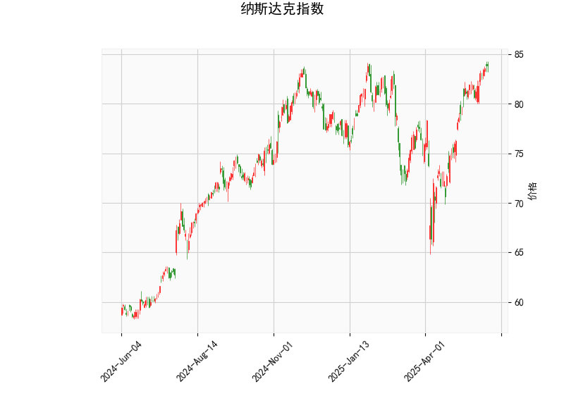

### 纳斯达克指数技术分析结果详解

#### 1. 技术指标分析
以下是对提供的纳斯达克指数技术分析结果进行的逐项解读，这些指标 collectively 反映了市场的当前态势、潜在趋势和风险。当前价位为83.81，显示指数处于相对较高的水平，但需结合其他指标综合评估。

- **RSI (相对强弱指数)**: 当前RSI值为69.78，这表明指数处于超买状态。通常，RSI高于70被视为超买信号，暗示短期内可能出现回调或修正风险。投资者需警惕潜在的价格回落，尤其在市场情绪高涨后，可能引发获利了结。

- **MACD (移动平均收敛散度)**: MACD线值为1.91，高于信号线（1.87），且直方图（0.04）为正。这是一个看涨信号，表明短期内多头势头可能仍在持续，价格可能进一步上涨。然而，直方图值较小，表明动量不强，如果MACD线与信号线发生交叉，可能预示趋势逆转。

- **Bollinger Bands (布林带)**: 
  - 上带（Upper Band）：85.52
  - 中带（Middle Band）：76.86
  - 下带（Lower Band）：68.20
  当前价83.81位于中带和上带之间，更接近上带，这反映价格处于相对高位。Bollinger Bands显示波动率较低（带宽较窄），可能预示即将出现突破或回调。如果价格触及上带（85.52）附近，可能面临阻力位；反之，如果跌破中带，可能测试下带支撑。

- **K线形态**: 
  - **CDLMATCHINGLOW**: 这是一个看跌形态，通常出现在价格底部附近，表明市场可能形成短期支撑或潜在反转信号。但在当前背景下，它可能暗示价格已触及短期低点，投资者需观察后续确认。
  - **CDLSPINNINGTOP**: 这是一个中性形态，显示市场不确定性或犹豫，通常表示买卖力量均衡，可能预示反转或盘整。如果后续K线出现更明确的模式（如大阳线），则可能转为看涨。

总体而言，技术指标呈现混合信号：RSI和Bollinger Bands提示超买和潜在回调风险，而MACD显示短期看涨。K线形态则强调市场不确定性，建议投资者关注价格行为以确认趋势。

#### 2. 近期可能存在的投资或套利机会和策略
基于上述分析，纳斯达克指数短期内可能存在波动性机会，但需结合市场整体环境（如经济数据、美联储政策和全球事件）进行决策。以下是针对潜在投资和套利机会的判断与策略建议，重点强调风险管理。

##### 投资机会判断
- **短期投资机会**:
  - **看涨机会**: MACD的正直方图和当前价接近上带表明，指数可能继续向上测试85.52附近阻力位。如果市场情绪保持乐观（如科技股驱动），这可能带来买入机会，尤其适合短期交易者。但RSI超买风险较高，建议只在确认突破后入场。
  - **看跌机会**: RSI超买和K线形态（如CDLSPINNINGTOP）暗示潜在回调。如果价格跌破83.00附近支撑（基于中带76.86的延伸），可能下探至68.20下带，创造卖出或做空机会。这适合风险厌恶者，但需防范突发利好导致反弹。

- **中长期投资机会**:
  - 指数整体处于上行通道（参考MACD看涨信号），如果全球经济复苏或科技行业强劲，纳斯达克可能维持牛市。CDLMATCHINGLOW形态可能标志短期底部，投资者可考虑在回调时布局多头头寸，如通过ETF或指数基金积累头寸。

##### 套利机会和策略
套利策略通常利用市场 inefficiencies 或技术信号进行低风险操作，以纳斯达克为代表的市场，以以下方式展开：

- **基于技术指标的套利策略**:
  - **均值回归套利**: 当前价接近Bollinger上带，RSI超买时，可采用“卖出看涨期权+买入看跌期权”的组合策略（如铁蝶式期权）。如果价格回调至中带（76.86）附近，可获利退出。预期收益：利用波动率缩小获利，但需监控MACD交叉以避免趋势逆转。
  - **MACD交叉套利**: MACD线高于信号线时，考虑“多头套利”——如买入指数期货并卖出期权对冲。如果MACD直方图收窄，可在信号线交叉前退出，目标利润率为1-2%。反之，如果RSI超买加剧，可转向“空头套利”，如卖空期货并用期权保护。

- **整体策略建议**:
  - **风险管理**: 设置止损位在Bollinger下带（68.20）下方5-10%，并结合RSI回落至60以下作为加仓信号。避免全仓操作，建议头寸占比不超过30%。
  - **进场时机**: 等待K线形态确认——如出现大阳线突破上带，可买入；若Spinning Top后形成大阴线，可卖出。
  - **适合人群**: 短期策略适用于活跃交易者；中长期策略适合稳健投资者。潜在回报：如果捕捉回调，收益可能达5-10%；但若市场反转，损失控制在2-5%以内。
  - **注意事项**: 技术分析并非万能，需结合基本面（如企业财报或利率变化）。当前地缘政治不确定性可能放大波动，建议使用模拟账户测试策略。

总之，近期纳斯达克指数可能存在短期套利机会，但超买信号提醒需谨慎。投资者应根据个人风险偏好调整策略，并持续监控市场动态。