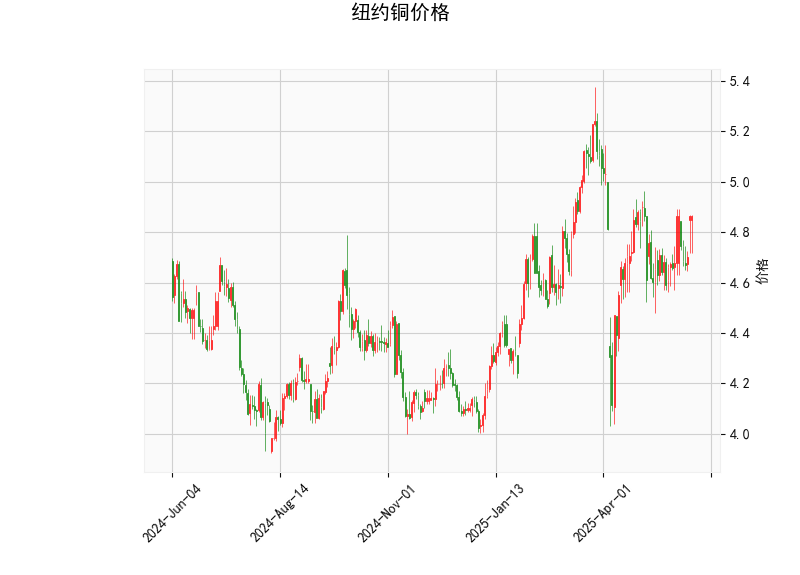

### 纽约铜价格技术分析结果分析

#### 1. 对技术分析结果的详细解读
基于提供的纽约铜价格数据，我们可以从多个技术指标角度对当前市场状况进行分析。以下是对关键指标的逐一解释，这些指标 collectively 反映了价格的动量、趋势和潜在反转信号。

- **当前价格（Current Price）**：当前价格为 4.865，这是一个中性位置，略高于近期均值（布林带中轨为 4.788）。这表明价格处于相对稳定的区间，但尚未触及超买区域（布林带上轨为 5.236），可能暗示短期内有向上空间，但也需警惕回调风险。

- **RSI（Relative Strength Index）**：RSI 值约为 57.34，这处于中性水平（50-70 区间）。RSI 衡量价格的超买或超卖状况，目前未显示极端信号（例如，低于 30 为超卖，高于 70 为超买）。这表示市场动力平稳，短期内可能继续横盘或轻微上涨，但缺乏强烈看涨动能。

- **MACD（Moving Average Convergence Divergence）**：MACD 线为 0.0192，信号线为 0.0011，柱状图（MACD Hist）为 0.0181。这些值均处于正值区域，表明短期看涨动量。MACD 线高于信号线，暗示多头趋势可能正在加强，但柱状图的微弱正值（0.0181）显示动量尚未强劲。如果 MACD 继续上行，可能确认上涨信号；反之，若回落至负值，则可能出现反转。

- **布林带（Bollinger Bands）**：上轨为 5.236、中轨为 4.788、下轨为 4.340。目前价格（4.865）位于中轨之上但未接近上轨，这反映出价格在波动区间内向上移动。布林带收窄或扩张通常表示波动性变化；当前状况显示潜在波动增加，但价格未突破上轨，意味着市场可能处于积累阶段。如果价格向上突破上轨，可能触发强势上涨；反之，向下测试下轨则可能引发回调。

- **K线形态**：提供的形态包括 "CDLGAPSIDESIDEWHITE"（向上跳空白实体）和 "CDLHANGINGMAN"（吊颈线）。前者是一个看涨形态，通常表示价格向上跳空，暗示短期多头控制；后者则是一个看跌反转形态，常在上涨后出现，警告潜在回调。这两种形态的结合显示市场信号混杂：一方面有上涨动能，另一方面存在反转风险。整体而言，这可能预示一个关键转折点，需要密切关注后续K线确认。

综上所述，技术指标呈现混合信号。RSI 和 MACD 倾向于中性到轻微看涨，布林带显示价格在合理范围内，而 K线形态的矛盾性增加了不确定性。当前市场可能处于一个过渡期，上涨潜力大于下行风险，但需防范突发反转。

#### 2. 近期可能存在的投资或套利机会和策略
基于上述分析，我们可以评估纽约铜市场的潜在机会。铜作为工业商品，其价格受全球经济、需求和库存影响，技术面信号可用于制定短期交易策略。以下是针对近期（短期内数日至数周）的判断和建议：

- **潜在投资机会**：
  - **看涨机会**：MACD 的正值和价格位于布林带中轨以上暗示短期上涨潜力，尤其是如果全球经济数据（如制造业PMI）转好，铜需求可能增加。RSI 未超买，留有上行空间，因此适合轻仓买入多头头寸，例如在 4.800 附近建仓，目标指向布林带上轨（5.236）。
  - **看跌风险**：K线中的 "CDLHANGINGMAN" 形态警告反转，可能在价格回调至 4.700-4.800 时出现。因此，投资者应警惕，如果RSI升至70以上或MACD回落至负值，市场可能转向下行。
  - **整体判断**：短期内（1-2周），多头机会略占优势，但需结合基本面（如铜矿供应或中美贸易动态）验证。风险在于波动性高，适合经验丰富的交易者。

- **可能套利策略**：
  - **跨品种套利**：铜价格与相关商品（如铝或黄金）相关性强。如果纽约铜显示看涨而其他金属（如LME铝）相对滞后，可考虑多头铜-空头铝的配对套利策略。例如，利用期现价差（如果当前价4.865高于期货价格），在交易所（如CME）构建头寸，目标锁定价差收敛（预计收益1-5%）。
  - **期权套利**：鉴于布林带的波动区间，可使用期权策略，如购买看涨期权（Call）保护多头头寸，同时卖出虚值看跌期权（Put）以赚取溢价。当前RSI中性环境下，铁蝶式（Iron Butterfly）策略适合：例如，在4.800-5.000价格带构建，成本低（约0.5-1%），若价格横盘可获利。
  - **风险管理策略**：无论投资还是套利，都应设置止损（如价格跌破4.700时退出）。建议采用分批建仓（例如，50%资金在4.850买入，剩余在4.900加仓），并监控全球事件（如美联储加息）。总体策略偏向保守：如果信号持续看涨，目标收益5-10%；若反转，优先保本退出。

在实际操作中，投资者应结合实时数据、市场情绪和风险承受能力进行调整。技术分析仅为参考，市场波动性高，建议与基本面分析结合使用。