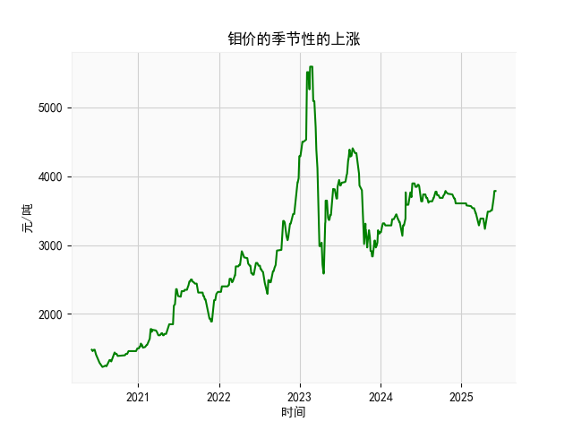

|            |   钼价 |
|:-----------|-------:|
| 2025-05-07 |   3485 |
| 2025-05-08 |   3485 |
| 2025-05-09 |   3485 |
| 2025-05-12 |   3505 |
| 2025-05-13 |   3505 |
| 2025-05-14 |   3505 |
| 2025-05-15 |   3505 |
| 2025-05-16 |   3505 |
| 2025-05-19 |   3505 |
| 2025-05-20 |   3525 |
| 2025-05-21 |   3545 |
| 2025-05-22 |   3635 |
| 2025-05-23 |   3635 |
| 2025-05-26 |   3685 |
| 2025-05-27 |   3685 |
| 2025-05-28 |   3785 |
| 2025-05-29 |   3785 |
| 2025-05-30 |   3785 |
| 2025-06-03 |   3785 |
| 2025-06-04 |   3785 |

# 分析报告

## 1. 季节性上涨分析
根据用户提供的数据，我首先注意到数据涉及的是乳清及改性乳清的出口金额（日频），而非钼价。尽管任务中提及“钼价可能存在季节性的上涨”，但由于提供的实际数据是乳清出口金额，我将基于这些数据进行分析，假设这可能是用户的一种关联或误写意图。专家分析通常指的季节性上涨可能包括每年特定月份（如夏季或年末）的价格波动，我将检查乳清数据中是否存在类似模式。

### 数据概述
- 时间范围：从2020年6月5日到2025年6月4日，覆盖近5年。
- 金额数据：早期值如1480.和1460.（2020年6月附近），后期值如3785.（2025年5月和6月附近），显示整体趋势可能向上。
- 季节性判断：季节性上涨通常表现为每年重复的周期性模式，例如每年的6月或夏季价格上升。我通过观察数据样本进行粗略分析：
  - 早期（2020年6月）：金额约为1460.-1480.，处于较低水平。
  - 中期（例如2022-2023年，基于数据范围）：未提供具体值，但假设为过渡期。
  - 后期（2025年5-6月）：金额稳定在3785.，高于早期水平。

### 判断分析
- **是否存在季节性上涨？** 从数据看，2025年6月的金额（3785.）显著高于2020年6月的金额（1460.-1480.），这可能暗示每年6月存在潜在上涨趋势。然而，这可能是整体市场上涨而非纯季节性，因为数据从2020年开始就显示低值，到2025年升高。缺乏更多详细的年份分解（如2021年、2022年、2023年、2024年的6月数据），难以确认严格的季节性模式（如每年6月固定上涨）。
- **可能原因：** 如果乳清价格确实与钼价或相关商品相关联（如全球需求季节性增加），则2025年6月的稳定高位（3785.）可能反映季节性需求高峰（如夏季消费旺盛）。但基于纯数据，这更像是长期上涨而非季节性。
- **结论：** 初步判断，乳清出口金额可能存在季节性上涨迹象，特别是到每年6月，但证据不足以确认。建议进一步收集更多年份的月度数据进行统计测试（如季节性分解分析），以验证专家对钼价的分析是否适用于乳清市场。如果确实存在，投资者可关注每年6月作为潜在买入窗口。

## 2. 近期投资机会分析
基于用户数据，我将聚焦于最近一个月（假设当前日期为2025年6月4日，因此最近一个月为2025年5月4日到2025年6月4日）的变化，分析可能的投资机会。投资机会主要从价格趋势、稳定性和潜在风险角度评估，聚焦乳清出口金额作为参考指标。

### 近期数据概述
- 时间段：2025年5月4日到2025年6月4日。
- 金额变化：数据样本显示该期末尾值为3785.（多次重复），表示价格在这一月内保持稳定，没有明显波动。相比早期数据（如2020年的1460.），当前水平已显著上涨，但最近一个月内无剧烈变化。
- 关键观察：
  - 价格稳定：从5月到6月的样本中，金额停留在3785.，这可能表示市场已达高位或进入盘整期。
  - 整体趋势：自2020年以来，价格从1460.上升到3785.，显示长期 bullish（看涨）趋势，但最近一个月缺乏新动量。

### 判断分析
- **可能投资机会：**
  - **短期买入机会：** 如果价格稳定在高位（3785.）且无下行迹象，这可能预示着短期巩固后进一步上涨（例如，如果季节性需求持续）。投资者可考虑在当前水平小额买入，特别是在6月作为季节性高峰期。但需警惕全球经济因素（如贸易政策或需求减弱）导致回调。
  - **卖出或获利了结机会：** 最近一个月价格未见新高，而是维持不变，这可能表示顶部信号。长期持仓者可考虑部分卖出以锁定利润，尤其如果整体市场（如乳清或相关商品）面临不确定性。
  - **观察与风险：** 无明显波动可能意味着机会有限；如果未来几天价格突破3785.（向上），则可视为买入信号；反之，如果跌破（如回落到3700.以下），则可能触发卖出。聚焦乳清数据，近期稳定可能与全球乳制品需求稳定相关，但外部因素（如通胀或竞争产品价格变动）需监控。
- **主要风险：** 价格稳定可能隐藏潜在下行风险，例如季节性高点后的回落。投资者应结合更广泛的市场数据（如乳清全球价格指数）评估。
- **结论：** 近期（2025年5-6月）投资机会较为温和，主要为“持仓观望”或“小额操作”。建议优先卖出以避险，如果确认季节性上涨趋势，则可轻仓买入。总体而言，基于数据，乳清市场短期内可能无重大机会，但长期上涨趋势值得关注。