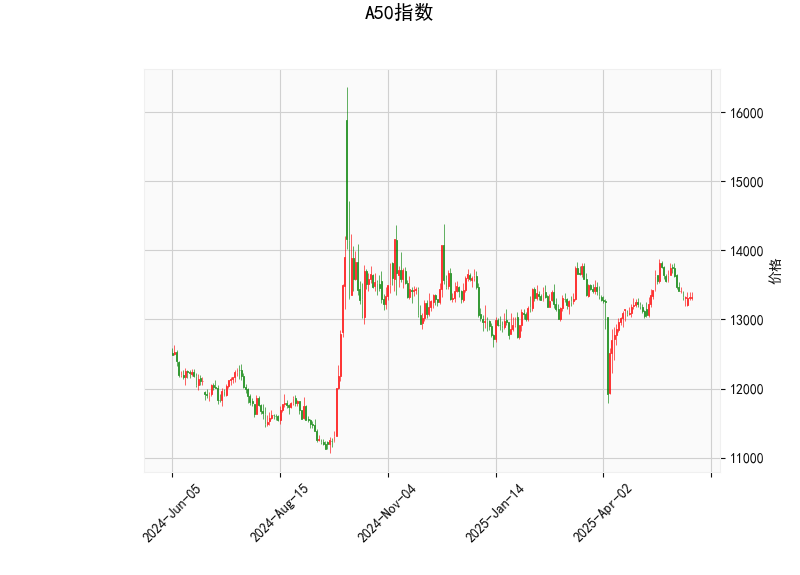

# A50指数的技术分析结果分析

## 整体市场状况概述
A50指数当前价格为13331.0点，基于提供的指标，我们可以看到市场处于一种相对中性的盘整状态。RSI指标显示市场不处于超买或超卖区域，MACD指标则暗示潜在的下行压力，而Bollinger Bands显示价格接近中间带，K线形态则反映了市场的不确定性。总体而言，这可能表示短期内指数缺乏明确方向，投资者需密切关注后续价格变动。

## 详细指标分析
以下是对每个技术指标的逐一解读和分析：

- **RSI (相对强弱指数)**: 当前值为46.58。这是一个中性水平（RSI通常在30以下为超卖，70以上为超买）。RSI低于50暗示短期内卖方力量略占上风，但尚未达到极端弱势。这可能表示市场正处于修正阶段，而不是强烈的下跌趋势。

- **MACD (移动平均收敛散度)**: MACD线值为10.28，信号线值为56.71，柱状图值为-46.42。MACD线低于信号线，且柱状图为负值，这是一个典型的看跌信号，表明短期动量可能转向负面。投资者应警惕潜在的卖出机会，但需注意如果柱状图开始收窄或转为正值，可能预示反弹。

- **Bollinger Bands (布林带)**: 上轨为13988.85，中轨为13312.67，下轨为12636.50。当前价格13331.0点接近中轨，表明价格处于布林带的中间区域。这反映了市场波动性较低，价格可能在窄幅区间内震荡。如果价格跌破下轨，可能触发进一步下行；反之，若向上突破上轨，则可能出现反弹。

- **K线形态**: 形态为"CDLSPINNINGTOP"（纺锤线或十字星）。这是一种表示市场不确定性的K线模式，通常暗示买卖力量均衡，可能预示反转或盘整。短期内，这可能意味着投资者犹豫不决，需要等待后续K线确认方向。

基于以上指标，A50指数当前呈现出中性偏弱的特征。RSI和Bollinger Bands显示市场未极端化，而MACD和K线形态则增加了下行风险。投资者应结合宏观经济因素（如全球股市动态或中国经济数据）来验证这些信号。

# 近期可能存在的投资或套利机会和策略
## 潜在投资机会判断
基于当前技术分析，A50指数短期内可能存在下行压力，但整体中性特征也留有反弹空间。以下是针对近期可能的投资机会分析：

- **下行机会**: MACD的负柱状图和K线形态的犹豫信号暗示可能出现短期回调。如果全球风险情绪恶化（如地缘政治事件或经济数据疲软），A50指数可能向Bollinger Bands下轨（12636.50点）靠近。这为做空策略提供机会，例如通过A50相关ETF或期货合约进行卖出操作。
  
- **反弹机会**: RSI处于中性水平，且价格接近中轨，表明市场并非深度超卖。如果后续K线出现正面形态（如阳线吞没），可能触发技术反弹。投资者可关注是否突破上轨（13988.85点），这可能标志多头回暖。

- **套利机会**: A50指数作为中国市场代表，可能存在跨市场套利空间。例如：
  - **指数期货与现货套利**: 如果A50期货价格与现货指数出现价差（当前价格13331.0点附近），投资者可通过期货合约进行反向操作，实现无风险套利。但需注意交易成本和流动性。
  - **期权策略**: 买入看跌期权（Put Option）以对冲下行风险，或构建铁蝶式期权策略（Iron Butterfly）来捕捉窄幅震荡。如果市场维持在当前区间，期权时间价值衰减可带来收益。
  - **多/空配对套利**: 结合A50与相关资产（如恒生指数或上证指数）的相关性，进行多头/空头配对交易。例如，如果A50相对恒生指数出现低估，可做多A50空恒生。

## 推荐投资策略
考虑到市场不确定性，以以下策略为主，强调风险控制：

- **观望与等待确认策略**: 短期内不宜大举进场。建议等待RSI跌破30（超卖信号）或MACD柱状图转为正值时再行动。这有助于避免假突破风险。

- **做空或防御性策略**: 如果预计下行，考虑在13331.0点附近做空A50期货或买入看跌期权。设置止损位在Bollinger Bands上轨（13988.85点）以上，以控制损失。目标位可设在下轨（12636.50点）附近。

- **多头布局策略**: 若市场情绪转好（如中国经济刺激政策出台），可在RSI回升到50以上时逐步建仓多头头寸。结合K线形态确认后，目标指向中轨上方。

- **风险管理建议**: 任何策略均需结合资金管理，例如控制仓位不超过总资金的20%，并监控全球事件（如美联储政策或中国PMI数据）。技术分析并非万能，需与基本面分析结合使用。

总之，近期A50指数的投资机会以短期交易为主，套利策略更适合经验丰富的投资者。市场波动可能加大，建议优先评估个人风险承受能力。