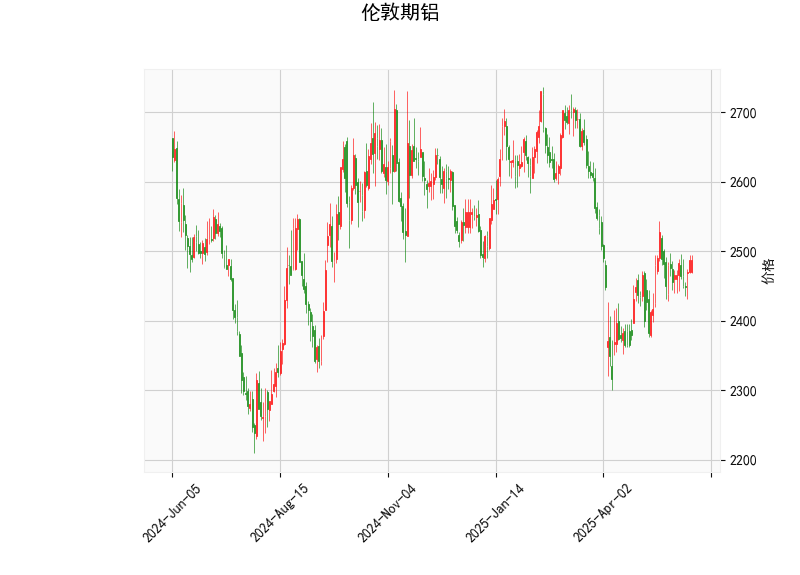

### 1. 伦敦期铝的技术分析结果分析

基于提供的伦敦期铝技术指标数据，我们可以对当前市场状况进行详细解读。以下是对关键指标的逐一分析，这些指标 collectively 反映了资产的动量、趋势和波动性。

- **当前价格（Current Price）**: 2487.0。这表明伦敦期铝的现价处于相对稳定的位置，略高于中间布林带（Middle Band），暗示价格可能在短期内保持盘整或轻微上行。如果与历史价格比较，这水平显示出一定的恢复性，但尚未达到极端高位。

- **RSI（Relative Strength Index）**: 54.65。这是一个中性水平（RSI 通常在 30-70 范围内视为正常）。高于 50 表示轻微的强势，但远未达到超买区域（70 以上）。这意味着市场目前没有明显的超买或超卖信号，短期内可能继续保持平衡，但如果 RSI 进一步上升，可能预示着潜在的上行势头。

- **MACD（Moving Average Convergence Divergence）**: MACD 线为 4.88，信号线为 2.31，直方图（MACD Hist）为 2.57。这些数值显示 MACD 线高于信号线，且直方图为正值，这是一个典型的看涨信号。表示短期移动平均线正在加速上行，暗示价格可能在近期出现向上突破。但需注意，如果直方图开始收窄或转为负值，信号可能逆转。

- **布林带（Bollinger Bands）**: 上轨（Upper Band）为 2659.99，中轨（Middle Band）为 2475.05，下轨（Lower Band）为 2290.10。目前价格 2487.0 紧邻中轨，这表明价格处于布林带的中间区域，波动相对温和。没有明显偏离中轨，显示市场缺乏剧烈波动。但如果价格向上逼近上轨，可能面临阻力；反之，向下接近下轨时，可能出现支撑。

- **K线形态**: 形态包括 "CDLBELTHOLD"（看涨腰带线）和 "CDLLONGLINE"（长实体线）。这些形态通常表示强势买入信号。"CDLBELTHOLD" 暗示市场在低点形成强势支撑，可能预示短期反弹；"CDLLONGLINE" 则反映了较大的价格实体，表明买方主导。这种组合整体偏向看涨，但需结合其他指标确认，避免假突破。

总体而言，技术指标显示伦敦期铝当前处于一个轻度看涨的环境。RSI 和 MACD 没有极端信号，价格在中轨附近盘整，K线形态提供正面支撑。这可能表示市场正从之前的波动中恢复，但缺乏强烈趋势，投资者应警惕潜在的逆转风险，如全球经济数据或商品需求变化的影响。

### 2. 近期投资或套利机会和策略分析

基于上述技术分析，我们可以推断近期伦敦期铝可能存在的投资机会。整体看涨信号（如 MACD 和 K线形态）暗示潜在的上行空间，但中性 RSI 和中轨位置表明风险控制至关重要。以下是对可能机会和策略的判断：

#### 可能的投资机会
- **短期买入机会**: 当前指标显示轻度看涨，价格接近中轨（2475.05），这可能是一个入场点。如果 MACD 直方图继续扩大，价格可能向上测试上轨（2659.99），提供 5-10% 的潜在上涨空间。适合于短期交易者，尤其是在全球铝需求（如新能源行业）回暖的背景下。
  
- **套利机会**: 伦敦期铝作为大宗商品，可能与相关资产（如上海期铝或 LME 其他金属）存在价差套利潜力。例如，如果伦敦期铝与上海期铝的价差扩大（当前价位下，假设历史价差为 100-200 美元），投资者可考虑跨市场套利：买入低价市场、卖出高价市场。但需监控全球贸易政策和库存数据，以避免外部冲击。

- **风险管理机会**: 如果 RSI 接近 70 或价格触及上轨，可能会出现回调（修正机会）。这对卖出或做空者有利，尤其是在经济不确定性（如通胀或地缘政治事件）下。

#### 推荐投资策略
- **多头策略（买入持仓）**: 建议在当前价位附近（2487.0）买入，目标设在上轨（2659.99）。设置止损在下轨（2290.10）以下，以控制风险。结合 RSI 监控：若 RSI 升至 60 以上，可加仓；若跌至 50 以下，考虑平仓。这适合风险偏好中等的投资者，预期持有 1-4 周。

- **套利策略**: 采用跨品种套利，例如与铜或锌等相关金属比较价差。如果伦敦期铝相对于这些金属的价差异常（如基于历史相关性），可进行配对交易（e.g., 买入铝、卖出铜）。使用 MACD 作为信号：当直方图正值时入场，但需实时跟踪 LME 数据以避免滑点。

- **保守策略（观望或波段操作）**: 如果市场不确定（如 RSI 未进一步上升），建议等待更明确信号（e.g., K线形成新看涨形态）。可采用布林带策略：价格触及中轨时买入，触及上轨时卖出部分仓位。这有助于规避短期波动，适合初级投资者。

总体判断，近期投资机会偏向多头，但需谨慎。外部因素（如中国需求或美联储政策）可能影响铝价，建议结合基本面分析（如库存水平）并使用风险管理工具（如限价订单）。若无明显信号，优先观望以避免过度交易。