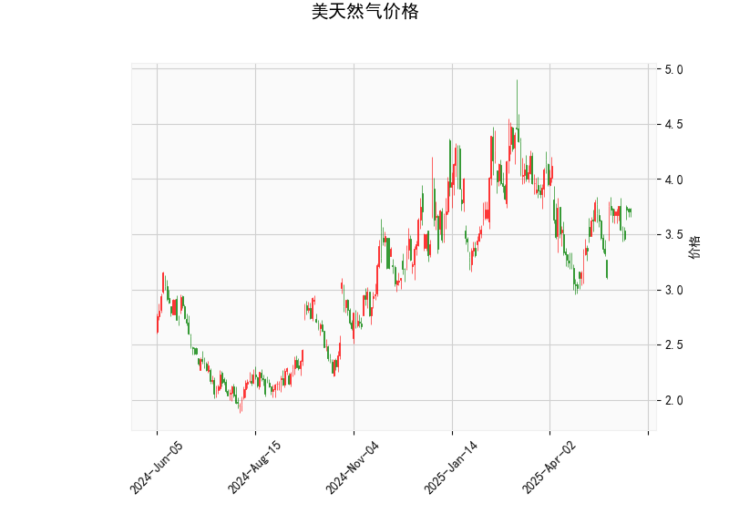

### 1. 美天然气价格的技术分析结果解读

以下是对提供的技术分析结果进行的详细解读，基于关键指标的当前状态分析美天然气市场的短期技术面表现。当前价格为3.706美元，我们将逐一评估各指标。

- **RSI (相对强弱指数)**: 当前RSI值为54.53，这表明市场处于中性区域（RSI在30-70之间通常被视为中性）。RSI略高于50，暗示近期买方力量稍占上风，但尚未进入超买状态（超买阈值为70以上）。这可能反映出价格正处于温和上涨趋势中，投资者需警惕潜在回调风险。

- **MACD (移动平均收敛散度)**: MACD线值为0.0389，信号线值为0.0226，直方图值为0.0163（正值）。MACD线高于信号线，且直方图为正，显示出短期看涨信号。这通常表示多头势头增强，价格可能继续上行。然而，MACD值相对较小，表明上涨动能还不是很强劲，仅为温和的看涨。

- **Bollinger Bands (布林带)**: 上轨为4.246、中轨为3.618、下轨为2.991。当前价格3.706位于中轨（3.618）附近，处于上轨和中轨之间。这反映出价格在波动性适中的范围内运行，没有明显突破上轨（可能表示上行潜力）或下轨（可能表示下行风险）。中轨附近的位置暗示市场可能处于盘整阶段，等待进一步的催化剂。

- **K线形态**: 检测到“CDLMATCHINGLOW”模式，这是一个经典的看涨K线形态，通常在价格见底后出现，暗示潜在反弹。结合其他指标，这可能预示短期内价格有向上测试上轨的可能，但需确认后续K线形态以避免假突破。

总体而言，技术指标显示美天然气价格处于中性偏看涨的状态。RSI和MACD的信号较为积极，K线形态提供支撑，但Bollinger Bands的窄幅波动表明市场缺乏强烈动量。短期内，价格可能在3.5-4.2美元区间震荡，需关注外部因素如天气变化或能源需求来强化趋势。

### 2. 近期可能存在的投资或套利机会和策略判断

基于上述技术分析，我们评估近期（即未来1-4周）的投资或套利机会。美天然气市场受制于商品特性，波动性较高，机会主要源于技术面信号和市场事件。以下是针对当前情况的判断和建议策略，强调风险管理。

#### 可能的机会
- **投资机会**: 
  - **看涨潜力**: MACD的正直方图和CDLMATCHINGLOW形态暗示短期反弹机会。如果价格突破上Bollinger Band（4.246以上），可能触发进一步上涨，目标可设在4.5美元附近。RSI未超买，提供一定的安全边际。
  - **回调买入点**: 当前价格接近中轨，RSI中性，适合逢低布局。若价格回落至3.5美元左右（接近下轨），这可能是一个低风险买入点，尤其在全球需求回暖（如冬季取暖季）背景下。
  - **套利机会**: 天然气期货市场可能存在跨品种套利，如天然气与原油的价差套利（如果天然气相对原油被低估）。当前油气市场联动性强，若天然气价格相对滞后于原油上涨，可通过多头天然气+空头原油的组合捕捉价差收敛。

- **潜在风险和限制**:
  - 市场波动性高，受地缘政治（如中东冲突）和天气影响，可能导致突发性下跌。
  - RSI和MACD信号虽积极，但强度有限，缺乏强势突破迹象，容易出现假信号。
  - 套利机会需依赖低流动性市场，可能面临执行成本高的问题。

#### 推荐策略
- **投资策略**:
  - **多头交易**: 如果价格维持在3.6美元以上，建议买入天然气期货或ETF（如UNG）。设置止损在3.4美元（下轨附近），目标位4.0-4.5美元。结合MACD交叉作为进场信号，可在RSI回落至50以下时加仓。
  - **均值回归策略**: 价格在中Bollinger Band附近，适合等待回调后买入。预期价格回归中轨或上轨，利用波动性进行波段操作。风险控制：仓位不超过总资金的5%，并结合基本面（如EIA库存数据）验证。
  
- **套利策略**:
  - **跨市场套利**: 利用天然气与电力或原油的关联性。例如，如果天然气价格低于历史均值而原油上涨，可执行“多天然气、空原油”套利。当前价差（天然气相对原油）若扩大至异常水平（如天然气/原油比低于0.05），可进场。使用衍生品如期权对冲风险，确保套利无风险或低风险。
  - **期权策略**: 买入看涨期权（strike price在4.0美元左右），成本较低，利用CDLMATCHINGLOW形态的反弹潜力。结合Bollinger Bands突破作为退出信号，预计持有期1-2周。

**总体建议**: 短期内看涨机会大于下行风险，但需谨慎操作。建议结合技术分析与基本面（如天气预报和库存报告）监控市场。风险厌恶者可小仓位试水，或使用模拟交易平台测试策略。最终决策应依据个人风险承受能力和实时市场数据。