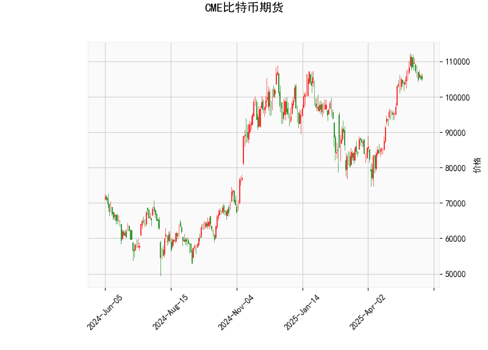

# CME 比特币期货技术分析结果分析

## 1. 对技术分析结果的详细解读

基于提供的CME比特币期货数据，我们对各个技术指标进行逐一分析，以评估当前市场的技术面状况。总体而言，这些指标显示出市场处于一个混合状态，既有潜在的看涨信号，也有看跌风险。以下是具体分解：

### 关键指标分析
- **当前价格（Current Price）**: 105105.0  
  当前价格位于布林带中轨（93919.0）和上轨（114206.0）之间，表明价格处于相对较高的位置，但尚未触及超买区域。这暗示市场可能在短期内保持波动，但如果价格进一步逼近上轨，可能面临回调压力。

- **RSI（Relative Strength Index）: 56.88**  
  RSI值处于中性区域（50-70之间），显示市场没有明显的超买或超卖状况。56.88的水平表明买方力量略占上风，但尚未过度强劲。如果RSI升至70以上，将提示潜在超买风险；反之，如果跌至30以下，则可能出现超卖反弹机会。目前，这是一个中性信号，支持短期市场稳定。

- **MACD（Moving Average Convergence Divergence）指标**:
  - MACD线: 3026.16
  - MACD信号线: 3974.51
  - MACD柱状图（Histogram）: -948.35  
  MACD线低于信号线，且柱状图为负值，这是一个典型的看跌信号，表明短期动量偏向卖方。投资者应注意，这可能预示价格回调或修正。然而，如果MACD线向上穿越信号线，将转为看涨。当前状况显示短期卖压可能增加。

- **布林带（Bollinger Bands）**:
  - 上轨（Upper Band）: 114206.01
  - 中轨（Middle Band）: 93919.0
  - 下轨（Lower Band）: 73631.99  
  当前价格（105105.0）位于中轨和上轨之间，显示价格在相对高位运行。布林带收窄或扩张可以反映市场波动性：如果价格接近上轨（如当前情况），可能面临阻力位测试，导致回调；如果跌破中轨，则可能加速向下轨移动。整体而言，这提示短期波动风险较高。

- **K线形态（Candlestick Patterns）: CDLMATCHINGLOW 和 CDLSHORTLINE**  
  - **CDLMATCHINGLOW**: 这是一个潜在看涨形态，通常表示市场在触及低点后出现两个相似的低点蜡烛，暗示可能的反弹或反转。这可能预示短期买盘入场，尤其在价格稳定后。
  - **CDLSHORTLINE**: 这表示一个实体较小的蜡烛，反映市场不确定性或窄幅波动。它通常不是强烈的信号，但结合其他指标，可能表明当前价格动作较为犹豫。  
  总体K线形态显示轻微看涨倾向，但需与其他指标（如MACD的看跌信号）结合验证。

### 总体市场解读
从以上指标来看，CME比特币期货市场呈现出矛盾的信号：RSI和K线形态（如Matching Low）显示潜在买方支持和反弹可能性，而MACD的负直方图和价格接近布林带上轨则暗示卖压和回调风险。比特币作为高波动资产，当前价格水平（105105.0）可能处于一个关键交叉点。如果外部因素（如宏观经济新闻或机构流入）推动价格向上，RSI可能进一步上升；反之，MACD的看跌信号若持续，可能导致价格回落至中轨以下。整体而言，市场短期内可能保持区间震荡，而不是强势趋势。

## 2. 近期可能存在的投资或套利机会和策略判断

基于上述分析，我们评估近期比特币期货市场的投资和套利机会。比特币市场受全球事件影响较大，因此策略应以风险管理为先。以下是针对当前数据的判断和建议：

### 可能的投资机会
- **短期反弹机会**: K线形态中的CDLMATCHINGLOW暗示潜在低点支撑，如果RSI保持在中性水平，价格可能向上测试布林带上轨（114206.0）。这为多头投资者提供入场机会，尤其若MACD信号线开始上行。
- **回调入场机会**: MACD的看跌信号和价格接近上轨表明可能出现修正。如果价格跌破中轨（93919.0），这可能是一个低风险买入点，特别是在RSI跌向50以下时。
- **套利机会**: 在期货和现货市场之间，可能存在价差套利。例如，如果CME比特币期货价格与现货价格（如在其他交易所）出现明显偏差（如由于流动性差异或预期调节），投资者可以通过多头期货+空头现货（或反之）的组合获利。但需注意，目前数据未显示具体现货价差，需实时监控（如通过Coinbase或Binance现货价格）。

### 推荐的投资策略
- **观望与等待策略**: 鉴于混合信号，建议短期内采用观望策略。监控MACD是否金叉（MACD线向上穿越信号线），若发生，则考虑多头入场；若MACD柱状图进一步恶化，则偏向空头。
- **多头策略（买入）**: 如果您看好K线形态的看涨信号，可在价格稳定于105000以上时小仓位买入期货合约。设置止损在布林带中轨（93919.0）以下，以防范回调风险。目标位可设在上轨（114206.0）附近。
- **空头策略（卖出）**: 基于MACD的看跌信号，考虑在价格接近上轨时卖出期货或买入看跌期权。止盈位可设在中轨（93919.0）以下，但需警惕突发反弹。
- **套利策略**: 利用期货市场的杠杆，进行跨市场套利。例如，如果比特币期货溢价高于现货，执行正向套利（买入现货、卖出期货）；反之，进行反向套利。风险控制措施包括限仓和实时价差监控，以避免高波动性导致的损失。
- **风险管理建议**: 比特币市场易受全球事件（如美联储政策或地缘政治风险）影响，因此所有策略应结合止损订单（如5-10%的价格波动）和头寸分散。长期投资者可考虑Dollar-Cost Averaging（定投）策略，逐步建仓以平滑波动。

请注意，投资涉及风险，本分析基于历史数据和技术指标，并非财务建议。实际决策应结合实时市场数据、个人风险承受能力和专业咨询。