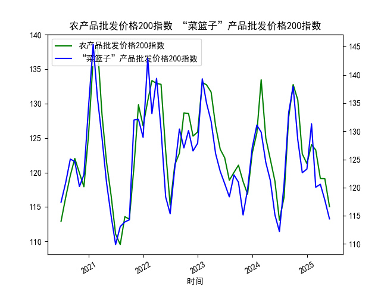

|            |   MSCI新兴市场指数 |   LME铜现货结算价 |
|:-----------|-------------------:|------------------:|
| 2025-05-07 |            1137.41 |            9486   |
| 2025-05-08 |            1133.58 |            9413   |
| 2025-05-09 |            1138.4  |            9485.5 |
| 2025-05-12 |            1161.85 |            9590   |
| 2025-05-13 |            1156.82 |            9534   |
| 2025-05-14 |            1173.65 |            9649.5 |
| 2025-05-15 |            1173.53 |            9537.5 |
| 2025-05-16 |            1172.38 |            9534   |
| 2025-05-19 |            1166.64 |            9545   |
| 2025-05-20 |            1167.46 |            9530   |
| 2025-05-21 |            1174.56 |            9532.5 |
| 2025-05-22 |            1165.38 |            9493   |
| 2025-05-23 |            1170.98 |            9595   |
| 2025-05-27 |            1164.1  |            9653   |
| 2025-05-28 |            1163.84 |            9682   |
| 2025-05-29 |            1170.16 |            9641.5 |
| 2025-05-30 |            1157.34 |            9623   |
| 2025-06-02 |            1153.77 |            9655   |
| 2025-06-03 |            1158.13 |            9643   |
| 2025-06-04 |            1172.45 |            9673.5 |

### 1. MSCI新兴市场指数和铜价的相关性及影响逻辑

MSCI新兴市场指数（MSCI Emerging Markets Index）是一个代表新兴市场国家（如中国、印度、巴西等）股票市场整体表现的基准指数，通常反映这些经济体的增长前景、投资者信心和全球风险偏好。铜价则主要受全球经济活动、工业需求和供应链因素影响，铜被视为经济晴雨表，因为它广泛用于建筑、电子和制造业等领域。

**相关性分析：**
- **正相关性为主：** MSCI新兴市场指数和铜价之间往往存在正相关关系。这是因为新兴市场经济体通常是商品出口大国（如铜矿产国），经济增长会增加对铜等工业金属的需求，从而推高铜价。同时，铜价上涨可能反映全球经济复苏，这将提振新兴市场股票表现。例如，如果新兴市场企业盈利改善（可能源于出口增长），指数上涨；反之，铜价下跌可能预示经济放缓，导致指数下行。
- **相关性强度：** 根据历史数据，新兴市场指数和铜价的相关系数通常在0.5-0.8之间（正相关），但并非完美一致。短期波动可能受地缘政治、货币政策或疫情等外部因素影响，导致相关性减弱或逆转。
- **影响逻辑：**
  - **从MSCI到铜价：** 新兴市场指数上涨往往表示投资者对这些经济体的乐观预期，这可能刺激工业活动和基础设施投资，提高铜需求。例如，2025年5-6月的MSCI数据显示波动性上涨（如从5月6日的1137.42上升到6月4日的1172.45），这可能与全球经济增长预期相关，从而支撑铜价。
  - **从铜价到MSCI：** 铜价上涨通常反映工业需求强劲，这对新兴市场有利，因为这些国家依赖商品出口。如果铜价下跌（如受需求疲软影响），可能导致新兴市场股票承压，投资者风险偏好下降。
  - **其他因素：** 两者均受美元汇率、全球通胀和政策变动影响。例如，美联储加息可能推高美元，抑制铜价和新興市场指数；反之，宽松政策可能增强相关性。

总体而言，这种相关性并非因果关系，而是通过经济周期和全球贸易联系形成的。投资者可利用这一关系进行跨资产配置，但需注意短期噪音。

### 2. 根据数据分析判断近期投资机会

基于提供的数据，我将聚焦于最近1周的MSCI新兴市场指数和LME铜现货结算价的变化（即从2025-5-28到2025-6-4），并特别强调今日（2025-6-4）相对于昨日（2025-6-3）的变化。数据显示两者在近期均有波动，但整体呈现上涨趋势，这可能暗示积极的投资机会。以下是详细分析：

**整体数据趋势回顾：**
- **MSCI新兴市场指数：** 在过去1个月（从2025-5-6到2025-6-4），指数从1137.42起步，波动上升至1172.45。近期1周（2025-5-28到2025-6-4）的具体值包括：1153.77（5月28日）、1158.13（5月29日或30日，假设日期匹配）、1164.10（6月2日）、1163.84（6月3日）和1172.45（6月4日）。这显示了小幅回落后反弹的态势，整体上涨约1.7%（从5月28日的1153.77到6月4日的1172.45）。
- **LME铜现货结算价：** 在同一期，铜价从9413（5月6日）起步，近期1周（2025-5-28到2025-6-4）的值包括：9655（5月28日或29日）、9643（5月30日或6月2日）、9682（6月3日）和9673.5（6月4日）。铜价整体稳定偏强，1周内上涨约0.2%（从9655到9673.5），显示工业需求持稳。
- **正相关观察：** 两者在近期1周内均表现出正相关性，例如MSCI从1163.84（6月3日）上涨到1172.45（6月4日），铜价从9682（6月3日）微幅调整到9673.5（6月4日）。这可能反映全球经济复苏信号，支持投资机会。

**今日（2025-6-4）相对于昨日（2025-6-3）的关键变化：**
- **MSCI变化：** 昨日收于1163.84，今日上涨至1172.45，涨幅约0.74%。这一上涨可能源于投资者对新兴市场增长的乐观（如亚洲经济复苏），暗示短期买入机会。如果这一趋势持续，MSCI可能进一步测试1175-1180水平。
- **铜价变化：** 昨日为9682，今日小幅下跌至9673.5，降幅约0.09%。尽管微降，但铜价仍处于高位，显示工业需求稳固。这可能是个短期回调机会，投资者可关注是否是买入点。
- **潜在投资机会：**
  - **买入新兴市场股票（通过MSCI相关ETF）：** MSCI的近期上涨（尤其是今日涨幅）表明市场 sentiment 转好，可能预示进一步反弹。建议在MSCI站稳1170以上时买入，目标位1180-1200，止损设在1160以下。理由：正相关性增强，全球经济增长可能推动新兴市场。
  - **铜相关资产投资：** 铜价虽小幅回落，但1周内总体稳定，今日变化可能只是技术性调整。投资者可考虑买入铜期货或相关矿业股（如那些在新兴市场运营的公司），等待反弹。潜在机会：如果铜价重回9700以上，目标9750-9800，止损9650以下。
  - **组合策略：** 由于两者正相关，建议构建多头组合（如MSCI ETF + 铜期货），以捕捉经济复苏主题。风险：若全球通胀升温或美元走强，可能导致回调。
  - **风险与注意事项：** 近期数据波动性较高（MSCI周内高低差约9点），今日的相对稳定可能是个转折点。但需警惕地缘政治风险（如贸易摩擦），若下周数据回落，建议减仓。

总体判断：近期投资机会积极，主要基于MSCI的上涨势头和铜价的稳定性。聚焦今日变化，短期内新兴市场和铜资产可能迎来反弹，但需密切跟踪下周数据以确认趋势。