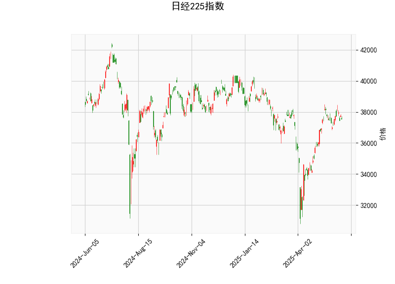

### 日经225指数技术分析结果解读

#### 1. 技术指标分析
以下是对日经225指数当前技术分析结果的详细解读，基于提供的指标数据。日经225指数当前价为37554.49，整体显示出混合信号，但倾向于短期下行风险。

- **RSI（相对强弱指数）**：当前值为54.28。这表明市场处于中性区域（RSI在30-70之间为中性），略高于50水平，暗示轻微的牛市势头。但RSI未进入超买区域（高于70），因此短期内缺乏强烈的上行动力。如果RSI进一步下降至50以下，可能预示着卖出压力增加。

- **MACD（移动平均收敛散度）**：MACD线值为405.19，信号线值为463.99，MACD柱状图（Hist）为-58.80。MACD线低于信号线，这是一个典型的看跌信号，表明短期动量转向下行。柱状图为负值进一步强化了这一观点，显示卖家可能正在主导市场。如果MACD线继续下行，可能确认进一步的下跌趋势。

- **Bollinger Bands（布林带）**：上轨为39805.15，中轨为36341.77，下轨为32878.38。目前价格37554.49位于中轨和上轨之间，接近中轨水平。这表明价格处于相对稳定的波动区间，没有明显突破上轨（可能表示超买）或下轨（可能表示超卖）。如果价格跌破中轨，可能会测试下轨支撑，增加下行风险。

- **K线形态**：形态为Inverted Hammer（倒锤子线）。这是一种看跌的反转形态，通常出现在上涨趋势末尾，暗示卖家可能开始介入。如果后续K线确认下行（如出现下跌实体蜡烛），则可能预示短期反转。结合其他指标，这进一步支持了潜在的下行压力。

总体而言，技术指标显示日经225指数短期内可能面临下行风险。RSI的中性状态提供了一些缓冲，但MACD的看跌信号和Inverted Hammer形态是主要担忧点。市场可能处于一个关键转折点，如果外部因素（如经济数据或全球事件）加剧卖压，指数可能测试中轨或更低水平。

#### 2. 近期投资或套利机会和策略判断
基于上述分析，日经225指数的短期前景偏向谨慎，潜在机会更多聚焦于下行交易或防御性策略。以下是针对近期可能的机会和策略建议：

- **投资机会判断**：
  - **下行机会主导**：当前指标显示看跌信号（如MACD负向和Inverted Hammer），短期内可能存在卖出或做空机会。如果日经225指数跌破中轨（约36341.77），这可能触发进一步下跌，目标指向下轨（约32878.38）。投资者可关注日本经济数据（如GDP或通胀报告）或全球市场情绪，如果负面事件出现，指数下行概率增加。
  - **潜在风险**：RSI仍处于中性，表明市场未极度超卖，因此下行可能有限。如果全球股市反弹，RSI可能回升至60以上，导致短期上行修正。
  - **整体评估**：适合风险偏好中性的投资者，机会在于捕捉短期波动，但需警惕波动性风险（如地缘政治事件）。

- **套利机会和策略建议**：
  - **做空策略**：鉴于MACD看跌信号，建议通过日经225期货或ETF（如EWJ）进行做空。如果价格跌破中轨，设定止损在上轨（约39805.15）附近，以控制风险。目标收益可设在下轨水平，预计潜在回报率为5-10%（基于历史波动）。
    
  - **期权套利策略**：利用看跌期权进行保护性套利。例如，买入日经225看跌期权（Strike Price设在37000左右），或卖出看涨期权以赚取溢价。如果市场下行，期权价值将上升，提供套利空间。结合Bollinger Bands，如果价格在下轨附近企稳，可考虑反向套利（如买入看涨期权）以捕捉反弹。

  - **波动率套利**：日经225当前处于中轨附近，波动率可能增加（尤其如果Inverted Hammer确认下行）。策略包括跨式期权（Straddle）或宽跨式（Strangle），买入看涨和看跌期权以捕捉大波动。预计如果RSI跌破50，波动率将上升，提供10-15%的潜在收益。

  - **风险管理建议**：任何策略应结合止损机制（如MACD信号线交叉时退出），并监控全球市场（如美股或人民币汇率）。长期投资者可等待RSI回升至60以上再考虑买入，以避免短期下行风险。

总之，近期日经225指数的投资机会偏向防御性操作，重点关注下行趋势。投资者应结合基本面因素（如日本央行政策）进行决策，并保持灵活性以应对市场变化。