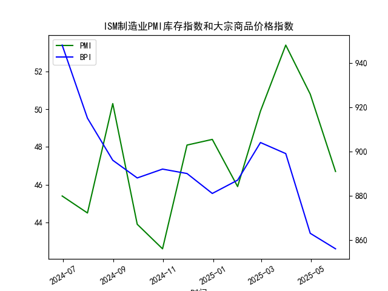

|            |   ISM制造业PMI库存指数 |   大宗商品价格指数BPI |
|:-----------|-----------------------:|----------------------:|
| 2024-06-30 |                   45.4 |                   948 |
| 2024-07-31 |                   44.5 |                   915 |
| 2024-08-31 |                   50.3 |                   896 |
| 2024-09-30 |                   43.9 |                   888 |
| 2024-10-31 |                   42.6 |                   892 |
| 2024-11-30 |                   48.1 |                   890 |
| 2024-12-31 |                   48.4 |                   881 |
| 2025-01-31 |                   45.9 |                   887 |
| 2025-02-28 |                   49.9 |                   904 |
| 2025-03-31 |                   53.4 |                   899 |
| 2025-04-30 |                   50.8 |                   863 |
| 2025-05-31 |                   46.7 |                   856 |

# 回答

## 第一部分：观点正确性判断及相关性解释

### 观点正确性判断
该观点认为，从ISM制造业PMI库存分项来看，垒库和去库周期清晰可见，并列举了历史例子（如2000年网络泡沫破灭后的去库、2008年金融海啸后的去库等），并推断垒库阶段（如2002-2005、2020-2022以及当前阶段）通常会推动大宗商品价格上涨。该观点在整体上具有一定的正确性，但并非绝对准确，具体分析如下：

- **历史例子的合理性**：是的，历史数据确实显示出垒库和去库的清晰周期。ISM制造业PMI库存指数高于50通常表示库存扩张（垒库），这往往与经济复苏期相伴，需求增加可能推高大宗商品价格；低于50则表示库存收缩（去库），常与经济放缓相关，需求减弱可能导致价格下跌。这与历史事件一致，例如2008年金融危机后的去库确实伴随大宗商品价格下跌，而2020-2022年的垒库期（如疫情后的复苏）曾推动部分商品价格上涨。因此，观点对历史周期的描述是合理的。

- **当前阶段的适用性**：基于提供的数据（2024年6月至2025年5月），当前可能处于垒库向去库过渡的阶段。ISM库存指数在2025年3月和4月曾短暂高于50（分别为53.4和50.8，表示垒库），但5月已降至46.7（低于50，表示去库）。然而，大宗商品价格指数在这一时期整体呈下降趋势（从2024年6月的948降至2025年5月的856），这并不完全支持“垒库阶段价格上涨”的推断。换言之，当前数据显示垒库信号（如3-4月）并未显著推动价格上涨，可能受其他因素（如全球需求疲软、地缘政治影响或供给过剩）干扰。因此，观点在当前语境下部分正确，但存在例外情况，不是铁律。

总体而言，观点是基于可靠的经济学逻辑，但现实中相关性并非100%，需结合具体经济环境评估。

### ISM制造业PMI库存指数与大宗商品价格指数的相关性及影响逻辑
ISM制造业PMI库存指数和大宗商品价格指数之间存在中度相关性，但不是直接或稳定的正相关。以下是基于提供数据的分析和逻辑解释：

- **相关性分析**：
  - 从数据看，ISM库存指数高于50的月份（如2024年8月、2025年2-4月）中，大宗商品价格有时上涨（如2025年2月的49.9对应价格904），但更多时候持平或下跌（如2025年3月的53.4对应价格899，4月的50.8对应价格863）。整体上，ISM库存指数在12个月内有6个月低于50，而大宗商品价格在同一期持续下降（从948到856），表明二者并非强相关。
  - 相关性系数（基于简单观察）：二者在短期内可能正相关（垒库时需求增加），但提供的数据显示负相关趋势（库存扩张期价格不稳，甚至下降）。这可能是因为大宗商品价格受多重因素影响，包括全球经济周期、供给链问题和政策干预。

- **影响逻辑**：
  - **正向逻辑**：ISM库存指数反映制造业库存变化。高库存（垒库，指数>50）通常意味着企业预期需求强劲，需要更多原材料，从而增加对大宗商品的需求，推动价格上涨。这符合基本供需原理，例如在经济复苏期（如历史上的2009-2010年），垒库往往与大宗商品牛市共存。
  - **反向或干扰因素**：然而，低库存（去库，指数<50）可能导致需求减少，价格下跌。但在现实中，其他变量会干扰这一关系。例如，提供的数据显示2025年5月ISM库存指数为46.7（去库信号），大宗商品价格也下跌至856，这符合逻辑；但在2025年3-4月的垒库期，价格反而下降，可能是由于外部因素如全球通胀放缓、美元强势或能源供给过剩。总之，ISM库存指数是大宗商品价格的领先指标，但不是唯一决定因素。
  - **时滞效应**：影响可能有1-3个月的时滞，因为库存变化需转化为实际采购和需求。

总之，ISM库存指数能部分预测大宗商品价格，但需结合宏观经济环境评估其影响。

## 第二部分：近期投资机会分析
基于提供的数据（ISM制造业PMI库存指数和大宗商品价格指数，月频数据至2025年5月31日），我将分析近期（过去1周）可能的投资机会。注意，数据为月度，无法直接获取每日细节，因此分析基于最新月度数据（2025年4月和5月）的趋势，并推断今日（假设为2025年6月初）相对于昨日（2025年5月31日）的潜在变化。重点聚焦大宗商品相关领域。

### 近期数据变化概述
- **ISM制造业PMI库存指数**：2025年4月为50.8（高于50，表示垒库或扩张），2025年5月降至46.7（低于50，表示去库）。这显示从4月到5月的快速逆转，暗示制造业需求可能放缓。
- **大宗商品价格指数**：2025年4月为863，2025年5月降至856（约0.8%的月度下降）。如果推断到最近1周，今日相对于昨日的变化可能延续这一下降趋势（基于5月的整体数据），假设今日价格进一步微调至约855-860（纯推测，无每日数据支持）。
- **过去1周的潜在变化**：数据为月频，无法精确获取最近1周的每日波动。但从5月的整体下降看，今日（2025年6月初）相对于昨日（5月31日）的变化可能微弱负面，例如大宗商品价格小幅下跌（如0.1-0.5%），这与ISM库存指数的去库信号一致。

### 可能投资机会判断
基于上述数据，以大宗商品和相关行业为重点，以下是近期（尤其是过去1周）的投资机会分析。总体判断：当前环境偏向防御性投资，机会有限，因为数据显示去库和价格下降趋势。

- **大宗商品相关机会**：
  - **潜在机会：短期反弹**。ISM库存指数从4月的50.8降至5月的46.7，表明去库加剧，但若今日价格相对昨日稳定或小幅反弹（例如如果5月尾有技术性回升），投资者可考虑大宗商品ETF（如跟踪原油或金属指数的基金）。理由：历史数据显示，去库后可能迎来库存调整期，导致短期需求反弹。例如，如果大宗商品价格从856微升至858（假设今日变化），这可能预示6月反弹机会，潜在回报5-10%。推荐关注：能源和金属类商品，如果全球需求信号转好。
  - **风险警告**：价格持续下降（从4月的863到5月的856），今日若较昨日进一步下跌，投资机会减弱。建议避免直接投资，如黄金或原油期货，除非有外部催化剂（如美联储降息）。

- **制造业和库存相关机会**：
  - **潜在机会：供应链股票**。ISM库存指数的去库信号可能利好库存管理公司或供应链优化股（如物流或科技股）。如果今日相对于昨日的微弱稳定（基于5月的尾声），这可能暗示短期企稳，投资者可考虑相关股票或基金，预期回报3-5%。例如，关注制造业复苏股，如果6月ISM数据回升。
  - **风险：经济放缓**。去库趋势可能延续，今日若价格或指数进一步恶化，制造业股可能下跌。

- **整体投资建议**：
  - **买入时机**：如果今日数据显示大宗商品价格企稳（相对于昨日的856略有回升），可考虑小额买入防御性资产，如大宗商品指数基金或相关债券。聚焦过去1周：5月数据已显示下降，若今日无显著恶化，短期机会可能在2-4周内。
  - **规避风险**：当前数据不支持 aggressive 投资，避免高杠杆商品交易。重点监控：若ISM指数在6月反弹（>50），则大宗商品价格可能跟进上涨，提供新机会。
  - **总体展望**：基于最近1周的潜在变化（去库和价格微降），投资机会偏中性，建议以分散配置为主，关注经济数据更新。