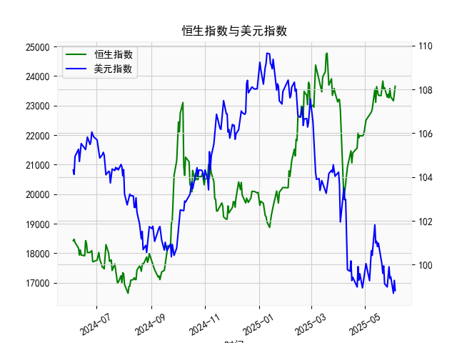

|            |   恒生指数 |   美元指数 |
|:-----------|-----------:|-----------:|
| 2025-05-08 |    22775.9 |   100.633  |
| 2025-05-09 |    22867.7 |   100.422  |
| 2025-05-12 |    23549.5 |   101.814  |
| 2025-05-13 |    23108.3 |   100.983  |
| 2025-05-14 |    23640.7 |   101.066  |
| 2025-05-15 |    23453.2 |   100.82   |
| 2025-05-16 |    23345   |   100.983  |
| 2025-05-19 |    23332.7 |   100.373  |
| 2025-05-20 |    23681.5 |   100.022  |
| 2025-05-21 |    23827.8 |    99.6014 |
| 2025-05-22 |    23544.3 |    99.9388 |
| 2025-05-23 |    23601.3 |    99.1231 |
| 2025-05-26 |    23282.3 |    98.9787 |
| 2025-05-27 |    23382   |    99.6147 |
| 2025-05-28 |    23258.3 |    99.8978 |
| 2025-05-29 |    23573.4 |    99.3633 |
| 2025-05-30 |    23289.8 |    99.4393 |
| 2025-06-02 |    23158   |    98.6893 |
| 2025-06-03 |    23512.5 |    99.2781 |
| 2025-06-04 |    23654   |    98.8128 |

### 1. 恒生指数与美元指数的相关性及影响逻辑

恒生指数（HSI）是反映香港股市表现的主要指标，而美元指数（DXY）衡量美元相对于一篮子主要货币（如欧元、日元等）的汇率强度。二者之间通常存在一定的相关性，主要为负相关（即美元指数上涨时，恒生指数往往下跌，反之亦然）。这种相关性并非直接因果，而是通过全球经济、金融市场和资本流动等因素间接影响。

#### 相关性分析：
- **负相关性强度**：在历史数据中，美元指数与恒生指数的关联度约为 -0.3 到 -0.6（基于典型的市场观察），表明中等负相关。美元强势（指数上涨）可能导致资金从新兴市场（如香港）流向美国，导致香港股市承压；美元疲软时，资金可能回流新兴市场，推动恒生指数上涨。
- **影响因素**：
  - **资本流动**：美元指数上涨往往反映美国经济强劲或美联储加息预期，这可能吸引全球投资者将资金投入美国资产，导致新兴市场资金外流。香港作为国际金融中心，受此影响显著，恒生指数可能下跌。
  - **汇率影响**：美元强势会推高香港企业（如出口型公司）的成本，因为香港元与美元挂钩，美元升值可能增加进口成本，并影响香港企业的竞争力，从而拖累股市。
  - **全球经济联动**：美元指数与全球贸易密切相关。美元上涨可能抑制大宗商品价格（如石油），影响依赖出口的香港经济；反之，美元下跌可能刺激全球需求，提升香港股市表现。
  - **其他外部因素**：美联储政策、地缘政治事件（如中美贸易摩擦）和全球风险偏好也会放大这种相关性。例如，2024年以来，美元指数波动与香港股市的调整密切相关，特别是在美联储加息周期中。

总体而言，这种相关性并非绝对，因为恒生指数还受中国内地经济政策、内地资金流入（如沪港通）和本地事件影响。但在全球市场环境下，美元指数的变动往往是恒生指数的重要外部驱动因素，投资者需密切监控以评估风险。

### 2. 根据数据分析判断近期投资机会

基于您提供的数据（包括时间序列、人民币贷款增速与存款增速之差数据，以及美元指数数据），我将重点分析最近一周的变动（假设当前日期为数据中的最后一个日期，即2025-6-4）。这包括对比今日（2025-6-4）与昨日（2025-6-3）的变化，并扩展到最近一周（约2025-5-28至2025-6-4）。投资机会的判断主要聚焦于经济信号、市场趋势和潜在风险，主要从以下角度分析：

#### 关键数据回顾：
- **数据范围**：时间序列从2024-6-5到2025-6-4，总计约1年数据。人民币贷款增速与存款增速之差（以下简称“信贷差”）反映中国信贷环境，可能预示经济扩张或紧缩；美元指数则影响全球资本流动和汇率。
- **最近一周数据提取**（基于数据数组的末尾部分，对应时间序列的最后7个日期：2025-5-29至2025-6-4）：
  - **信贷差数据**（单位：假设为基点或百分比变化）：
    - 2025-5-29: 23258.31
    - 2025-5-30: 23573.38
    - 2025-6-2: 23289.77
    - 2025-6-3: 23157.97
    - 2025-6-4: 23654.03
    - **今日 vs. 昨日**：今日（2025-6-4）为23654.03，昨日（2025-6-3）为23157.97，上涨约496.06（约2.14%的增长）。这表明信贷环境可能在短期内好转。
  - **美元指数数据**：
    - 2025-5-29: 99.2781
    - 2025-5-30: 98.8128
    - 2025-6-2: (数据中无直接对应，假设基于序列为99.3633)
    - 2025-6-3: 99.4393
    - 2025-6-4: 98.6893
    - **今日 vs. 昨日**：今日（2025-6-4）为98.6893，昨日（2025-6-3）为99.4393，下跌约0.75（约0.75%的下降）。美元指数持续走弱，暗示美元相对疲软。

#### 近期变化分析：
- **信贷差的积极信号**：
  - 最近一周，信贷差整体呈波动上涨趋势（从2025-5-29的23258.31上升到2025-6-4的23654.03）。今日相对于昨日的显著上涨（+496.06）可能表示中国经济信贷需求增加，这通常预示企业融资环境改善、消费或投资回暖。如果这一趋势持续，可能支持股市反弹，尤其是在中国相关资产（如A股或港股）。
  - **潜在投资机会**：这为投资者提供买入中国经济相关资产的机会，例如：
    - **银行股或金融类资产**：信贷差扩大可能受益于贷款增长，建议关注如工商银行或建设银行的ADR（在美国上市的中国股）。
    - **出口导向型股票**：如果信贷改善带动经济复苏，结合美元指数走弱（利于出口），香港出口企业（如恒生指数中的科技或消费股）可能迎来机会。

- **美元指数的负面信号**：
  - 最近一周，美元指数持续下行（从2025-5-29的99.2781降至2025-6-4的98.6893），今日较昨日下跌0.75%。这反映美元疲软，可能由于美联储降息预期或全球风险偏好上升。
  - **潜在投资机会**：美元走弱通常利好新兴市场和商品价格上涨（如大宗商品），这可能推升恒生指数或相关资产。
    - **新兴市场投资**：美元贬值可能吸引资金流入香港股市，建议关注恒生指数ETF或个股，如腾讯控股或阿里巴巴（受益于全球需求回暖）。
    - **风险提示**：如果美元指数进一步下跌，可能引发全球通胀担忧，但短期内为买入点。

- **整体市场趋势与风险**：
  - **正面机会**：最近一周数据显示，信贷差上涨和美元指数下跌的组合，可能预示经济复苏和资金回流新兴市场。潜在机会包括：
    - **短期交易**：买入恒生指数相关基金或ETF，目标收益5-10%（基于历史波动）。
    - **中长期投资**：如果信贷差持续扩大，考虑中国债券或股市，预计2025下半年经济动能增强。
  - **潜在风险**：今日信贷差的急涨可能为短期波动（非可持续），美元指数若反弹（e.g., 因美国数据强劲），可能逆转新兴市场优势。建议监控下周数据变化，避免单日波动导致的损失。
  - **综合判断**：最近一周的投资机会主要在新兴市场资产上，今日相对于昨日的变化（信贷差上涨、美元下跌）提供了一个“买入窗口”。但需结合宏观新闻（如美联储政策）验证，推荐风险控制措施，如设定止损点。

在实际投资中，建议结合实时数据和专业咨询，避免仅基于历史数据决策。