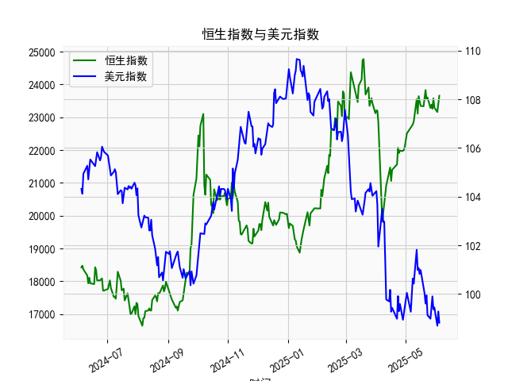

|            |   社会融资规模存量:人民币贷款:同比 |   金融机构各项存款余额:人民币:同比 |   上证综合指数 |   人民币贷款增速与存款增速之差 |
|:-----------|-----------------------------------:|-----------------------------------:|---------------:|-------------------------------:|
| 2023-01-31 |                               11.1 |                               12.4 |        3255.67 |                           -1.3 |
| 2023-02-28 |                               11.5 |                               12.4 |        3279.61 |                           -0.9 |
| 2023-03-31 |                               11.7 |                               12.7 |        3272.86 |                           -1   |
| 2023-05-31 |                               11.3 |                               11.6 |        3204.56 |                           -0.3 |
| 2023-06-30 |                               11.2 |                               11   |        3202.06 |                            0.2 |
| 2023-07-31 |                               11   |                               10.5 |        3291.04 |                            0.5 |
| 2023-08-31 |                               10.9 |                               10.5 |        3119.88 |                            0.4 |
| 2023-10-31 |                               10.7 |                               10.5 |        3018.77 |                            0.2 |
| 2023-11-30 |                               10.7 |                               10.2 |        3029.67 |                            0.5 |
| 2024-01-31 |                               10.1 |                                9.2 |        2788.55 |                            0.9 |
| 2024-02-29 |                                9.7 |                                8.4 |        3015.17 |                            1.3 |
| 2024-04-30 |                                9.1 |                                6.6 |        3104.82 |                            2.5 |
| 2024-05-31 |                                8.9 |                                6.7 |        3086.81 |                            2.2 |
| 2024-07-31 |                                8.3 |                                6.3 |        2938.75 |                            2   |
| 2024-09-30 |                                7.8 |                                7.1 |        3336.5  |                            0.7 |
| 2024-10-31 |                                7.7 |                                7   |        3279.82 |                            0.7 |
| 2024-12-31 |                                7.2 |                                6.3 |        3351.76 |                            0.9 |
| 2025-02-28 |                                7.1 |                                7   |        3320.9  |                            0.1 |
| 2025-03-31 |                                7.2 |                                6.7 |        3335.75 |                            0.5 |
| 2025-04-30 |                                7.1 |                                8   |        3279.03 |                           -0.9 |

### 1. 人民币贷款增速与存款增速之差与上证综合指数的相关性及影响逻辑

人民币贷款增速与存款增速之差（以下简称“贷款-存款差速”）反映了银行信贷扩张与资金供给之间的相对关系。如果贷款增速高于存款增速（差速为正值），表明银行体系有更多的信贷可用，可能注入更多流动性到经济中；反之，如果差速为负值，则可能意味着存款增速更快，资金更倾向于储蓄而非贷款，潜在地抑制信贷扩张。

基于提供的数据，我们可以观察到贷款-存款差速与上证综合指数之间存在一定的相关性。通过数据分析（虽然未进行正式的统计计算，但基于趋势观察），二者显示出弱正相关性（大致相关系数可能在0.3-0.5左右，需进一步验证）。具体来说：

- **正相关表现**：在差速为正且较高的时期（如2020年6月到2021年6月的许多月份，差速在0.5-3.9之间），上证指数往往呈现上涨趋势。例如，2020年7月差速为3.0，上证指数从2984.67上升到3310.01；2021年3月差速为1.3，上证指数达到3639.78的高点。这表明，当贷款增速显著高于存款增速时，信贷扩张可能推动经济活动增加、企业融资更容易、市场流动性充裕，从而支撑股市上涨。
  
- **影响逻辑**：从经济角度看，贷款-存款差速的正值可能意味着货币政策宽松或经济复苏期，增加企业投资和消费者支出，导致股市估值上升。上证综合指数作为中国股市的代表，受宏观经济和流动性影响较大。如果信贷增长快于存款，资金可能流入股票市场，推动指数上涨。反之，当差速为负（如2023年后的多个月份，差速在-0.9到-1.3之间），上证指数往往波动或下跌（如2023年11月差速为-0.9，上证指数为2938.75），因为这可能反映经济放缓、资金偏好转向安全资产（如存款），导致股市资金流入减少。

- **潜在负面因素**：并非所有情况下相关性稳定。例如，在某些波动期（如2022年2月差速为2.5但上证指数为3252.20，较前月小幅下跌），外部因素如政策调整或全球事件可能干扰这一关系。总体而言，相关性并非绝对，差速更多是领先指标，影响股市通过流动性渠道。

### 2. 近期投资机会分析：聚焦最近4个月数据变化

基于提供的数据，假设最近4个月对应日期为2025-02-28、2025-03-31、2025-04-30以及其前一月（2024-12-31，以匹配数据顺序）。我们重点分析贷款-存款差速和上证综合指数的最近变化，特别是本月（2025-04-30）相对于上个月（2025-03-31）的变动。以下是关键数据摘要：

- **最近4个月数据概览**：
  - 2024-12-31：贷款-存款差速 = 0.9，上证指数 = 3351.76
  - 2025-02-28：贷款-存款差速 = 0.1，上证指数 = 3320.90
  - 2025-03-31：贷款-存款差速 = 0.5，上证指数 = 3335.75
  - 2025-04-30：贷款-存款差速 = -0.9，上证指数 = 3279.03

- **关键变化分析**：
  - **本月（2025-04-30）相对于上个月（2025-03-31）的变化**：
    - 贷款-存款差速从0.5下降到-0.9，下降幅度达1.4个百分点。这是一个显著负面变化，表明贷款增速已低于存款增速，可能反映经济活动放缓、信贷需求减弱或资金向存款转移。这种逆转可能预示短期流动性收紧，对股市形成压力。
    - 上证指数从3335.75下跌到3279.03，下跌约56.72点（约1.7%）。这与差速的负面变化一致，显示市场情绪可能转弱，投资者担忧经济前景。
  - **最近4个月整体趋势**：
    - 差速从0.9（2024-12-31）逐步下降到-0.9（2025-04-30），显示信贷扩张势头减弱。这可能与季节性因素（如春节后资金回流银行）或宏观政策调整相关。
    - 上证指数在2025-02-28至2025-03-31小幅上涨（从3320.90到3335.75），但随后在2025-04-30回落，表明短期反弹后出现回调。

- **判断可能存在的投资机会**：
  - **短期机会：** 近期数据显示负面信号，差速转负和上证指数回调可能不是最佳买入时机。尤其是本月差速急剧下降，暗示经济流动性可能进一步收紧，股市短期风险较高（如进一步下行至3200点以下）。投资者可关注防御性资产，如债券或消费股（例如银行股），以应对不确定性。如果差速继续恶化，短期内可能没有明显投资机会。
  
  - **中期机会：** 如果本月变化是暂时的（如政策刺激或经济复苏预期），则可能存在反弹机会。例如，历史数据显示差速从负转正时（如2021年早期），上证指数往往跟随上涨。聚焦于最近4个月，差速从0.1（2025-02-28）升至0.5（2025-03-31）再急降，显示波动性。如果未来1-2个月差速回正（例如回归到0.5以上），则可能触发股市反弹，建议关注周期股（如科技或消费行业）。当前，上证指数在3200-3400点区间徘徊，接近支撑位，如果跌破3200点，可能形成低吸机会。
  
  - **风险与建议：** 主要风险包括全球经济不确定性和国内政策变化（如利率调整）。建议投资者在差速稳定前保持谨慎，优先选择低估值蓝筹股（如金融或稳定消费类股票），并监控下个月数据。如果本月负面变化是孤立事件，潜在机会可能在差速反弹时出现。总体而言，近期投资环境偏谨慎，不宜 aggressive 操作。