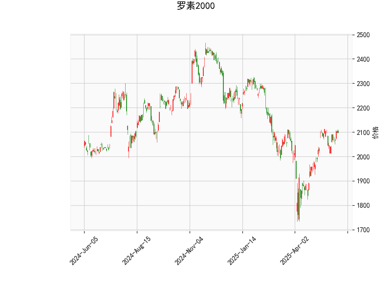

### 1. 对罗素2000指数的技术分析结果进行分析

以下是对提供的罗素2000指数技术指标的详细分析，这些指标反映了当前市场的动向，包括动量、趋势和潜在反转信号。罗素2000指数当前价格为2098.48，整体指标显示市场处于相对中性偏多头的状态，但存在一些潜在风险。

- **RSI (相对强弱指数)**: 当前RSI值为59.62，这表明指数处于中性区域（通常RSI在30-70之间为中性）。RSI高于50显示了轻微的多头势头，表明买方力量稍占上风，但尚未进入超买区域（RSI > 70）。这暗示短期内可能有进一步上涨的空间，但如果RSI快速上升至70以上，可能面临回调风险。

- **MACD (移动平均收敛散度)**: MACD线为25.05，信号线为24.89，MACD柱状图（Hist）为0.16。这是一个轻微的看涨信号，因为MACD线高于信号线，且柱状图为正值，表明短期多头动量正在增强。然而，柱状图值较小（仅0.16），显示多头势头不强，市场可能处于盘整阶段。如果MACD柱状图继续扩大，可能会确认向上趋势；反之，如果柱状图转为负值，则可能出现反转。

- **Bollinger Bands (布林带)**: 
  - 上轨：2189.42
  - 中轨：2004.41
  - 下轨：1819.40
  当前价格2098.48位于中轨和上轨之间，距离中轨上方约94点。这表明价格处于相对稳定的波动范围内，市场可能在盘整。Bollinger Bands的宽度显示出适中的波动性，如果价格向上突破上轨（2189.42），可能触发进一步上涨；如果跌破中轨，可能向下轨（1819.40）测试支撑位。目前的位置暗示短期内有上行潜力，但也需警惕波动加剧。

- **K线形态**: 检测到"CDLMATCHINGLOW"形态，这是一个典型的看跌反转信号。它通常出现在上涨趋势末期，表示价格可能形成双底或测试支撑，但后续可能反转下行。这与MACD的轻微看涨信号形成矛盾，表明市场存在不确定性，可能即将进入盘整或回调阶段。投资者应密切关注后续K线确认是否强化这一形态。

总体而言，技术指标显示罗素2000指数当前处于中性偏多头状态，RSI和MACD支持短期上涨，但K线形态的看跌信号和价格在中Bollinger Bands内提示潜在反转风险。市场可能在2000-2200点区间盘整，需结合外部因素（如经济数据或地缘事件）进一步验证。

### 2. 分析判断近期可能存在的投资或套利机会和策略

基于上述技术分析，罗素2000指数近期可能存在短期投资机会，但风险较高。罗素2000作为小盘股指数，通常对经济复苏敏感，当前指标显示市场在多头和空头之间摇摆。以下是可能的投资或套利机会及策略建议，重点关注趋势跟踪和风险管理。策略基于技术面，不包括基本面因素。

#### 可能的投资机会
- **短期多头机会**: RSI和MACD的轻微看涨信号表明，如果市场继续上行，价格可能测试Bollinger Bands上轨（2189.42）。若突破此水平，指数可能进一步上涨10-15点，带来短期获利空间。机会主要针对活跃投资者，可能出现在经济数据正面（如就业报告）时。
- **潜在空头或反转机会**: K线形态"CDLMATCHINGLOW"暗示下行风险，如果价格跌破中轨（2004.41），可能向下轨（1819.40）回落10-15%。这适合风险厌恶者，尤其在RSI接近超买（>70）时。
- **套利机会**: 罗素2000指数期货或期权市场可能存在套利空间。例如，利用MACD的轻微差异进行跨期套利（如买入当前合约、卖出远期合约），或在波动率较低时进行期权价差套利。但当前Bollinger Bands显示波动性适中，套利机会不如强势趋势时明显。

#### 推荐投资策略
- **多头策略**: 
  - **买入点**: 如果价格向上突破2189.42（上轨），或MACD柱状图扩大至0.5以上，可考虑买入ETF（如IWM）或指数期货。目标价位设定为2200-2250点，止损设在中轨下方（2000点以下）。
  - **风险管理**: 结合RSI监控，若RSI超过70，及时减仓以避免回调。适合短期交易者，预期持有1-2周。
  
- **空头策略**:
  - **卖出点**: 若K线形态确认反转（例如，价格跌破中轨2004.41），或RSI从59.62开始回落，可考虑做空期货或买入看跌期权。目标价位为1850-1900点，止损设在上轨上方（2200点以上）。
  - **风险管理**: 等待MACD柱状图转为负值作为确认信号。这策略适合在市场不确定时使用，预期持有短期。

- **中性或套利策略**:
  - **范围交易**: 在Bollinger Bands内（1819.40-2189.42）进行买卖。买入时价格接近下轨，卖出时接近上轨，利用盘整获利。或通过期权价差套利（如牛市价差或熊市价差）锁定波动率。
  - **组合策略**: 采用MACD和RSI的交叉信号进行套利，例如，当MACD线与信号线交叉时，调整头寸以捕捉短期波动。风险较低，但收益可能有限。

#### 总体风险与建议
- **风险因素**: 技术指标显示市场脆弱，外部事件（如美联储政策或全球经济数据）可能放大波动。RSI和MACD的信号不强，K线形态增加不确定性。
- **建议**: 优先使用止损订单，控制仓位不超过总资金的20%。对于长线投资者，等待更明确趋势（如RSI突破70或MACD大幅扩张）再行动。新手应结合模拟交易测试策略。最终，投资决策需参考实时数据和专业咨询。