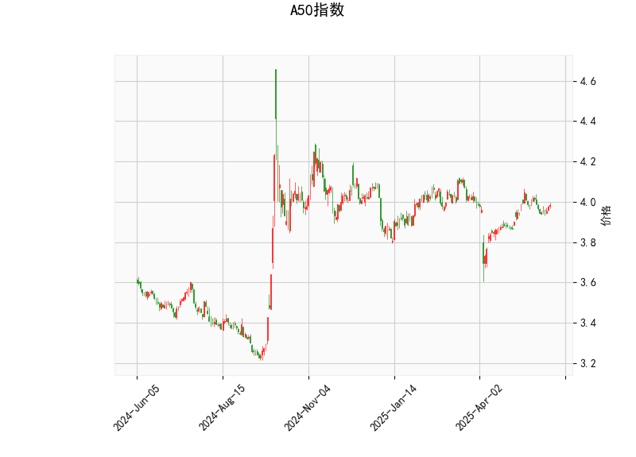

### 1. A50指数的技术分析结果解读

A50指数的技术分析数据展示了当前市场状态的多个关键指标，以下是对这些指标的详细分析：

- **当前价格（Current Price）**：3.984。这表明A50指数当前处于一个相对稳定的水平，位于Bollinger Bands的中轨附近（中轨为3.948），暗示价格在短期内可能保持震荡，而不是出现剧烈波动。

- **RSI（Relative Strength Index，相对强弱指数）**：55.49。这是一个动量指标，范围通常在0-100。RSI高于50表示市场偏向强势，但低于70，表明尚未进入超买区域。目前的55.49处于中性水平，显示买方和卖方力量基本平衡，市场可能在积累动能准备下一步动作。如果RSI继续上升，可能预示短期上行；反之，如果跌破50，可能出现回调。

- **MACD（Moving Average Convergence Divergence，移动平均收敛散度）**：MACD线为0.00963，信号线为0.01280，直方图（MACD Hist）为-0.00317（负值）。MACD线低于信号线（0.00963 < 0.01280），这通常是一个轻微的看跌信号，表明短期动能可能转向负面。直方图的负值进一步确认了这一趋势，可能暗示市场即将出现回调或修正。然而，MACD整体水平接近零，表明熊市信号并不强烈，而是更像是一个暂时的波动。如果MACD线向上交叉信号线，将可能转为看涨。

- **Bollinger Bands（布林带）**：上轨为4.126、中轨为3.948、下轨为3.769。当前价格3.984接近中轨，这显示价格处于中性区间，没有明显偏离均值。Bollinger Bands的宽度相对适中，表明市场波动率不高。如果价格向上逼近上轨（4.126），可能进入超买区域，适合考虑卖出；反之，如果跌向下轨（3.769），则可能出现超卖反弹机会。目前的定位暗示市场在窄幅震荡，等待突破方向。

- **K线形态**：检测到“CDLSPINNINGTOP”（纺锤线或十字星）。这是一种中性K线形态，通常表示市场不确定性，多头和空头力量均衡。纺锤线常出现在趋势转折点，可能预示价格即将反转或进入盘整期。在当前背景下，这与RSI的中性和MACD的轻微看跌信号相呼应，表明短期内市场缺乏明确方向，投资者需警惕潜在的波动。

总体而言，A50指数的技术指标显示市场处于一个中性偏谨慎的阶段。RSI和Bollinger Bands的中性表现表明没有极端风险，但MACD的负直方图和纺锤线形态暗示短期可能存在下行压力。整体来看，这不是一个强烈的趋势市场，而是更倾向于震荡或小幅修正。

### 2. 近期可能存在的投资或套利机会和策略分析

基于上述技术分析，A50指数的近期走势可能以震荡为主，潜在机会包括短期回调或反弹。以下是针对可能的投资和套利机会的判断，以及相应的策略建议。请注意，市场环境复杂，实际操作应结合宏观经济因素、全球事件和风险管理。

#### 可能存在的投资机会
- **短期回调机会**：MACD直方图为负且K线形态显示不确定性，暗示A50指数可能在短期内出现小幅下行（如向Bollinger Bands下轨3.769靠拢）。这为逆势投资者或短线交易者提供买入低点的机会，尤其是如果外部因素（如经济数据或政策支持）触发反弹。
- **震荡反弹机会**：RSI处于中性（55.49），且价格接近中轨，市场可能很快恢复上行动能。如果纺锤线后出现阳线（上升K线），这可能标志着潜在的上行突破，提供买入机会。
- **套利机会**：A50指数作为中国股票指数的代表，可能与相关衍生品（如期货、期权或ETF）存在价差。例如，如果A50期货价格与现货指数出现偏差，或者与全球指数（如恒生指数）相关性高时，可通过跨市场套利（如A50 ETF与期货的价差交易）来捕捉无风险或低风险收益。当前的中性指标环境可能放大此类机会，但需注意波动率。

#### 推荐的投资和套利策略
- **策略1: 短期观望并等待突破（适合保守投资者）**  
  鉴于MACD的轻微看跌信号和纺锤线的不确定性，建议先观望，避免盲目入场。设定价格警戒线：如果价格跌破中轨（3.948），可考虑轻仓买入作为回调机会；如果突破上轨（4.126），则转为看涨并加仓。风险管理：使用止损订单，例如设定在下轨（3.769）下方5%位置，以控制潜在损失。

- **策略2: 趋势跟踪交易（适合活跃交易者）**  
  监控MACD线是否向上交叉信号线（从当前负值转为正值）。如果发生，可在RSI高于50时买入多头头寸，目标价格设在上轨（4.126）。反之，如果MACD继续下行，可尝试短线做空。结合K线形态，纺锤线后若出现连续阳线，则加强买入信号。

- **策略3: 套利操作（适合专业投资者）**  
  利用A50指数的震荡特性，进行跨品种套利。例如：  
  - **期货与现货套利**：如果A50期货价格高于现货（基差扩大），可卖出期货并买入现货锁定收益。当前中性指标暗示基差可能稳定，适合在波动中捕捉。  
  - **期权策略**：购买看涨期权（Call Option）作为对冲，针对潜在反弹；或卖出看跌期权（Put Option）以赚取溢价，特别是在Bollinger Bands收窄时（当前宽度适中）。  
  例如，构建一个价差套利组合：买入A50 ETF并卖出相应期货合约，目标在RSI回升时获利。注意，套利需实时监控价差，并确保资金充足以应对市场波动。

总体判断：近期A50指数的投资机会以短期震荡为主，潜在回报中等，但风险也不可忽视。建议优先采用防御性策略，如分散投资和设置止盈止损。同时，结合基本面分析（如中国经济政策），以提升决策准确性。投资需谨慎，市场随时可能变化。