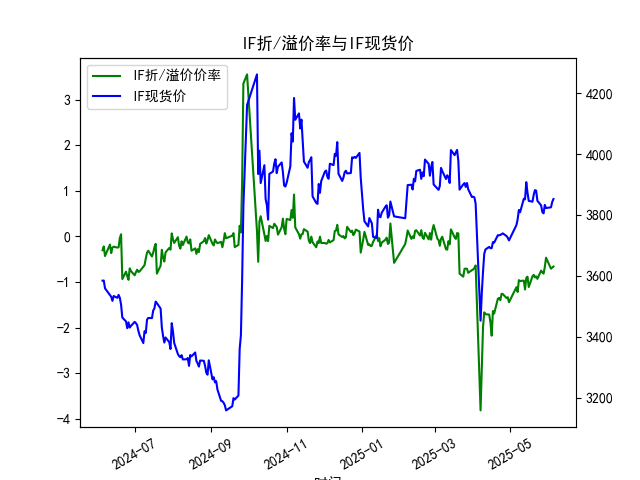
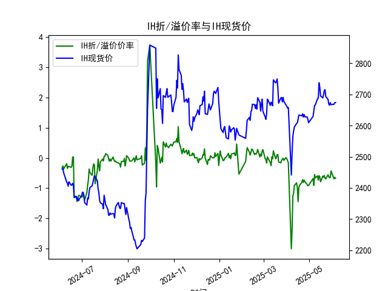
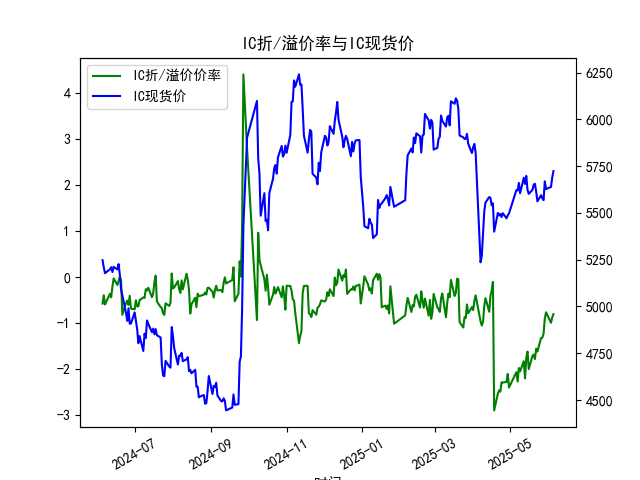
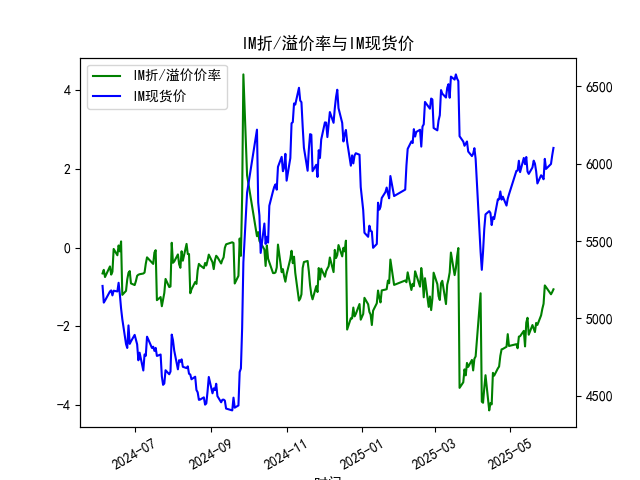

|            |   IF折/溢价率 |   IF现货价 |   IH折/溢价率 |   IH现货价 |   IC折/溢价率 |   IC现货价 |   IM折/溢价率 |   IM现货价 |
|:-----------|--------------:|-----------:|--------------:|-----------:|--------------:|-----------:|--------------:|-----------:|
| 2025-05-08 |     -0.957625 |     3816   |     -0.548944 |     2664.8 |     -1.97107  |     5660   |     -2.2617   |     6018.8 |
| 2025-05-09 |     -0.976471 |     3808.6 |     -0.663397 |     2666.2 |     -2.04348  |     5604.8 |     -2.25057  |     5945.2 |
| 2025-05-12 |     -0.966676 |     3853   |     -0.592655 |     2686.6 |     -1.82396  |     5688   |     -2.1153   |     6037   |
| 2025-05-13 |     -1.16158  |     3851   |     -0.733322 |     2688.2 |     -2.19778  |     5654.6 |     -2.51032  |     5996.6 |
| 2025-05-14 |     -0.908163 |     3907.4 |     -0.587737 |     2737.6 |     -1.74715  |     5697.8 |     -1.90524  |     6043   |
| 2025-05-15 |     -0.880406 |     3872.8 |     -0.631231 |     2723   |     -1.6149   |     5623   |     -1.78364  |     5949   |
| 2025-05-16 |     -1.10785  |     3846   |     -0.790006 |     2695.2 |     -1.99531  |     5601.8 |     -2.21348  |     5933.8 |
| 2025-05-19 |     -0.875523 |     3843.2 |     -0.602139 |     2688.8 |     -1.70946  |     5623   |     -1.96768  |     5975.4 |
| 2025-05-20 |     -0.840664 |     3865.4 |     -0.63422  |     2699.4 |     -1.6802   |     5650.8 |     -2.06014  |     6019.4 |
| 2025-05-21 |     -0.898296 |     3881.2 |     -0.580049 |     2712.6 |     -1.77707  |     5655.6 |     -2.14574  |     6000.6 |
| 2025-05-22 |     -0.87548  |     3879.6 |     -0.666962 |     2715.4 |     -1.55138  |     5614.8 |     -1.91397  |     5950   |
| 2025-05-23 |     -0.9292   |     3846.2 |     -0.695185 |     2693   |     -1.61406  |     5561.8 |     -1.96463  |     5872   |
| 2025-05-26 |     -0.748858 |     3831.2 |     -0.556508 |     2684.4 |     -1.32042  |     5594.6 |     -1.72151  |     5925   |
| 2025-05-27 |     -0.786501 |     3809.2 |     -0.621209 |     2668.6 |     -1.31181  |     5578   |     -1.55547  |     5915   |
| 2025-05-28 |     -0.814251 |     3805   |     -0.658307 |     2665.4 |     -1.22822  |     5568   |     -1.42796  |     5899   |
| 2025-05-29 |     -0.671205 |     3832.8 |     -0.642634 |     2673.6 |     -0.897044 |     5668.6 |     -0.961935 |     6031   |
| 2025-05-30 |     -0.464355 |     3822.4 |     -0.429145 |     2667.2 |     -0.763036 |     5627.8 |     -1.00489  |     5966   |
| 2025-06-03 |     -0.706454 |     3824.8 |     -0.695718 |     2668.6 |     -0.991047 |     5638.4 |     -1.18676  |     5998   |
| 2025-06-04 |     -0.680916 |     3842.4 |     -0.640112 |     2673.6 |     -0.874817 |     5688.8 |     -1.12968  |     6054   |
| 2025-06-05 |     -0.659067 |     3852   |     -0.673396 |     2674   |     -0.803601 |     5723.6 |     -1.06072  |     6101.6 |

### 1. 股指期货折/溢价率与现货价的相关性及影响逻辑

股指期货的折/溢价率（Basis Percent）是指期货价格相对于现货价格的百分比差额（正值表示溢价，负值表示折价），这与现货价密切相关。以下是它们之间的关键相关性和影响逻辑：

- **相关性概述**：  
  股指期货价格通常是现货价格的未来预期，因此折/溢价率与现货价存在正相关或负相关动态。具体而言，折/溢价率反映了市场对未来现货走势的预期。如果现货价上涨，期货可能溢价（正值）；如果现货价下跌，期货可能折价（负值）。这种相关性源于套利机制：当折/溢价率过大时，投资者会通过买卖期货和现货来获利，推动价格向合理水平收敛。

- **影响逻辑**：  
  - **套利行为**：如果期货折价（期货价格低于现货），投资者可能买入期货并卖出现货（反向套利），这会推高期货价格或拉低现货价，直到价差缩小。反之，溢价时则可能卖出期货买入现货。  
  - **市场情绪与预期**：牛市中，现货价上涨可能导致期货溢价（投资者预期进一步上涨）；熊市中，现货价下跌可能加剧折价（预期悲观）。例如，在经济不确定期，现货价波动会放大折/溢价率。  
  - **持有成本因素**：期货合约涉及融资成本、股息调整和交割期限，这些会影响价差。如果现货价上涨但持有成本较高，期货可能保持折价。  
  - **流动性与外部事件**：高流动性市场中，折/溢价率更易收敛；反之，在政策变化或全球事件影响下，现货价剧烈波动可能导致短期折/溢价率扩大，从而影响投资决策。

总体上，折/溢价率是现货价的领先指标，能帮助投资者识别套利或趋势机会，但需结合市场环境分析。

### 2. 基于数据分析判断近期投资机会

根据提供的数据，我分析了IF、IH、IC和IM四个股指期货的近1年数据，重点聚焦最近一周（约2025-05-29至2025-06-05）的变化，尤其是今日（2025-06-05）相对于昨日（2025-06-04）的差异。投资机会主要基于折/溢价率的异常（如大幅折价可能暗示套利买入机会）和现货价趋势（上涨可能预示牛市信号）。以下是逐个指数的分析：

- **总体观察**：  
  最近一周，所有指数的折/溢价率均维持在负值（折价状态），但今日相对于昨日，折价率整体有所收窄（绝对值变小），同时现货价普遍上涨。这表明市场情绪可能在好转，潜在投资机会包括套利操作或买入期货以捕捉现货反弹。但需注意，折价率仍处于较高水平（-0.6%至-1.1%），需警惕短期波动风险。

- **IF（沪深300指数期货）分析**：  
  - **最近一周数据**：折/溢价率从2025-05-29的-0.671205逐步波动至2025-06-05的-0.659067，现货价从3832.8上涨至3852.0。  
  - **今日 vs 昨日**：昨日折/溢价率为-0.680916（现货价3842.4），今日为-0.659067（现货价3852.0）。折价率收窄0.021849，现货价上涨9.6点。  
  - **投资机会判断**：今日折价率略有改善，现货价上涨暗示潜在牛市信号，可能存在买入期货的机会。如果折价继续收窄，套利空间增大；建议关注若现货价维持上涨，短期回报可观。但折价率仍负，需防范回调风险。

- **IH（上证50指数期货）分析**：  
  - **最近一周数据**：折/溢价率从2025-05-29的-0.642634波动至2025-06-05的-0.673396，现货价从2673.6微涨至2674.0。  
  - **今日 vs 昨日**：昨日折/溢价率为-0.640112（现货价2673.6），今日为-0.673396（现货价2674.0）。折价率扩大0.033284，现货价上涨0.4点。  
  - **投资机会判断**：今日折价率加深，但现货价小幅上涨，显示市场分歧。短期套利机会较小，可能适合观望；若折价率快速收敛（例如回落到-0.6%以下），可考虑买入期货跟涨现货。但整体波动小，机会不明显。

- **IC（中证500指数期货）分析**：  
  - **最近一周数据**：折/溢价率从2025-05-29的-0.897044波动至2025-06-05的-0.803601，现货价从5668.6上涨至5723.6。  
  - **今日 vs 昨日**：昨日折/溢价率为-0.874817（现货价5688.8），今日为-0.803601（现货价5723.6）。折价率收窄0.071216，现货价上涨34.8点。  
  - **投资机会判断**：今日折价率显著收窄，现货价强势上涨，暗示较强买入信号。IC的折价率较高（仍约-0.8%），这可能提供套利机会，如买入期货以跟随现货反弹。近期走势积极，是四大指数中投资机会最明显的，建议优先关注。

- **IM（中证1000指数期货）分析**：  
  - **最近一周数据**：折/溢价率从2025-05-29的-0.961935波动至2025-06-05的-1.060722，现货价从6031.0上涨至6101.6。  
  - **今日 vs 昨日**：昨日折/溢价率为-1.129676（现货价6054.0），今日为-1.060722（现货价6101.6）。折价率收窄0.068954，现货价上涨47.6点。  
  - **投资机会判断**：今日折价率收窄，但仍处于高折价水平，现货价大幅上涨显示强势。IM的折价率最高（约-1.06%），可能存在较大套利潜力，如在折价收敛时买入期货。短期内是潜在机会，但需监控若现货价回调，折价率可能扩大。

- **整体投资建议**：  
  基于上述，近期投资机会主要集中在IC和IM上，它们今日折价率收窄且现货价上涨明显，适合寻求套利或趋势跟进的投资者。IF和IH机会较弱，但若市场整体回暖，可作为辅助选择。风险提示：数据基于过去一周，未来走势受经济政策影响，建议结合实时市场监控进行决策。

