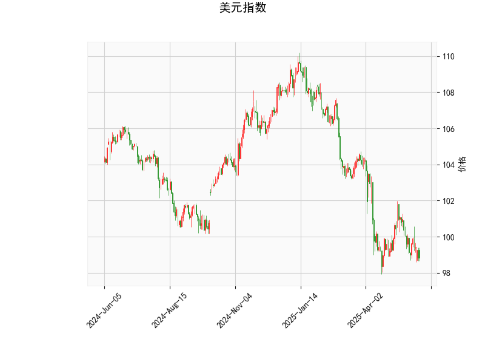

# 分析美元指数的技术分析结果

美元指数（DXY）当前的技术指标显示出整体弱势，但可能存在短期反弹潜力。以下是对关键指标的详细分析：

- **当前价格（98.8128）**：美元指数处于相对较低水平，接近近期低点。这表明市场可能处于超卖状态，但如果缺乏强有力的多头信号，价格可能进一步下探。

- **RSI（39.29）**：相对强弱指数（RSI）低于30，显示美元指数已进入超卖区域。这通常暗示潜在的反弹机会，因为卖家情绪可能已过度，买家可能开始入场。然而，RSI持续在低位可能意味着弱势趋势仍在延续。

- **MACD指标**：
  - MACD线（-0.4856）低于信号线（-0.4417），且直方图（-0.0439）为负值，这反映出短期看跌趋势。
  - 然而，直方图值较小（接近零），表明看跌动能正在减弱。这可能预示着趋势逆转或横盘整理的信号，如果多头力量增强，美元指数可能迎来短期反弹。

- **布林带指标**：
  - 上轨（105.02）、中轨（101.06）和下轨（97.10）。
  - 当前价格（98.81）接近下轨，这进一步确认了超卖状态。价格靠近下轨通常是买入信号，但如果突破下轨，可能触发进一步下跌。
  - 中轨（101.06）作为关键支撑位，如果价格反弹并站上中轨，将是多头转强的积极迹象。

- **K线形态（CDLLONGLINE和CDLMATCHINGLOW）**：
  - CDLLONGLINE表示一根实体较长的蜡烛线，可能反映出强烈的市场情绪（如连续下跌后的大阴线）。
  - CDLMATCHINGLOW暗示低点匹配或双底形态，这往往是潜在反转信号，表明卖家力量可能耗尽，买家开始积累。
  - 整体K线形态显示短期内可能存在底部信号，但需结合其他指标确认，避免假突破。

综合来看，美元指数当前处于弱势下行趋势，但超卖信号（如RSI和布林带下轨）暗示短期内可能出现技术性反弹。投资者应密切关注关键水平（如中轨101.06），如果价格未能反弹，美元指数可能进一步测试更低点位。

# 近期A股和港股的投资或套利机会和策略

美元指数的弱势通常对新兴市场有利，尤其是A股和港股，因为美元走弱可能吸引资金流入中国市场，推动股指上涨。然而，当前美元指数的超卖状态增加了不确定性，可能导致短期波动。基于上述分析，以美元指数潜在反弹为前提，以下是近期A股和港股可能的投资或套利机会和策略建议：

### 投资机会分析
- **总体市场影响**：
  - 如果美元指数从超卖区反弹（例如突破中轨101.06），这可能导致资金从新兴市场流出，对A股和港股造成压力，特别是对出口导向型股票（如消费、科技板块）。反之，如果美元继续走弱，A股和港股可能受益于外资流入和人民币升值。
  - 当前A股（以上证指数为代表）可能处于相对低估值区域，港股（以恒生指数为代表）则更易受国际因素影响，潜在机会包括科技股和消费股反弹。

- **具体投资机会**：
  - **A股机会**： 
    - 关注低估值蓝筹股和成长股，例如在科技（如半导体、5G）和消费（如家电、食品）板块。美元弱势可能刺激内需驱动型股票上涨。如果美元反弹，建议选择防御性板块，如公用事业或医疗，以降低风险。
    - 短期机会：RSI和K线形态暗示美元可能反弹，但若A股未跟随下跌，可考虑买入超跌股（如近期回调的银行股），目标回报率10-15%。
  - **港股机会**：
    - 港股更国际化，受美元影响更大。如果美元指数保持弱势，中概股（如阿里巴巴、腾讯）可能迎来估值修复机会。当前港股的波动性较高，适合短期交易。
    - 潜在机会：利用美元弱势推动的跨境资金流入，投资中概股ADR（如在纽约上市的中国公司），预计回报在5-10%。

### 套利机会和策略
- **套利基础**：A股和港股之间存在价格差异（如同股不同价），可以通过沪港通/深港通机制进行套利。如果美元指数反弹，港股可能比A股更先下跌，创造套利空间。
  
- **具体套利策略**：
  - **跨市场套利**：
    - 如果A股某股票（如科技股）相对港股同类股票（如中概股）出现折价（例如A股价格低于港股），可买入A股并卖出港股（或反之），利用价格收敛获利。预计套利周期为1-3个月，风险控制在5%以内。
    - 例如，腾讯控股在港股和A股（通过相关ETF）的价格差异可作为套利目标：若美元弱势导致港股先涨，可在港股买入后在A股卖出相关品种。
  - **短期波动策略**：
    - 结合美元指数信号，使用期权或期货进行套利。例如，如果预计美元反弹导致港股下跌，可买入A股看涨期权并卖出港股看跌期权，锁定潜在收益。
    - 风险管理：设置止损位（如美元指数若跌破97.10，则转为多头策略），并控制仓位不超过总资金的20%。
  - **整体策略建议**：
    - **防御性策略**：在美元指数不确定期，优先选择低风险资产，如A股的ETF或港股的稳定蓝筹股，避免高杠杆操作。
    - **进攻性策略**：若美元继续弱势，加大对A股成长股的配置；若反弹迹象明显，转向港股套利以捕捉短期差价。
    - **监控要点**：持续跟踪美元指数关键水平（中轨101.06）和全球经济数据（如美联储政策），结合A股/港股成交量变化调整策略。

总体而言，近期A股和港股的投资机会较大，但需谨慎应对美元指数的潜在反弹。建议投资者结合个人风险偏好，采用多元化策略，并咨询专业顾问以规避市场波动风险。