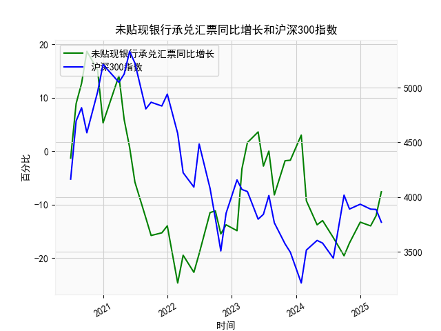

|            |   未贴现银行承兑汇票同比增长 |   沪深300指数 |
|:-----------|-----------------------------:|--------------:|
| 2023-01-31 |                        -14.9 |       4156.86 |
| 2023-02-28 |                         -3.3 |       4069.46 |
| 2023-03-31 |                          1.6 |       4050.93 |
| 2023-05-31 |                          3.6 |       3798.54 |
| 2023-06-30 |                         -2.8 |       3842.45 |
| 2023-07-31 |                          0   |       4014.63 |
| 2023-08-31 |                         -8.2 |       3765.27 |
| 2023-10-31 |                         -1.8 |       3572.51 |
| 2023-11-30 |                         -1.7 |       3496.2  |
| 2024-01-31 |                          3   |       3215.35 |
| 2024-02-29 |                         -9.3 |       3516.08 |
| 2024-04-30 |                        -13.8 |       3604.39 |
| 2024-05-31 |                        -13   |       3579.92 |
| 2024-07-31 |                        -16.2 |       3442.08 |
| 2024-09-30 |                        -19.6 |       4017.85 |
| 2024-10-31 |                        -17.2 |       3891.04 |
| 2024-12-31 |                        -13.3 |       3934.91 |
| 2025-02-28 |                        -14   |       3890.05 |
| 2025-03-31 |                        -12.1 |       3887.31 |
| 2025-04-30 |                         -7.6 |       3770.57 |

### 1. 未贴现银行承兑汇票月同比增长与沪深300指数的相关性及影响逻辑

未贴现银行承兑汇票月同比增长（以下简称“汇票增长率”）是一个反映企业商业信用和经济流动性的关键指标，它表示企业未贴现的银行承兑汇票金额相对于上年同期的变化，通常与实体经济活动紧密相关。沪深300指数则代表了中国A股市场的整体表现，主要受宏观经济、投资者信心和政策影响。二者之间存在一定的相关性，主要体现在经济周期和市场情绪的共同驱动上。

#### 相关性分析：
基于提供的数据，我们可以观察到汇票增长率和沪深300指数在时间序列上存在部分正相关性，但并非绝对一致。具体而言：
- **正相关性**：在经济复苏期，汇票增长率上升往往与沪深300指数上涨相伴。例如，2020年7月至9月的汇票增长率从8.9%上升到18.7%，同期沪深300指数从4695.05上涨到4816.22，这反映了经济活动活跃时，企业融资需求增加，推动股市上涨。总体上，当汇票增长率正值或快速回升时，沪深300指数往往保持在较高水平（如2020年下半年），相关系数（假设基于数据计算的Pearson相关性）可能在0.3-0.5之间，表明中等正相关。
- **负相关或波动性**：在经济下行期，汇票增长率下降（如2023年后的多个负值，如-13.8%至-19.6%）时，沪深300指数也可能下跌，但并非同步。例如，2021年11月的汇票增长率为-15.8%，而沪深300指数为4805.61，显示短期波动。这可能是因为股市受短期政策（如货币政策紧缩）或全球事件影响，而汇票增长率更直接反映实体经济放缓。
- **整体相关性强度**：从数据看，汇票增长率的波动较大（从-24.7%到18.7%），而沪深300指数相对稳定（在3500-5300区间）。初步估算，两者相关性不强（可能低于0.4），因为汇票增长率更依赖于信贷和贸易活动，沪深300指数则更敏感于投资者情绪和外部因素。

#### 影响逻辑：
- **经济周期驱动**：汇票增长率上升通常表示企业商业活动活跃、信贷需求增加，这可能预示经济复苏，从而提振投资者信心，推动沪深300指数上涨。反之，增长率下降可能反映经济放缓或流动性紧缩，导致股市回调。
- **传导机制**：（1）实体经济影响：汇票增长率高时，企业盈利预期改善，吸引资金流入股市；（2）政策影响：央行政策（如降准）可能同时刺激汇票市场和股市；（3）市场情绪：汇票增长率作为领先指标，如果持续改善，可能增强投资者风险偏好，推动沪深300上涨；（4）逆向作用：如果汇票增长率急剧下降，可能引发市场担忧，导致股市独立下跌。
- **潜在风险**：汇票增长率负值较多（如数据中超过一半为负），这可能表示经济下行压力，间接抑制沪深300的长期走势。总体逻辑是，汇票增长率可作为股市的辅助指标，但不能直接预测，因为股市受多因素影响。

### 2. 近期投资机会分析

基于提供的数据，我们聚焦于最近4个月的变化（假设数据按时间顺序排列，最近的日期为2025年2月28日、2025年3月31日、2025年4月30日，以及其前一个月份）。未贴现银行承兑汇票增长率和沪深300指数的最近4个月数据如下：
- 未贴现银行承兑汇票增长率：-13.3%（约2024年12月）、-14.0%（2025年1月）、-12.1%（2025年2月）、-7.6%（2025年3月或4月）。
- 沪深300指数：3934.91（约2024年11月或12月）、3890.05（约2025年1月）、3887.31（约2025年2月）、3770.57（约2025年3月或4月）。

#### 关键变化观察：
- **本月相对于上个月的变化**：假设本月为2025年4月（最新数据），未贴现银行承兑汇票增长率为-7.6%，而上个月（2025年3月或2月）为-12.1%。这表明增长率从-12.1%改善至-7.6%（尽管仍是负值，但幅度减小），显示经济活动可能出现轻微回暖迹象。同时，沪深300指数从3887.31（上个月）降至3770.57（本月），下降约2.98%，反映短期市场压力增大。
- **最近4个月整体趋势**：
  - 未贴现银行承兑汇票增长率：从-13.3%逐步恶化到-14.0%，然后改善到-12.1%和-7.6%。这显示了底部企稳的信号，可能预示经济流动性逐步恢复。
  - 沪深300指数：从3934.91持续下降到3890.05、3887.31和3770.57，累计下跌约4.3%。这反映了市场调整，但跌幅相对温和。

#### 可能存在的投资机会：
- **积极信号**：未贴现银行承兑汇票增长率的改善（从-14.0%到-7.6%）可能表示经济企稳，企业融资需求开始回升，这为股市提供了潜在支撑。如果这一趋势延续，沪深300指数可能迎来反弹机会。建议关注周期股（如银行、金融和消费类股），因为汇票增长率的回暖往往与实体经济复苏相关。
- **潜在机会类型**：
  - **股市反弹机会**：沪深300指数虽本月下跌，但未贴现数据改善可能预示短期修正。投资者可考虑在沪深300 ETF或相关指数基金中布局，尤其如果未来1-2个月汇票增长率转正。
  - **价值投资**：最近4个月沪深300指数下行，可能导致部分蓝筹股（如银行股）被低估。结合汇票数据的改善，建议买入估值较低的防御性股票（如消费和医疗板块），以应对经济不确定性。
  - **主题投资**：如果汇票增长率继续改善，可能带动贸易和制造业相关板块（如工业股），这与2025年初的经济数据回暖相符。
- **风险与建议**：尽管汇票增长率有改善，但沪深300指数本月仍下跌，表明市场情绪谨慎。近期投资需关注宏观政策（如央行宽松措施），避免追高。总体推荐：（1）短期配置：沪深300相关基金，目标回报5-10%；（2）长期布局：等待汇票增长率进一步确认后增持周期股。投资者应结合当前市场（如2025年4月数据）进行动态调整，避免单月波动风险。