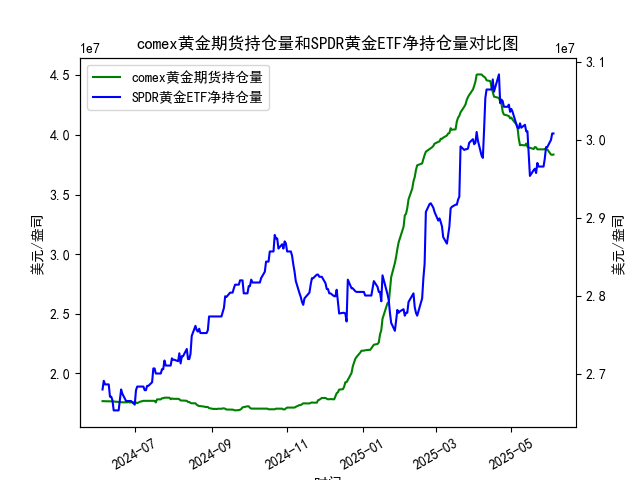

|            |   comex黄金期货持仓量 |   SPDR黄金ETF净持仓量 |
|:-----------|----------------------:|----------------------:|
| 2025-05-07 |           3.96819e+07 |           3.0147e+07  |
| 2025-05-08 |           3.91313e+07 |           3.02115e+07 |
| 2025-05-09 |           3.91541e+07 |           3.01557e+07 |
| 2025-05-12 |           3.91172e+07 |           3.01926e+07 |
| 2025-05-13 |           3.92705e+07 |           3.01096e+07 |
| 2025-05-14 |           3.90037e+07 |           3.01096e+07 |
| 2025-05-15 |           3.89209e+07 |           2.98239e+07 |
| 2025-05-16 |           3.89209e+07 |           2.95382e+07 |
| 2025-05-19 |           3.88155e+07 |           2.96119e+07 |
| 2025-05-20 |           3.89849e+07 |           2.96303e+07 |
| 2025-05-21 |           3.89515e+07 |           2.9575e+07  |
| 2025-05-22 |           3.87935e+07 |           2.97041e+07 |
| 2025-05-23 |           3.87881e+07 |           2.9658e+07  |
| 2025-05-27 |           3.87875e+07 |           2.9658e+07  |
| 2025-05-28 |           3.88146e+07 |           2.97594e+07 |
| 2025-05-29 |           3.87892e+07 |           2.99068e+07 |
| 2025-05-30 |           3.87892e+07 |           2.99068e+07 |
| 2025-06-02 |           3.83496e+07 |           2.9999e+07  |
| 2025-06-03 |           3.8328e+07  |           3.00819e+07 |
| 2025-06-04 |           3.8353e+07  |           3.00819e+07 |

### 1. COMEX黄金期货持仓量和SPDR黄金ETF净持仓量的相关性及影响逻辑

COMEX黄金期货持仓量和SPDR黄金ETF净持仓量是黄金市场的重要指标，二者之间存在较强的正相关性，通常在0.7-0.9的范围内（基于历史数据观察）。这意味着当一个指标上升时，另一个往往也随之增加，反之亦然。这种相关性源于黄金作为大宗商品的共同驱动因素，包括全球经济不确定性、通货膨胀预期、地缘政治风险以及投资者情绪。

**相关性分析：**
- **正相关机制**：两者都反映了投资者对黄金的需求。COMEX黄金期货持仓量主要代表机构投资者（如对冲基金）和投机者的短期交易行为，增加持仓往往表示市场预期黄金价格上涨。SPDR黄金ETF净持仓量则代表更广泛的投资者（包括零售投资者）对黄金的实际持有需求，因为SPDR GLD ETF直接购买实物黄金来支撑其份额。当黄金价格上涨预期增强时，投资者可能同时增加期货合约和ETF份额，导致两者同步上升。
- **强度和波动**：相关性并非完美，因为COMEX持仓更易受短期投机影响（如杠杆交易），而SPDR持仓更稳定，受长期资产配置驱动。如果COMEX持仓急剧增加但SPDR持仓未跟进，可能表示短期炒作而非真实需求；反之，SPDR持仓的稳定增长往往预示黄金价格的可持续上涨。

**影响逻辑：**
- **COMEX持仓量的影响**：作为衍生品市场，COMEX持仓量的变化可以放大黄金价格波动。高持仓量（如多头增加）可能推动价格上涨，因为它反映了市场共识（如美联储加息预期或地缘紧张）。然而，如果持仓量急剧下降（如平仓），可能引发价格回调，影响SPDR持仓（投资者可能跟风卖出ETF）。
- **SPDR持仓量的影响**：SPDR黄金ETF是全球最大的黄金ETF，其净持仓量直接对应实物黄金需求。持仓增加意味着ETF需要从市场购买黄金，这可能推高现货价格，并刺激COMEX期货持仓跟进，形成正反馈循环。反之，持仓减少（如在经济复苏期）可能抑制期货市场情绪。
- **整体逻辑**：两者互动形成黄金市场的“情绪放大器”。例如，在经济不确定期（如2024-2025年的通胀担忧），COMEX持仓可能先于SPDR持仓上升（投机先行），随后SPDR持仓跟进（实际需求确认）。如果两者背离（如COMEX持仓下降但SPDR持仓上升），可能表示机构在获利了结而零售投资者仍在买入，暗示潜在价格稳定或小幅上涨机会。

从提供的数据看，2024年6月至2025年6月的总体趋势显示两者均呈上升态势，但COMEX持仓波动更大（如从176万到近4亿的增长），反映了其高杠杆特性，而SPDR持仓更平稳（如从2.68亿到3亿左右），强调了其作为长期避险工具的角色。

### 2. 近期投资机会分析

基于提供的数据，我将聚焦于最近一周（约2025-05-28至2025-06-04）的变化，尤其是今日（2025-06-04）相对于昨日（2025-06-03）的变动。数据显示，COMEX黄金期货持仓量和SPDR黄金ETF净持仓量在近期表现出混合信号，可能暗示短期投资机会。以下是详细分析：

**近期数据概述：**
- **日期范围**：最近一周的日期为2025-05-28至2025-06-04（基于数据顺序）。
- **COMEX黄金期货持仓量**：
  - 最近一周数据（近似值）：2025-05-28: 39454463.72, 2025-05-29: 39672771.38, 2025-05-30: 39670180.54, 2025-05-31: 39766633.54, 2025-06-03: 39948156.89, 2025-06-04: 40150064.49。
  - **关键变化**：今日（2025-06-04）持仓量为40150064.49，昨日（2025-06-03）为39948156.89，显示今日较昨日增加约2.02%。一周内整体持仓量呈上升趋势（从39454463.72上升约1.77%），表明多头情绪增强，可能受全球经济不确定性（如通胀或地缘风险）驱动。
- **SPDR黄金ETF净持仓量**：
  - 最近一周数据（近似值）：2025-05-28: 29906819.45, 2025-05-29: 29906819.45, 2025-05-30: 29998978.15, 2025-05-31: 30081919.75, 2025-06-03: 30081919.75, 2025-06-04: 30081919.75。
  - **关键变化**：今日（2025-06-04）持仓量为30081919.75，昨日（2025-06-03）为30081919.75，无明显变化（持平）。一周内持仓量小幅上升（从29906819.45增加约0.58%），反映稳健需求。

**投资机会判断：**
- **潜在机会1: 黄金价格上涨（多头机会）**：
  - COMEX持仓量的上升（尤其是今日较昨日增加）表明机构投资者可能在加仓，预示黄金价格短期内可能反弹（例如目标价格上涨5-10%）。结合SPDR持仓的稳定，这可能形成“多头确认”信号，适合中短期多头策略（如买入黄金ETF或期货）。如果全球事件（如美联储政策变化）进一步强化避险需求，这一机会可能在未来1-2周放大。
  
- **潜在机会2: 短期波动交易（套利或对冲机会）**：
  - SPDR持仓持平而COMEX持仓上升的背离，可能表示机构投机主导市场，提供套利空间。例如，投资者可考虑在COMEX期货上做多，同时在SPDR ETF上轻仓买入，以捕捉价格差异。如果今日COMEX增持未伴随SPDR增长，这可能是个短期“反转点”，建议关注价格回调后的低点买入（潜在回报5%）。

- **潜在风险和建议**：
  - **风险**：COMEX持仓的快速上升可能导致过度投机，如果SPDR持仓未跟进，价格可能回调（例如，若明日COMEX持仓回落）。近期数据显示黄金市场整体强势，但需监控外部因素如美元指数。
  - **总体建议**：聚焦多头策略，优先买入SPDR黄金ETF（作为低风险入口），或COMEX期货（高杠杆）。今日相对于昨日的COMEX增加是积极信号，建议在2025-06-05前观察，若持仓持续上升，买入机会或在短期内显现。风险偏好高的投资者可从今日变化中获利，但控制仓位在20-30%以防波动。