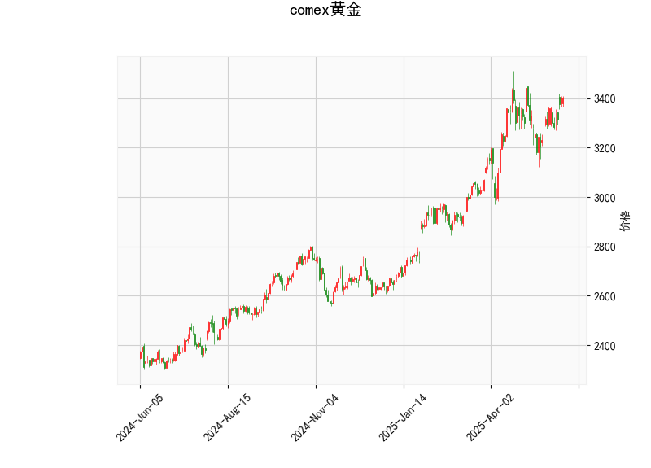

### COMEX黄金技术分析结果详解

#### 1. 对技术分析结果的分析
基于提供的COMEX黄金技术指标数据，我们可以对当前市场态势进行全面评估。以下是对各指标的逐一解释及整体解读：

- **当前价格（Current Price）**：黄金当前价格为3397.4。这一价格处于相对较高的位置，相比历史波动，这表明黄金近期可能处于上行趋势中，但需关注潜在的回调风险。

- **RSI（Relative Strength Index，相对强弱指数）**：RSI值为59.02。这是一个中性偏看涨的信号。RSI在50以上表示市场强势，但低于70的阈值，表明黄金尚未进入超买区。近期RSI的上升趋势暗示买盘力量较强，但如果继续上涨接近70，可能面临修正。

- **MACD指标**：
  - MACD线：33.30
  - MACD信号线：27.01
  - MACD直方图：6.29
  MACD线高于信号线，且直方图为正值，这是一个明显的看涨信号。MACD的正直方图表示短期移动平均线向上穿越长期移动平均线，暗示多头动能增强。投资者可视为买入机会，但需警惕如果直方图开始收窄或转为负值，可能预示趋势逆转。

- **Bollinger Bands（布林带）**：
  - 上轨（Upper Band）：3497.49
  - 中轨（Middle Band）：3232.38
  - 下轨（Lower Band）：2967.27
  当前价格3397.4位于中轨和上轨之间，更接近上轨。这表明黄金价格处于一个相对窄幅的波动区间内，市场波动性较低。如果价格进一步逼近上轨（3497.49），可能测试上行阻力；反之，如果跌破中轨，可能触发回调。布林带的收窄通常预示即将出现突破或反转。

- **K线形态**：检测到“CDLSHORTLINE”模式。这是一种短期K线形态，可能表示价格短期内出现快速拉升或反转信号（如锤头线或类似短期多头模式）。在当前背景下，这支持看涨观点，但需结合其他指标验证其持续性。如果K线形态反复出现，可能会强化多头趋势。

**整体市场解读**：从以上指标来看，COMEX黄金当前处于一个中性偏看涨的态势。RSI和MACD的组合显示多头主导，Bollinger Bands暗示价格有上行潜力，但接近上轨的临界点增加了回调风险。K线形态进一步强化了短期积极信号。然而，黄金市场受全球经济、地缘政治和美元波动影响较大，因此技术分析应与基本面结合使用。

#### 2. 近期可能存在的投资或套利机会和策略
基于上述分析，我们可以识别出一些潜在的投资机会和策略。黄金作为避险资产，其价格波动往往与经济不确定性相关。以下是针对近期市场的判断和建议：

- **投资机会判断**：
  - **看涨机会**：当前指标显示黄金有向上突破的潜力，尤其是MACD的看涨信号和RSI的强势表现。如果全球经济不确定性增加（如通胀上升或地缘冲突），黄金价格可能进一步上行，目标指向Bollinger Bands上轨（约3497.49）或更高。
  - **回调风险**：如果价格无法维持在当前水平，RSI接近超买或Bollinger Bands上轨被测试后回落，可能出现短期修正，价格跌向中轨（3232.38）左右。这为逢低买入提供机会。
  - **套利潜力**：黄金市场存在跨市场套利机会，例如COMEX期货与现货黄金（或SPDR Gold Shares ETF）的价差。如果COMEX价格相对于现货出现异常偏离（如由于期货溢价），投资者可通过期货与现货的套利操作获利。但需注意，近期全球市场联动性强，套利窗口可能短暂。

- **投资策略建议**：
  - **多头策略**：推荐在当前价格附近买入黄金期货或相关ETF（如GLD），目标设在上轨以上（3500以上）。止损位可设在中轨下方（约3200），以控制风险。理由：MACD和RSI的看涨信号支持这一操作，但需监控全球经济数据（如美国CPI或美联储会议）。
  - **波段交易策略**：如果价格接近上轨（3497.49），可考虑部分获利了结或观望待回调。待价格跌回中轨附近时，再次买入以捕捉反弹。这适合风险偏好中等的投资者，利用Bollinger Bands的波动区间。
  - **套利策略**：针对跨市场机会，投资者可监控COMEX期货与伦敦现货金的价差。如果差价扩大（如COMEX溢价过高），可采用“买入现货、卖出期货”的套利组合。反之，如果现货溢价，可反向操作。建议使用杠杆较低的工具，并结合技术指标（如MACD交叉）作为进出场信号。
  - **风险管理**：无论何种策略，都应设置严格的止损（如基于Bollinger Bands下轨）。黄金易受美元指数和利率变动影响，建议结合基本面分析（如关注美联储政策）。例如，如果美元走强，黄金价格可能回落，增加卖出机会。

总体而言，近期COMEX黄金的投资环境偏乐观，但需警惕市场波动。投资者应根据个人风险承受能力和市场动态调整策略，建议结合实时数据（如MT4平台）进行验证。