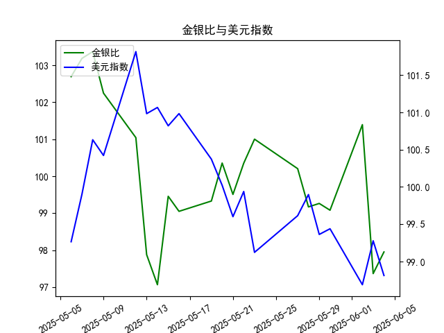

|            |    金价 |   银价 |   美元指数 |   金银比 |
|:-----------|--------:|-------:|-----------:|---------:|
| 2025-05-07 | 3392.25 | 32.875 |    99.9006 | 103.186  |
| 2025-05-08 | 3352.3  | 32.43  |   100.633  | 103.37   |
| 2025-05-09 | 3324.55 | 32.515 |   100.422  | 102.247  |
| 2025-05-12 | 3235.4  | 32.02  |   101.814  | 101.043  |
| 2025-05-13 | 3227.95 | 32.98  |   100.983  |  97.876  |
| 2025-05-14 | 3191.95 | 32.885 |   101.066  |  97.064  |
| 2025-05-15 | 3191.05 | 32.085 |   100.82   |  99.4561 |
| 2025-05-16 | 3182.95 | 32.135 |   100.983  |  99.0493 |
| 2025-05-19 | 3230.15 | 32.52  |   100.373  |  99.3281 |
| 2025-05-20 | 3261.55 | 32.5   |   100.022  | 100.355  |
| 2025-05-21 | 3299.65 | 33.16  |    99.6014 |  99.5069 |
| 2025-05-22 | 3284    | 32.725 |    99.9388 | 100.351  |
| 2025-05-23 | 3342.65 | 33.095 |    99.1231 | 101.002  |
| 2025-05-27 | 3296.7  | 32.9   |    99.6147 | 100.204  |
| 2025-05-28 | 3300.85 | 33.285 |    99.8978 |  99.1693 |
| 2025-05-29 | 3312.4  | 33.37  |    99.3633 |  99.2628 |
| 2025-05-30 | 3277.55 | 33.08  |    99.4393 |  99.0795 |
| 2025-06-02 | 3370.85 | 33.245 |    98.6893 | 101.394  |
| 2025-06-03 | 3334.75 | 34.25  |    99.2781 |  97.365  |
| 2025-06-04 | 3364.6  | 34.35  |    98.8128 |  97.9505 |

# 1. 金银比与美元指数的相关性及影响逻辑

金银比（Gold/Silver Ratio）是指黄金价格与白银价格的比率，通常用于评估两种贵金属的相对价值。当金银比较高时，表明黄金相对于白银更昂贵（即白银相对便宜）；当较低时，则白银相对更昂贵。美元指数（USD Index）则衡量美元对一篮子主要货币的汇率变化，美元指数上升表示美元走强，反之走弱。

### 相关性：
- **负相关性**：金银比与美元指数通常存在负相关关系。这是因为黄金和白银作为传统避险资产，其价格往往与美元呈反向运动。当美元走强时，贵金属价格通常下跌，因为美元是国际大宗商品的定价货币，导致黄金和白银的需求减少，从而可能拉高金银比（黄金价格相对白银更坚挺或下跌更少）。反之，当美元走弱时，贵金属价格往往上涨，这可能拉低金银比。
- **相关性强度**：根据历史数据，这种相关性并非绝对，而是受全球经济因素（如通胀、地缘政治风险和市场情绪）影响。在数据中，我们可以看到美元指数波动时，金银比也随之变化，例如美元指数下降时，金银比可能趋于稳定或小幅上升。

### 影响逻辑：
- **美元走强的影响**：美元升值会增加持有贵金属的机会成本，因为投资者可能转向美元资产，导致黄金和白银价格双双下跌。但如果黄金价格下跌幅度小于白银，金银比可能上升。这反映了投资者对黄金的偏好（如作为更稳定的避险工具）。
- **美元走弱的影响**：美元贬值往往刺激贵金属需求，尤其是白银（工业需求更强），可能导致金银比下降。逻辑在于，白银价格上涨幅度可能大于黄金，从而缩小两者比率。
- **其他因素**：虽然美元是关键驱动因素，但金银比还受供需动态（如矿产供应和工业需求）影响。总体上，美元指数的变化可以作为金银比的领先指标，帮助投资者预测贵金属市场趋势。

# 2. 近期投资机会分析

基于提供的数据，我将聚焦于最近一周的变动（从2025年5月28日至6月4日），并特别强调今日（2025年6月4日）相对于昨日（2025年6月3日）的变化。数据包括21天金银比和美元指数，我会分析整体趋势、关键变化，并判断可能的投资机会。注意，投资机会基于历史数据推断，实际决策应结合实时市场和风险评估。

### 数据概述：
- **最近一周日期和数据**：
  - 2025年5月28日：金银比 99.07950423，美元指数 99.4393
  - 2025年5月29日：金银比 99.26281091，美元指数 99.3633
  - 2025年5月30日：金银比 99.16929548，美元指数 99.8978
  - 2025年6月2日：金银比 101.39419462，美元指数 98.6893
  - 2025年6月3日（昨日）：金银比 97.3649635，美元指数 99.2781
  - 2025年6月4日（今日）：金银比 97.95050946，美元指数 98.8128

- **关键变化**：
  - **金银比**：最近一周，金银比整体呈波动下行趋势，从5月28日的99.08降至6月3日的97.36，但今日回升至97.95（较昨日上涨约0.59点）。这表明短期内金银比可能触底反弹，暗示白银相对于黄金的价值有所提升。
  - **美元指数**：最近一周，美元指数总体小幅下行，从5月28日的99.44降至今日的98.81（较昨日下降约0.47点）。美元走弱的趋势可能已持续数日，这通常利好贵金属市场。
  - **今日 vs 昨日**：金银比小幅上升（97.36 → 97.95），而美元指数微降。这可能反映美元走弱开始推动贵金属反弹，但金银比的上升暗示黄金价格相对白银更坚挺。

### 投资机会判断：
- **潜在机会1：买入白银**：
  - **理由**：金银比在最近一周内有所下降（尤其从6月2日的101.39到6月3日的97.36），表明白银相对黄金更具吸引力。如果这一趋势延续（结合美元走弱），白银价格可能进一步上涨。今日金银比虽小幅反弹，但仍处于较低水平（低于100），这往往是买入白银的信号。投资者可关注如果金银比跌破95，可能会触发更大反弹。
  - **风险**：如果美元指数企稳反弹（如未来几天回升至100以上），金银比可能再次上升，削弱白银的机会。

- **潜在机会2：黄金作为避险资产**：
  - **理由**：美元指数的持续走弱（从5月30日的99.90降至今日的98.81）通常利好黄金。金银比的波动显示黄金价格相对稳定，如果今日的反弹持续，黄金可能在短期内表现强势。近期数据表明，金银比在美元弱势环境下保持在97-101区间，这为黄金提供了潜在支撑点。
  - **风险**：今日金银比上升可能表示黄金正变得更贵，短期内可能面临回调。如果全球风险情绪改善，投资者可能转向其他资产。

- **整体市场建议**：
  - **近期焦点**：最近一周的数据显示美元走弱与金银比下行相结合，可能预示贵金属市场回暖。这为投资者提供了逢低买入的机会，尤其是在今日金银比小幅上升的背景下（可能是一个短期买入点）。建议监控未来1-2天数据：如果美元指数继续下降至98以下，金银比可能进一步回落，提供更佳的买入时机。
  - **多元化策略**：考虑贵金属相关ETF或期货，避免单一资产风险。总体而言，基于数据，短期内贵金属市场存在中性到看涨的机会，但需警惕全球经济不确定性（如通胀数据或地缘事件）。
  - **注意事项**：以上分析基于历史数据推断，并非投资建议。实际机会取决于更广泛的市场因素，投资者应结合止损策略进行操作。