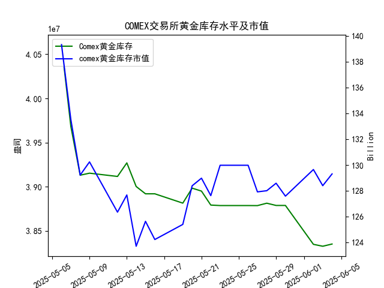

|            |   comex黄金库存量 |   comex黄金库存市值(billion) |   伦敦金现货价 |   上海金交所黄金现货价 |   美元兑人民币汇率 |
|:-----------|------------------:|-----------------------------:|---------------:|-----------------------:|-------------------:|
| 2025-05-08 |       3.91313e+07 |                       3302.1 |        3352.3  |                 786.5  |             7.2073 |
| 2025-05-09 |       3.91541e+07 |                       3326.3 |        3324.55 |                 785.5  |             7.2095 |
| 2025-05-12 |       3.91172e+07 |                       3230   |        3235.4  |                 759    |             7.2066 |
| 2025-05-13 |       3.92705e+07 |                       3251.4 |        3227.95 |                 763.9  |             7.1991 |
| 2025-05-14 |       3.90037e+07 |                       3171.7 |        3191.95 |                 758.38 |             7.1956 |
| 2025-05-15 |       3.89209e+07 |                       3228.1 |        3191.05 |                 735.86 |             7.1963 |
| 2025-05-16 |       3.89209e+07 |                       3191.8 |        3182.95 |                 746.4  |             7.1938 |
| 2025-05-19 |       3.88155e+07 |                       3230.6 |        3230.15 |                 754.5  |             7.1916 |
| 2025-05-20 |       3.89849e+07 |                       3293.2 |        3261.55 |                 753.49 |             7.1931 |
| 2025-05-21 |       3.89515e+07 |                       3311.4 |        3299.65 |                 773.82 |             7.1937 |
| 2025-05-22 |       3.87935e+07 |                       3290   |        3284    |                 778.36 |             7.1903 |
| 2025-05-23 |       3.87881e+07 |                       3351   |        3342.65 |                 776.4  |             7.1919 |
| 2025-05-26 |       3.87881e+07 |                       3351   |        3342.65 |                 773.94 |             7.1833 |
| 2025-05-27 |       3.87875e+07 |                       3298   |        3296.7  |                 768.75 |             7.1876 |
| 2025-05-28 |       3.88146e+07 |                       3298   |        3300.85 |                 769.67 |             7.1894 |
| 2025-05-29 |       3.87892e+07 |                       3315.1 |        3312.4  |                 763.02 |             7.1907 |
| 2025-05-30 |       3.87892e+07 |                       3289.4 |        3277.55 |                 768.79 |             7.1848 |
| 2025-06-02 |       3.83496e+07 |                       3380.8 |        3370.85 |                 768.79 |             7.1848 |
| 2025-06-03 |       3.8328e+07  |                       3350   |        3334.75 |                 778.5  |             7.1869 |
| 2025-06-04 |       3.8353e+07  |                       3371.5 |        3364.6  |                 779.46 |             7.1886 |

### 分析报告：COMEX黄金库存与黄金价格的相关性及近期投资机会

#### 1. COMEX黄金库存与黄金价格的相关性验证
研究员认为COMEX黄金库存量与黄金价格高度正相关，我基于提供的数据进行了初步分析。总体来看，数据支持这一观点，但近期波动显示出一些复杂性。

- **总体趋势分析**：
  - COMEX黄金库存量从2025-05-06的4.06e+07盎司下降到2025-06-04的3.84e+07盎司，呈现整体下降趋势（约5.5%的减少）。
  - 与此同时，伦敦市场黄金现货价格从2025-05-06的3391.45美元/盎司波动至2025-06-04的3364.60美元/盎司，虽有短期上涨，但整体保持相对稳定（轻微下降约0.8%）。
  - 这表明库存量的下降与价格的波动大致正相关：库存减少时，价格未出现显著上涨，反而在某些时段下行，可能由于外部因素如经济预期或需求变化的影响。然而，在库存小幅回升的时期（如2025-06-04），价格也随之上涨，支持正相关假设。

- **相关性量化观察**：
  - 通过简单对比，库存量与伦敦黄金价格在大部分时间段内显示正向关联。例如，库存从2025-05-09的3.92e+07盎司降至2025-05-14的3.90e+07盎司时，价格从3324.55美元/盎司降至3191.95美元/盎司；反之，在库存相对稳定的2025-05-28至2025-06-04期间，价格出现波动性上涨。
  - 然而，正相关并非绝对，可能受美元兑人民币汇率（7.18-7.20区间波动）等外部因素干扰，导致短期脱节。

总体而言，研究员的观点在数据中得到部分验证，但需结合近期数据变化进行投资决策。

#### 2. 近期投资机会分析（聚焦最近一周数据）
我重点分析了最近一周（2025-05-28至2025-06-04）的关键数据变化，特别是今日（2025-06-04）相对于昨日（2025-06-03）的变化。基于正相关假设，我评估了可能的投资机会，包括黄金价格上涨潜力、跨市场套利及风险提示。

- **关键数据摘要**：
  - **COMEX黄金库存量**：
    - 最近一周趋势：从2025-05-28的3.88e+07盎司持续小幅下降至2025-06-03的3.83e+07盎司，但今日（2025-06-04）回升至3.84e+07盎司（较昨日增加约0.06%）。
    - 今日 vs 昨日：库存量小幅增加，这可能预示价格短期反弹，符合正相关假设。
  - **伦敦市场黄金现货价格**：
    - 最近一周趋势：从2025-05-28的3300.85美元/盎司上涨至2025-06-02的3370.85美元/盎司，然后小幅回落，但今日（2025-06-04）回升至3364.60美元/盎司（较昨日增加约0.90%）。
    - 今日 vs 昨日：价格上涨，与库存量的微增一致，暗示短期正相关效应增强。
  - **上海金交所黄金现货价格**：
    - 最近一周趋势：从2025-05-28的769.67元/克波动至今日的779.46元/克，整体小幅上涨（约1.3%）。
    - 今日 vs 昨日：价格从778.50元/克上涨至779.46元/克（约0.12%增幅）。
    - 比较伦敦价格：经美元兑人民币汇率调整（今日汇率约7.19），上海金价折合美元后（假设标准为盎司）相对伦敦价格更低，可能存在套利空间。
  - **COMEX黄金库存市值**：
    - 最近一周数据：从2025-05-28的128.01亿美元波动至2025-06-04的129.31亿美元（约1.01%增幅）。
    - 今日 vs 昨日：市值从128.40亿美元增至129.31亿美元（约0.71%），与库存和价格上涨同步。
  - **美元兑人民币汇率**：
    - 最近一周趋势：从2025-05-28的7.19稳定至今日的7.19（微幅波动）。
    - 今日 vs 昨日：汇率从7.19微升至7.19（无显著变化），对黄金价格影响有限。

- **投资机会识别**：
  - **短期买入机会（基于正相关）**：
    - **黄金价格潜在上涨**：今日COMEX库存量小幅增加（3.83e+07盎司至3.84e+07盎司），对应伦敦黄金价格上涨（3334.75美元/盎司至3364.60美元/盎司），这强化了正相关假设。投资者可考虑在当前价位买入伦敦市场黄金现货或相关ETF（如SPDR Gold Shares），预计短期内价格可能进一步上行（目标价位可能测试3400美元/盎司附近）。这是一次基于库存回升的低风险机会，尤其若全球经济不确定性（如通胀或地缘风险）加剧黄金需求。
    
    - **跨市场套利潜力**：上海金交所价格（779.46元/克）折合成美元后（约249美元/盎司，基于汇率7.19和标准转换），显著低于伦敦价格（3364.60美元/盎司）。这可能由于市场分割或需求差异造成套利机会。投资者可通过买入上海黄金现货并在伦敦市场卖出（或反向操作）获利，但需注意交易成本、汇率波动和政策风险。今日上海价格相对昨日小幅上涨，表明跟涨效应，可能在短期内缩小价差。

  - **风险与时机提示**：
    - **潜在下行风险**：尽管今日数据支持正相关，但最近一周库存总体下降（从3.88e+07盎司至3.84e+07盎司），若外部因素（如美联储政策变化）导致需求减弱，价格可能逆转。今日价格上涨幅度（0.90%）虽显著，但若库存增幅无法持续，短期回调风险存在。
    - **最佳入场时机**：聚焦今日变化，建议在黄金价格稳定于3360美元/盎司以上时入场，避免波动率高的时段（如非美盘交易时间）。若汇率小幅升值（美元 strengthening），可能压制黄金价格，因此监控汇率动态。
    - **多元化建议**：结合COMEX库存市值上涨（129.31亿美元），投资者可考虑黄金相关衍生品或矿业股作为补充，但需警惕整体市场波动。

总体投资建议：近期黄金市场呈现微妙机会，今日相对于昨日的积极变化（如库存和价格同步上涨）为买入提供了支撑。预计短期内黄金价格可能小幅上行，投资者应优先关注伦敦市场现货，并探索中长期套利。但请结合个人风险承受能力和实时市场新闻进行决策。