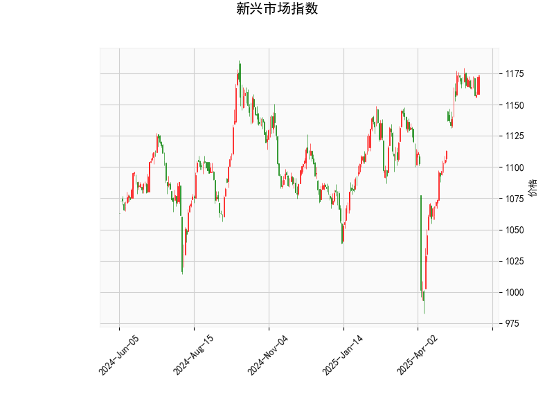

### 新兴市场指数的技术分析结果分析

#### 1. 整体技术指标解读
新兴市场指数的当前价格为1172.45，基于提供的指标，我们可以从多个维度分析其市场态势。以下是对关键指标的详细剖析：

- **RSI（相对强弱指数）**: 当前RSI值为62.81，这表明市场处于相对强势状态，但已接近超买区域（通常RSI>70被视为超买）。RSI在50以上表示买方主导，但62.81的水平暗示短期内可能出现回调风险。如果市场继续上涨，RSI可能很快突破70，进一步增加调整压力。

- **MACD（移动平均收敛散度）**: MACD线值为13.97，信号线值为16.39，MACD直方图为-2.42（负值）。这显示MACD线已跌破信号线，形成一个典型的看跌信号（死亡交叉）。直方图的负值表明短期动量转向弱势，可能预示价格下行趋势。整体MACD指标暗示卖方力量正在增强，尽管幅度不大。

- **布林带（Bollinger Bands）**: 上轨为1215.28，中轨为1119.91，下轨为1024.54。目前价格1172.45位于中轨和上轨之间，接近上轨。这反映市场波动率适中，但价格已进入相对高位。如果价格突破上轨，可能引发进一步上涨；反之，如果跌破中轨，则可能进入修正阶段。布林带的收窄或扩张趋势（未直接提供数据）将影响未来波动。

- **K线形态**: 检测到的形态包括“CDLBELTHOLD”（腰带持有线）和“CDLGAPSIDESIDEWHITE”（跳空侧边白实体）。这两种形态均具有看涨特性：
  - “CDLBELTHOLD”通常表示强势多头控制，实体蜡烛线较长，暗示短期趋势可能向上延续。
  - “CDLGAPSIDESIDEWHITE”涉及跳空上涨和白色实体蜡烛，表明买方热情高涨，可能推动价格进一步上行。
  然而，这些形态的可靠性需结合其他指标验证，因为MACD的看跌信号可能削弱其影响力。

总体而言，指标呈现混合信号：RSI和K线形态支持短期看涨，但MACD的负直方图和潜在超买风险（RSI接近70）提示警惕回调。新兴市场指数可能正处于一个关键转折点，价格波动性较高。

#### 2. 近期可能存在的投资或套利机会和策略判断
基于上述分析，我们可以评估新兴市场指数的潜在机会。考虑到全球新兴市场的波动性（如受经济数据、地缘政治影响），以下分析聚焦于短期（1-3个月）视角。机会主要源于指标的矛盾信号，但需强调风险管理。

##### 投资机会分析
- **潜在机会**:
  - **短期看涨机会**: K线形态的看涨信号（如“CDLBELTHOLD”）和价格接近布林上轨，暗示可能有向上突破的空间。如果全球风险偏好提升（如美联储降息预期），新兴市场指数可能进一步上涨，目标位可设在布林上轨附近（约1215）。这为多头投资者提供买入点。
  - **中期看跌机会**: MACD的死亡交叉和RSI的超买风险，表明指数可能面临回调。价格若跌破中轨（1119.91），可能测试下轨（1024.54），这适合空头或避险策略。新兴市场的估值敏感性（如中国或印度股市影响），可能放大下行压力。
  - **套利机会**: 在新兴市场指数（如MSCI Emerging Markets Index）对应的ETF（例如EEM）中，可能存在价格与净值（NAV）的偏差机会。例如，如果ETF价格低于NAV，由于套利机制，这可能是一个低风险买入点；反之，如果溢价过高，则可考虑卖出套利。但需监控流动性，避免滑点。

- **风险因素**:
  - 指标矛盾可能导致假突破，RSI超买和MACD看跌增加了市场逆转风险。
  - 外部因素如通胀数据、汇率波动或地缘事件，可能放大新兴市场的波动性。
  - 总体风险/回报比中等，建议结合基本面（如经济增长数据）验证。

##### 推荐策略
- **买入策略（针对看涨信号）**:
  - **条件**: 如果价格稳定在中轨以上，且K线形态持续出现看涨模式（如突破上轨），可考虑在1170附近买入相关ETF或指数基金。
  - **目标和止损**: 目标位设在1220（上轨上方5%缓冲），止损设在中轨下方（如1110），以控制回调风险。结合RSI，如果回落至55以下，再次考虑加仓。
  - **适合人群**: 风险偏好中高的投资者，例如通过期权或杠杆产品放大收益。

- **卖出或空头策略（针对看跌信号）**:
  - **条件**: MACD直方图若持续负值，或价格跌破中轨，可在1175附近卖出或做空指数期货。
  - **目标和止损**: 目标位设在下轨附近（1025），止损设在上轨上方（如1220）。这可利用短期回调获利。
  - **适合人群**: 经验丰富的交易者，避免新手操作以防波动性风险。

- **套利策略**:
  - **基于ETF偏差**: 监控EEM或其他新兴市场ETF的价格与NAV差。如果偏差超过1%，可进行现货-期货套利（例如，买入低估ETF，同时卖出相关期货）。在低流动性时段（如亚洲时段），这种机会更常见。
  - **跨市场套利**: 若新兴市场指数与发达市场（如S&P 500）相关性降低，可在二者间进行配对交易（例如，当新兴市场相对低估时买入）。
  - **风险管理**: 套利策略宜小仓位操作，持有期控制在几天内，以避免突发事件干扰。

##### 总体建议
新兴市场指数当前显示出短期上行潜力和中期下行风险，投资者应采用“观望+验证”的原则，避免盲目行动。建议结合实时数据（如后续K线形态变化）调整策略，并使用风险管理工具（如不超过总仓位的10%分配）。如果市场环境恶化（如全球通胀上升），优先转向防御性资产。最终，投资决策应参考个人风险承受能力和专业咨询。