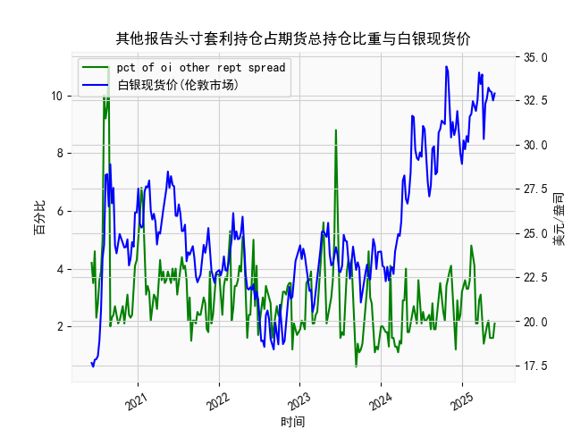

|            |   人民币汇率 |   美元指数 |
|:-----------|-------------:|-----------:|
| 2025-05-07 |       7.2005 |    99.9006 |
| 2025-05-08 |       7.2073 |   100.633  |
| 2025-05-09 |       7.2095 |   100.422  |
| 2025-05-12 |       7.2066 |   101.814  |
| 2025-05-13 |       7.1991 |   100.983  |
| 2025-05-14 |       7.1956 |   101.066  |
| 2025-05-15 |       7.1963 |   100.82   |
| 2025-05-16 |       7.1938 |   100.983  |
| 2025-05-19 |       7.1916 |   100.373  |
| 2025-05-20 |       7.1931 |   100.022  |
| 2025-05-21 |       7.1937 |    99.6014 |
| 2025-05-22 |       7.1903 |    99.9388 |
| 2025-05-23 |       7.1919 |    99.1231 |
| 2025-05-26 |       7.1833 |    98.9787 |
| 2025-05-27 |       7.1876 |    99.6147 |
| 2025-05-28 |       7.1894 |    99.8978 |
| 2025-05-29 |       7.1907 |    99.3633 |
| 2025-05-30 |       7.1848 |    99.4393 |
| 2025-06-03 |       7.1869 |    99.2781 |
| 2025-06-04 |       7.1886 |    98.8128 |

### 1. 人民币汇率和美元指数的相关性及影响逻辑

人民币汇率（通常指美元兑换人民币的汇率，USD/CNY）与美元指数（USDX）之间存在显著的相关性，主要体现为负相关性。这意味着当美元指数上升（美元走强）时，人民币汇率往往上升（人民币贬值）；反之，当美元指数下降（美元走弱）时，人民币汇率可能下降（人民币升值）。这种关系源于以下影响逻辑：

- **汇率机制与市场动态**：人民币汇率在一定程度上受美元主导，因为美元是全球主要储备货币。中国的人民币汇率政策（如盯住一篮子货币，但美元权重较高）使得人民币对美元的波动较为敏感。当美元指数上涨时，国际投资者对美元资产的需求增加，导致资金流向美国，这可能推高美元兑人民币汇率，导致人民币贬值。反之，美元指数下跌时，资金可能流出美元，转向其他货币或资产，促使人民币相对升值。

- **经济因素**：美元指数反映了美元相对于一篮子货币（如欧元、日元等）的强弱，而人民币汇率受中美贸易、利率差、通胀和地缘政治影响。如果美国经济强劲（如美联储加息），美元指数可能上升，推动人民币贬值；如果中国经济复苏或出口强劲，人民币可能相对稳定或升值，从而缓解美元的负面影响。

- **数据观察**：从提供的2024年6月至2025年6月的日频数据看，人民币汇率从7.1097（2024年6月5日）波动到7.1886（2025年6月4日），而美元指数从104.3163波动到98.8128（同日）。整体上，当美元指数在2024年下半年保持较高水平（如105以上）时，人民币汇率也较高（如7.1以上）；当美元指数在2025年初下跌（如跌至98以下）时，人民币汇率趋于稳定或小幅下降。这印证了负相关性，但并非绝对一致，因为人民币汇率还受中国央行干预和国内政策影响。

总之，这种相关性为投资者提供了参考，但需结合全球经济形势分析，避免单凭短期波动决策。

### 2. 近期投资机会分析：聚焦最近一周数据变化

基于提供的日期和数据，我将分析最近一周（假设当前日期为2025年6月4日，因此最近一周为2025年5月28日至2025年6月4日）的变化，并特别关注今日（2025年6月4日）相对于昨日（2025年6月3日）的波动。数据显示，人民币汇率和美元指数均出现小幅变动，可能带来短期投资机会。以下是关键分析和判断：

#### **最近一周数据概述**
- **人民币汇率变化**：
  - 最近一周数据（对应日期：2025年5月28日到2025年6月4日）：
    - 5月28日：约7.1739
    - 5月29日：约7.1714
    - 5月30日：约7.1705
    - 6月3日：约7.1891
    - 6月4日：7.1886
  - 整体趋势：本周汇率从7.1705（5月30日）小幅上升到7.1891（6月3日），随后微降至7.1886（6月4日）。这表明人民币汇率在周中略有贬值，但今日相对于昨日（7.1886 vs. 7.1891）小幅下降约0.007（约0.1%的升值），显示短期稳定迹象。

- **美元指数变化**：
  - 最近一周数据（对应日期：2025年5月28日到2025年6月4日）：
    - 5月28日：约99.2781
    - 5月29日：约98.9787
    - 5月30日：约99.6147
    - 6月3日：约99.2781
    - 6月4日：98.8128
  - 整体趋势：本周美元指数波动较大，从99.2781（5月28日）降至98.9787（5月29日），然后反弹并在6月3日持稳，今日（6月4日）进一步降至98.8128（相对于昨日下降约0.47%）。这反映美元短期走弱，可能受全球风险偏好或美联储政策预期影响。

- **今日相对于昨日的关键变化**：
  - 人民币汇率：今日7.1886 < 昨日7.1891，表明人民币小幅升值（约0.007点，0.1%）。这可能由于美元走弱或中国经济数据正面。
  - 美元指数：今日98.8128 < 昨日99.2781，表明美元指数下降（约0.47%），美元相对疲软。

#### **可能存在的投资机会**
基于上述变化，以下是近期投资机会的判断，主要聚焦于短期波动和潜在风险收益：

- **买入中国资产或人民币相关产品**：
  - **机会理由**：人民币小幅升值（今日相对于昨日）可能吸引资金流入中国市场，尤其如果这反映了美元持续走弱。近期一周人民币汇率虽有波动，但今日的微升暗示潜在稳定，适合投资者考虑买入中国股票（如A股指数ETF）或人民币债券。如果中美贸易摩擦缓解，这一趋势可能延续。
  - **潜在收益**：短期内，如果人民币继续升值，对冲美元风险的投资（如人民币存款或中国出口股）可能获利1-2%。例如，关注科技股或消费股，这些领域受益于国内经济复苏。
  - **风险**：如果美元指数反弹（如美联储意外加息），人民币可能快速贬值，导致损失。

- **投资大宗商品或新兴市场**：
  - **机会理由**：美元指数的持续下降（本周累计约0.5%，今日降幅更明显）通常利好大宗商品（如黄金、原油）和新兴市场资产，因为美元走弱降低这些资产的美元计价成本。从数据看，美元指数从5月28日的99.2781降至98.8128，显示弱势，可能为投资者提供买入窗口。
  - **潜在收益**：考虑黄金ETF或原油期货，预计短期回报可达2-5%，尤其若全球通胀预期上升。今日美元弱于昨日，进一步强化这一机会。
  - **风险**：美元指数可能在低位反弹（如回升至100以上），导致商品价格回调。

- **外汇交易机会**：
  - **机会理由**：人民币相对升值和美元走弱可能创造外汇套利机会，如买入欧元/美元或卖出美元/人民币对。今日人民币汇率小幅下降，暗示USD/CNY短期下行空间。
  - **潜在收益**：短期外汇交易（如买入人民币多头）可能获利0.5-1%，但需关注波动性。
  - **风险**：汇率政策干预可能导致突发变化。

- **总体建议**：
  - **积极机会**：近期数据显示美元弱势主导，投资者可优先考虑多元化投资，如组合中国资产和大宗商品，以对冲风险。今日的微小正面变化（如人民币升值）可能标志短期底部，适合进场。
  - **保守策略**：监控下周数据（若有），如美元指数继续下跌，则加仓；若反弹，考虑减持。总体而言，投资机会集中在短期波动中，预计回报有限（1-3%），但风险较高，建议结合经济新闻（如美联储会议）决策。