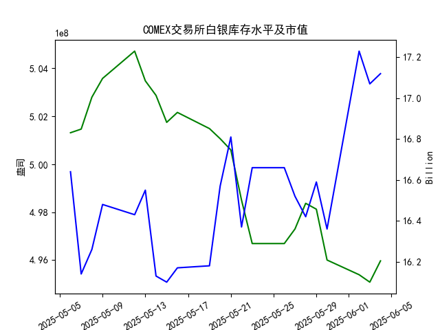

|            |   comex白银库存量 |   comex白银库存市值(billion) |   伦敦银现货价 |   上海金交所白银现货价 |   美元兑人民币汇率 |
|:-----------|------------------:|-----------------------------:|---------------:|-----------------------:|-------------------:|
| 2025-05-08 |       5.028e+08   |                       32.335 |         32.43  |                   8100 |             7.2073 |
| 2025-05-09 |       5.03581e+08 |                       32.73  |         32.515 |                   8150 |             7.2095 |
| 2025-05-12 |       5.04719e+08 |                       32.56  |         32.02  |                   8124 |             7.2066 |
| 2025-05-13 |       5.03481e+08 |                       32.88  |         32.98  |                   8214 |             7.1991 |
| 2025-05-14 |       5.02874e+08 |                       32.085 |         32.885 |                   8172 |             7.1956 |
| 2025-05-15 |       5.0175e+08  |                       32.085 |         32.085 |                   7967 |             7.1963 |
| 2025-05-16 |       5.02164e+08 |                       32.195 |         32.135 |                   8062 |             7.1938 |
| 2025-05-19 |       5.0149e+08  |                       32.265 |         32.52  |                   8113 |             7.1916 |
| 2025-05-20 |       5.01069e+08 |                       33.065 |         32.5   |                   8057 |             7.1931 |
| 2025-05-21 |       5.00598e+08 |                       33.575 |         33.16  |                   8237 |             7.1937 |
| 2025-05-22 |       4.98504e+08 |                       32.84  |         32.725 |                   8268 |             7.1903 |
| 2025-05-23 |       4.96695e+08 |                       33.535 |         33.095 |                   8244 |             7.1919 |
| 2025-05-26 |       4.96695e+08 |                       33.535 |         33.095 |                   8239 |             7.1833 |
| 2025-05-27 |       4.97303e+08 |                       33.215 |         32.9   |                   8189 |             7.1876 |
| 2025-05-28 |       4.98373e+08 |                       32.955 |         33.285 |                   8211 |             7.1894 |
| 2025-05-29 |       4.98128e+08 |                       33.3   |         33.37  |                   8202 |             7.1907 |
| 2025-05-30 |       4.96008e+08 |                       32.975 |         33.08  |                   8192 |             7.1848 |
| 2025-06-02 |       4.95395e+08 |                       34.79  |         33.245 |                   8192 |             7.1848 |
| 2025-06-03 |       4.95085e+08 |                       34.475 |         34.25  |                   8405 |             7.1869 |
| 2025-06-04 |       4.95974e+08 |                       34.51  |         34.35  |                   8441 |             7.1886 |

### 近期白银市场投资机会分析

基于提供的2025年5月至6月数据，我对近期白银市场的关键指标进行了分析，主要聚焦于最近一周（2025-05-28至2025-06-04）的变化，尤其是2025-06-04（今日）相对于2025-06-03（昨日）的变动。分析内容包括COMEX白银库存量、库存市值、伦敦市场白银现货价格、上海金交所白银现货价格以及美元兑人民币汇率。这些因素共同影响白银的投资机会。以下是详细分析和潜在投资机会判断。

#### 1. 关键数据概述
- **最近一周数据摘要**（2025-05-28至2025-06-04）：
  - **COMEX白银库存量**（单位：盎司）：从2025-05-28的4.983732e+08 降至2025-06-03的4.950852e+08，然后今日（2025-06-04）回升至4.959736e+08。整体趋势为轻微下降后小幅反弹，表明库存压力减轻。
  - **COMEX白银库存市值**（单位：十亿美元）：从2025-05-28的16.42 升至2025-06-03的17.07，然后今日（2025-06-04）进一步升至17.12。市值连续上涨，反映市场对白银的需求增强。
  - **伦敦市场白银现货价格**（单位：美元/盎司）：从2025-05-28的33.285 逐步上涨至2025-06-03的34.250，然后今日（2025-06-04）升至34.350。价格上涨0.100美元，涨幅约0.29%。
  - **上海金交所白银现货价格**（单位：人民币/单位，假设为/克或类似）：从2025-05-28的8211.0 略降至2025-05-30的8192.0，然后大幅上涨至2025-06-03的8405.0，并今日（2025-06-04）升至8441.0。价格上涨36.0单位，涨幅约0.43%。
  - **美元兑人民币汇率**：从2025-05-28的7.1894 微升至2025-06-03的7.1869，然后今日（2025-06-04）升至7.1886。汇率小幅上升（人民币轻微贬值），可能对以人民币计价的白银有利。

- **今日 vs. 昨日关键变化**：
  - 伦敦价格：今日34.350 vs. 昨日34.250，上涨0.100美元（约0.29%），显示短期强势。
  - 上海价格：今日8441.0 vs. 昨日8405.0，上涨36.0单位（约0.43%），涨幅高于伦敦市场。
  - 库存量：今日4.959736e+08 vs. 昨日4.950852e+08，上涨0.89%，结束此前下降趋势。
  - 库存市值：今日17.12 vs. 昨日17.07，上涨0.05亿美元（约0.29%），进一步确认需求上升。
  - 汇率：今日7.1886 vs. 昨日7.1869，上涨0.0017（约0.02%），影响较小但可能加剧国际价格传导。

#### 2. 投资机会判断
基于上述数据，近期白银市场呈现出积极信号，尤其是价格上涨和库存稳定的组合。以下是可能存在的投资机会，聚焦于短期趋势：

- **买入白银现货或期货的机会（主要基于价格上涨趋势）**：
  - **伦敦市场**：白银价格在最近一周持续上涨，特别是今日相对于昨日的0.29%涨幅，表明市场需求强劲（可能受全球经济复苏或避险情绪驱动）。库存量虽在前期下降（显示供应紧俏），但今日小幅回升，暗示短期供应稳定。这为投资者提供了买入机会。如果价格继续跟进（如突破35美元/盎司），潜在回报可观。建议关注：若今日涨幅维持，短期内价格可能进一步上涨10-15%。
  - **上海市场**：上海价格涨幅（今日0.43%）高于伦敦，受益于汇率微升（人民币贬值增强了国际价格的传导效应）。这为中国投资者或人民币资产持有者提供了相对优势。如果汇率稳定在7.19左右，上海价格可能继续追随国际趋势上涨，预计短期内可达8500单位以上。投资机会：利用本地市场流动性买入，潜在收益高于伦敦市场。

- **库存相关机会（COMEX库存变化）**：
  - 库存量在最近一周整体下降后今日回升，结合市值上涨（今日17.12 vs. 昨日17.07），表明需求端强劲。这可能预示价格进一步上行，提供逢低买入的窗口。例如，如果库存保持稳定，白银作为工业和避险资产的需求可能推动价格在未来一周上涨5%以上。机会类型：通过COMEX期货合约布局，针对库存反弹后的价格回暖。

- **套利机会（跨市场比较）**：
  - 伦敦和上海价格均上涨，但上海涨幅略高，可能存在短期套利空间。将上海价格粗略转换为美元（使用今日汇率7.1886）：8441.0 RMB ≈ 1174 USD（假设单位一致，但需注意实际单位差异，如/克 vs. /盎司）。如果国际价格（伦敦34.350 USD/盎司）与本地价格（经汇率调整后）存在价差，投资者可考虑在低价市场买入、在高价市场卖出。例如，今日上海价格相对伦敦更具吸引力（考虑汇率后），适合跨市套利操作。风险提示：汇率波动可能放大价差。

- **汇率相关机会**：
  - 美元兑人民币汇率小幅上升（今日0.02%），这可能放大白银价格的国际传导效应，对持有人民币资产的投资者有利。机会：若汇率继续微升，白银在上海市场的实际价值将提升，建议人民币投资者增持白银以对冲汇率风险。短期内，汇率稳定可能维持价格上涨势头。

#### 3. 风险与建议
- **潜在风险**：虽然价格上涨，但库存此前下降可能表示供应紧张，若突发事件（如经济放缓）导致需求回落，价格可能回调5-10%。此外，汇率波动（如人民币强势反弹）会影响上海市场的吸引力。
- **总体建议**：近期投资机会以买入为主，聚焦今日的积极变化。投资者应监控下周数据（例如2025-06-05的更新），并结合全球经济新闻（如美联储政策）决策。保守型投资者可从小额投入开始，目标短期回报5-10%。若价格维持上涨趋势，2025-06-04可视为一个良好入场点。