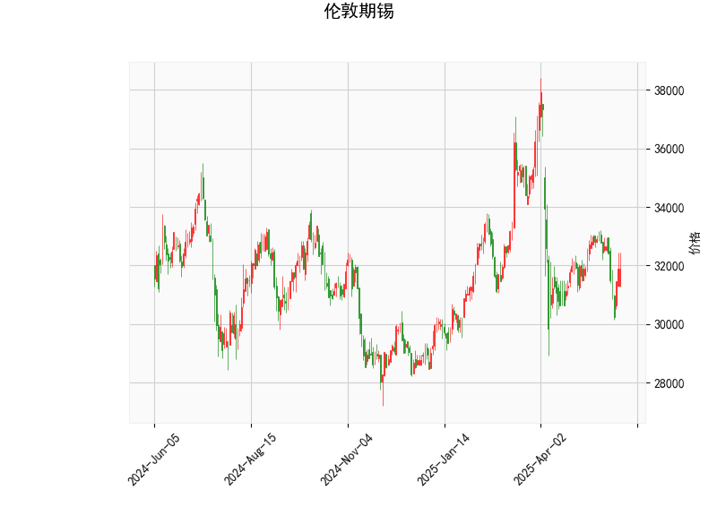

### 伦敦期锡技术分析结果详解

#### 1. 对技术分析结果的整体分析
伦敦期锡的当前价格为31895.0，基于提供的指标，我们可以从多个技术角度评估其市场态势。以下是对关键指标的逐一解读：

- **RSI (相对强弱指数)**: 当前值为48.28。这表明市场处于中性区域（RSI通常在30-70之间为中性）。RSI未达到超卖（低于30）或超买（高于70）的阈值，暗示近期价格波动较为平稳，没有明显的强势买方或卖方主导。但接近50水平线，可能会预示潜在的中期调整。

- **MACD (移动平均收敛散度)**: MACD线为-240.75，信号线为-168.55，直方图为-72.20。MACD线低于信号线，且直方图为负值，这显示出短期看跌信号。MACD的负值表示价格可能处于下行趋势或动量减弱，投资者需警惕进一步的下跌风险。然而，直方图的负值幅度不算极端，暗示修正可能有限。

- **Bollinger Bands (布林带)**: 上轨为36838.23，中轨为32880.24，下轨为28922.25。当前价格31895.0位于中轨附近（略低于中轨），这反映市场处于相对中性状态。价格靠近中轨表明波动率较低，如果价格跌破下轨（28922.25），可能触发进一步下行；反之，如果反弹至上轨，可能出现向上修正。整体上，布林带收窄可能预示即将到来的波动加大。

- **K线形态**: 检测到"CDLBELTHOLD"模式，这是一种看跌的蜡烛图形态，通常表示市场可能出现逆转或下行压力加剧。该形态常在强势上涨后出现，暗示卖方力量开始占优，短期内价格可能面临回调风险。

综合来看，技术指标显示伦敦期锡处于中性偏看跌的态势。RSI的中性水平缓解了极端风险，但MACD和K线形态的看跌信号主导了短期前景。价格在布林带中轨附近徘徊，表明市场可能在积累动能，等待突破方向。

#### 2. 近期可能存在的投资或套利机会和策略判断
基于上述分析，伦敦期锡的近期走势可能以观望为主，但存在一定的交易机会。以下是从投资和套利角度的评估和建议：

- **潜在投资机会**:
  - **看跌机会**: MACD的负直方图和"CDLBELTHOLD"形态暗示短期下行风险。如果价格跌破布林带下轨（28922.25），这可能是一个做空或卖出信号，尤其适合短期交易者。预计价格可能测试28000-29000区间，投资者可关注此区域作为潜在支撑位。
  - **反弹机会**: RSI接近中性水平，价格在布林带中轨附近，表明市场并非深度超卖。如果后续RSI回升至50以上或MACD直方图转为正值，可能会出现向上修正的买点。例如，价格反弹至中轨以上（32880.24）时，可考虑低风险买入。
  - **风险因素**: 当前指标显示波动性较低，但全球经济因素（如金属需求变化或地缘政治事件）可能放大风险。投资者应避免在无确认信号时入场。

- **套利策略建议**:
  - **跨市场套利**: 伦敦期锡与上海期锡或其他金属期货（如铜或铝）存在价格联动。如果伦敦期锡价格继续下行，而上海期锡相对稳定（如通过对比历史价差），可考虑反向套利策略。例如，卖出伦敦期锡合约的同时买入上海期锡合约，以捕捉价差收敛。但需监控全球库存数据和需求动态，确保价差异常（如当前价低于历史均值）。
  - **波动率套利**: 布林带收窄暗示即将到来的波动放大。可采用期权策略，如购买看跌期权（针对潜在下行）或straddle策略（买入看涨和看跌期权），以捕捉价格突破。短期内，如果RSI跌至40以下，波动率套利机会将增加。
  - **整体策略框架**:
    - **保守策略**: 等待更多确认信号（如K线形态变化或MACD金叉），并设置止损位（如价格跌破31000时止损）。适合长线投资者。
    - **积极策略**: 短期交易者可采用"卖出+止盈"组合，例如在31800附近卖出，目标至下轨28922.25，止损设在中轨以上33000。
    - **风险管理**: 所有策略应结合资金管理（如仓位不超过总资金的10%）和实时监控，避免单一指标决策。建议结合基本面分析（如锡矿供应或电动汽车需求）以增强准确性。

总体上，近期投资机会以短期看跌为主，但套利需谨慎把握市场联动。投资者应根据个人风险偏好调整策略，并持续跟踪最新数据。