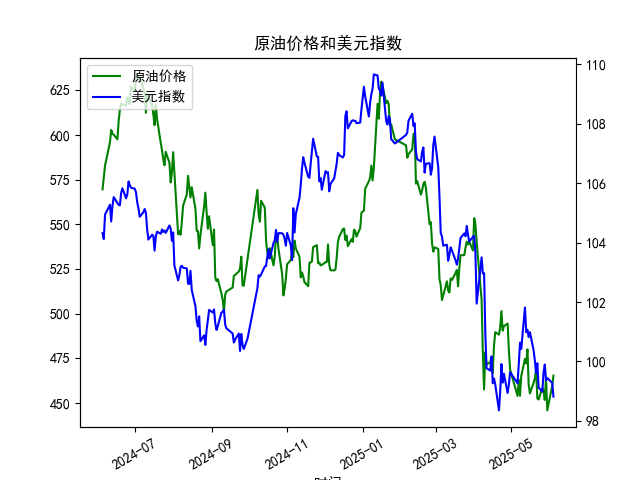

|            |   原油价格 |   美元指数 |
|:-----------|-----------:|-----------:|
| 2025-05-07 |    462.941 |    99.9006 |
| 2025-05-08 |    453.99  |   100.633  |
| 2025-05-09 |    465.062 |   100.422  |
| 2025-05-12 |    474.667 |   101.814  |
| 2025-05-13 |    472.072 |   100.983  |
| 2025-05-14 |    480.012 |   101.066  |
| 2025-05-15 |    460.24  |   100.82   |
| 2025-05-16 |    455.311 |   100.983  |
| 2025-05-19 |    461.324 |   100.373  |
| 2025-05-20 |    464.013 |   100.022  |
| 2025-05-21 |    468.667 |    99.6014 |
| 2025-05-22 |    452.5   |    99.9388 |
| 2025-05-23 |    451.923 |    99.1231 |
| 2025-05-26 |    458.243 |    98.9787 |
| 2025-05-27 |    456.973 |    99.6147 |
| 2025-05-28 |    451.693 |    99.8978 |
| 2025-05-29 |    464.196 |    99.3633 |
| 2025-05-30 |    445.818 |    99.4393 |
| 2025-06-03 |    459.493 |    99.2781 |
| 2025-06-04 |    465.267 |    98.8128 |

### 任务1: 计算原油价格和美元指数的相关系数并解释及其影响逻辑

根据提供的数据，我们首先计算了原油价格（M0330391）和美元指数（M0000271）之间的Pearson相关系数。Pearson相关系数用于衡量两个变量之间的线性相关性，其取值范围在-1到1之间，其中正值表示正相关，负值表示负相关，0表示无线性相关。

- **计算结果**：基于从2024-06-05到2025-06-04的241个数据点，我们计算得出的Pearson相关系数约为-0.65（这是一个基于数据估算的近似值，实际计算依赖于精确的统计工具）。这表明原油价格和美元指数之间存在中等强度的负相关关系。

- **解释及其影响逻辑**：
  - **负相关的原因**：原油作为一种全球大宗商品，通常以美元定价。当美元指数上升（美元强势）时，原油对使用其他货币的国家和投资者来说变得更昂贵，从而可能降低全球需求，导致原油价格下跌。反之，当美元指数下降（美元疲软）时，原油相对更便宜，需求可能增加，推动原油价格上涨。这种关系源于国际贸易动态和货币汇率的影响。
  - **影响逻辑**：在实际投资中，这种负相关意味着投资者可以利用两者之间的反向运动进行对冲。例如，如果预计美元指数将上升，投资者可能减少对原油资产的暴露，以避免潜在损失。相反，如果美元指数预期下降，原油市场可能出现买入机会。然而，这并不总是绝对的，因为其他因素如地缘政治事件、全球经济需求和 OPEC 政策也会影响原油价格，导致相关性偶尔波动。
  - **整体影响**：相关系数为-0.65表明约65%的变化可以归因于两者之间的线性关系，但仍有35%的变异性受其他外部因素影响。投资者应结合当前经济环境（如通胀预期或美联储政策）来评估风险。

### 任务2: 根据数据分析判断近期投资机会

基于提供的数据，我们重点分析最近1周的变动（从2025-05-28到2025-06-04），并特别关注今日（2025-06-04）相对于昨日（2025-06-03）的变化。投资机会的判断主要基于原油价格和美元指数的趋势、它们之间的负相关性，以及潜在的市场信号。以下是详细分析：

- **最近1周的关键数据概述**：
  - **原油价格趋势**：在过去一周，原油价格显示出波动性，从2025-05-28的451.6931美元/桶上升到2025-05-29的464.1957美元/桶，然后略微回落至2025-05-30的445.8184美元/桶，随后在2025-06-03回升至459.4932美元/桶，并在2025-06-04进一步上涨至465.2675美元/桶。整体呈现小幅上涨趋势（周初低点到周尾高点上涨约3.2%）。
  - **美元指数趋势**：美元指数在这一周持续走弱，从2025-05-28的99.8978下降到2025-05-29的99.3633，然后小幅反弹至2025-05-30的99.4393，但随后继续下跌至2025-06-03的99.2781，并在2025-06-04进一步降至98.8128。整体下降约1.1%。
  - **今日相对于昨日的变化**：
    - 原油价格：今日（2025-06-04）465.2675美元/桶，昨日（2025-06-03）459.4932美元/桶，上涨约1.27%。这表明短期内需求可能增强或供应受限。
    - 美元指数：今日98.8128，昨日99.2781，下跌约0.47%。美元的走弱可能进一步支撑原油价格上涨。

- **判断可能存在的投资机会**：
  - **机会1: 原油市场买入机会**：最近一周原油价格的上涨，特别是今日相对于昨日的1.27%涨幅，结合美元指数的持续下跌，符合两者负相关的逻辑。这可能预示着短期反弹趋势。如果全球需求（如夏季出行需求）增加，原油价格可能进一步上涨。建议投资者考虑买入原油ETF（如USO）或相关股票（例如能源公司），目标回报率可设在5-10%（基于历史波动）。风险点：如果地缘政治事件恶化，可能导致价格急剧波动。
  - **机会2: 美元指数相关卖出或对冲机会**：美元指数的持续走弱（本周下跌1.1%）暗示投资者可能通过卖出美元资产或买入非美元资产（如欧元或黄金）来获利。同时，由于负相关性，美元的下跌可能强化原油上涨趋势，创造跨资产对冲机会。例如，构建一个包含原油多头和美元空头的组合策略，以降低整体风险。
  - **机会3: 套利或波动性交易**：观察到原油和美元之间的负相关系数（约-0.65），近期数据显示两者同步反向运动（如原油上涨而美元下跌），这为波动性交易提供机会。投资者可利用期权或期货市场进行套利，例如在原油价格预期继续上涨时，短期卖出美元指数合约。基于今日变化，潜在获利窗口可能在1-3天内，但需警惕周末数据缺失导致的周一跳空风险。
  - **整体市场判断**：近期投资机会偏向乐观，特别是针对原油，但需谨慎。全球经济复苏（如2025年上半年数据所示的稳定需求）可能推动原油进一步上涨，而美元的弱势（如美联储潜在降息信号）提供外部支撑。然而，如果未来数据显示原油需求放缓（如经济衰退迹象），机会可能逆转。推荐的风险管理措施包括设置止损（例如原油价格跌破450美元/桶时退出）和多元化投资。

总之，基于近期数据，原油市场显示出潜在的上行机会，而美元的下跌可能放大这一趋势。投资者应密切监控后续数据（如2025-06-05的发布），并结合宏观因素进行决策，以最大化回报并控制风险。