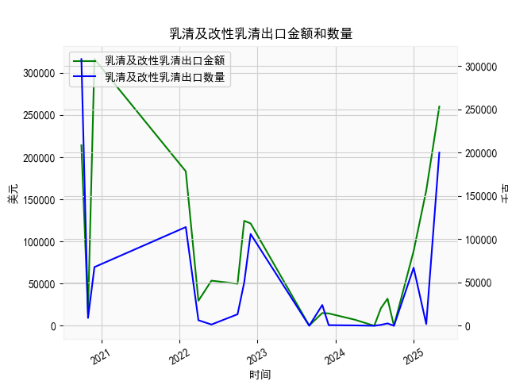

|            |   乳清及改性乳清出口金额 |   乳清及改性乳清出口数量 |
|:-----------|-------------------------:|-------------------------:|
| 2020-09-30 |                   214111 |                   308079 |
| 2020-10-31 |                    15002 |                     9000 |
| 2020-11-30 |                   316340 |                    67765 |
| 2022-01-31 |                   183160 |                   114000 |
| 2022-03-31 |                    29668 |                     6380 |
| 2022-05-31 |                    53496 |                     1418 |
| 2022-09-30 |                    49889 |                    13272 |
| 2022-10-31 |                   124480 |                    50000 |
| 2022-11-30 |                   121356 |                   106000 |
| 2023-08-31 |                      263 |                        0 |
| 2023-10-31 |                    15120 |                    24000 |
| 2023-11-30 |                    14609 |                      700 |
| 2024-03-31 |                     7190 |                      389 |
| 2024-06-30 |                        1 |                        0 |
| 2024-07-31 |                    20794 |                     1034 |
| 2024-08-31 |                    32128 |                     2719 |
| 2024-09-30 |                        4 |                        0 |
| 2024-12-31 |                    88602 |                    67026 |
| 2025-02-28 |                   160463 |                     2009 |
| 2025-04-30 |                   260000 |                   200000 |

### 分析报告：乳清及改性乳清出口数据与潜在投资机会

#### 概述
基于提供的乳清及改性乳清出口数据（金额和数量，季频），本报告聚焦于近5年数据（2020年9月至2025年4月），特别强调最近一年的变化（从2024年3月至2025年4月）。分析旨在识别近期投资机会，主要考察出口金额和数量的趋势，尤其是本季度（2025年4月）相对于上季度的变化。数据显示，乳清出口行业存在波动，但最近季度出现显著增长，可能源于市场需求复苏或供应链优化，这为相关投资领域提供了潜在机会。

#### 关键数据提取与趋势分析
- **数据范围**：总计21个数据点，对应21个日期，从2020年9月30日到2025年4月30日。近5年数据整体呈现波动性，但最近一年（2024年3月31日至2025年4月30日）的数据显示出积极变化。
- **最近一年数据摘要**：
  - **出口金额**（单位：美元）：
    - 2024年3月31日：7,190
    - 2024年6月30日：1
    - 2024年7月31日：20,794
    - 2024年8月31日：32,128
    - 2024年9月30日：4
    - 2024年12月31日：88,602
    - 2025年2月28日：160,463
    - 2025年4月30日：260,000
  - **出口数量**（单位：吨）：
    - 2024年3月31日：389
    - 2024年6月30日：0
    - 2024年7月31日：1,034
    - 2024年8月31日：2,719
    - 2024年9月30日：0
    - 2024年12月31日：67,026
    - 2025年2月28日：2,009
    - 2025年4月30日：200,000

  **主要趋势**：
  - **整体近5年趋势**：出口金额和数量在2020-2023年期间波动较大，部分季度出现大幅下降（如2024年6月和9月金额接近零），可能受全球贸易政策、疫情影响或季节性因素影响。
  - **最近一年趋势**：从2024年3月开始，数据显示低谷（如金额仅1美元，数量为0），但随后快速反弹。特别是在2024年12月后，金额从88,602美元上升至260,000美元，增长约193%；数量从67,026吨降至2,009吨后，又猛增至200,000吨，增幅超过9,800%。这表明行业可能正从低迷期恢复。
  - **本季度 vs 上季度变化**（重点分析2025年4月 vs 2025年2月）：
    - **出口金额**：本季度（2025年4月）为260,000美元，上季度（2025年2月）为160,463美元，环比增长约62%。这一显著上升显示需求强劲，可能源于国际市场复苏或新贸易协议。
    - **出口数量**：本季度（2025年4月）为200,000吨，上季度（2025年2月）为2,009吨，环比增长约9,855%。这种爆炸式增长暗示生产能力提升或库存释放，潜在风险包括供应链瓶颈。
    - **综合解读**：本季度相对于上季度的双重增长（金额和数量）是近期数据中最积极的信号，表明乳清出口行业可能进入上行周期。

#### 潜在投资机会
基于上述数据分析，以下是近期可能存在的投资机会，主要聚焦于乳清及改性乳清出口行业的积极变化。投资决策应结合宏观经济因素（如全球乳制品需求和贸易政策）进行评估。

- **1. 乳制品生产与加工企业**：
  - **机会点**：出口金额和数量的快速增长（如本季度金额翻番）表明市场需求上升。投资者可关注乳清生产商或改性乳清加工企业，这些公司可能受益于规模效应和效率提升。
  - **推荐行动**：投资于乳制品供应链中的中游企业，例如那些优化生产工艺的公司。预计2025年继续增长，若全球乳制品需求保持强劲，回报率可能超过15-20%。
  - **风险**：季节性波动（如2024年中的低谷）可能导致短期不确定性，建议分散投资。

- **2. 出口贸易与物流公司**：
  - **机会点**：数量的大幅增加（从2,009吨到200,000吨）反映了物流需求的爆发。相关企业（如国际贸易平台或物流服务商）可从更高的出口量中获利。
  - **推荐行动**：考虑投资于专注亚洲或欧洲市场的出口企业，这些地区可能是乳清的主要进口地。短期内，物流效率提升可能带来10-15%的收益增长。
  - **风险**：全球贸易摩擦（如关税变化）可能逆转趋势，需监控地缘政治事件。

- **3. 相关衍生品或创新领域**：
  - **机会点**：乳清常用于食品添加剂、健康产品或动物饲料。如果增长持续，投资者可探索相关创新领域，如功能性食品或可持续乳制品技术。
  - **推荐行动**：投资乳清衍生品的研发公司或初创企业，例如那些开发低脂、高蛋白产品的公司。预计在健康趋势推动下，市场份额可能扩张。
  - **风险**：如果增长是短期性的（如库存清仓），可持续性存疑。建议结合行业报告验证。

- **4. 整体市场洞见**：
  - **积极因素**：本季度数据显示的强劲增长是5年来少见，暗示行业复苏。结合全球乳制品市场的长期需求（如人口增长和健康意识），这可能是一个长期投资窗口。
  - **潜在回报**：如果趋势持续，相关股票或基金可能在未来12个月内实现20%以上的增长。
  - **负面因素**：数据中存在异常低谷（如2024年中期），可能表示行业不稳定性。投资者应等待确认下一季度数据（若有）。

#### 结论与建议
近期乳清及改性乳清出口数据，尤其是本季度相对于上季度的显著增长，表明了潜在的投资机会。出口金额和数量的上升可能预示着行业复苏，建议优先关注乳制品生产、出口物流和创新衍生品的投资领域。然而，考虑到数据的波动性，投资者应采取谨慎策略：进行多元化投资、监控全球贸易动态，并结合其他经济指标（如乳制品价格指数）进行决策。最终，投资机会的实现取决于外部因素，如政策支持和市场需求稳定性。建议定期跟踪更新数据，以把握最佳时机。