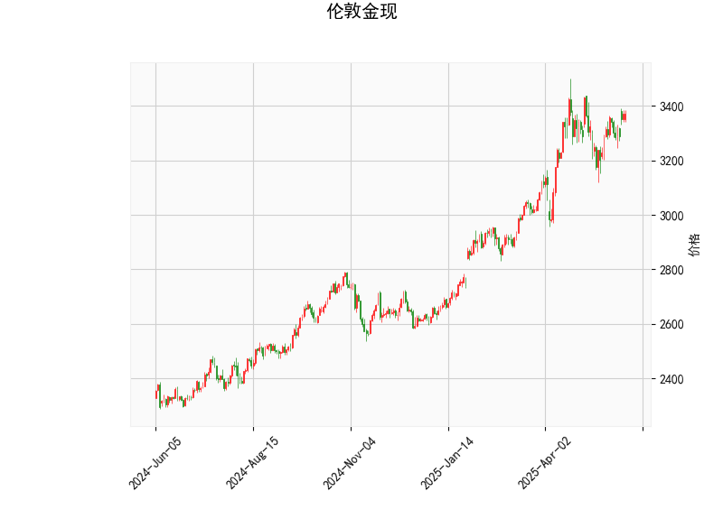

# 伦敦金现的技术分析结果分析

以下是对提供的伦敦金现（现货黄金）技术分析结果的详细解读。基于当前数据，我们可以评估市场的短期趋势、强势程度以及潜在风险。关键指标包括当前价格、RSI、MACD、布林带以及K线形态。

### 1. 关键指标解读
- **当前价格（3371.89）**: 当前黄金价格为3371.89美元/盎司。这是一个相对较高的水平，表明市场可能处于强势期，但需要结合其他指标验证是否接近阻力位。
- **RSI（58.15）**: 相对强弱指数（RSI）衡量价格变化的速度和幅度。目前RSI值为58.15，处于中性区域（50-70之间），略微偏向强势。这表示黄金市场有轻微的上行动能，但未进入超买状态（超买通常>70）。如果RSI继续上升，可能预示进一步上涨；反之，若跌破50，则可能转为弱势。
- **MACD指标**:
  - MACD线（30.07）：MACD线高于信号线（26.80），且直方图（3.27）为正值。这是一个典型的看涨信号，表明短期内买方力量占优，价格可能继续向上移动。
  - 信号线（26.80）和直方图（3.27）：直方图的正值强化了多头趋势，但如果直方图开始缩小或转为负值，则可能暗示动量减弱。
- **布林带**:
  - 上轨（3485.59）、中轨（3219.25）和下轨（2952.91）：当前价格（3371.89）位于中轨上方，但尚未触及上轨。这表明价格处于布林带的扩张期，可能有上行潜力。然而，接近上轨时往往会遇到阻力，如果价格回落至中轨以下，则可能转为看跌。
- **K线形态（CDLSHORTLINE）**: 这表示最近的K线形态为“短线蜡烛”（Short Line Candle），通常指实体较短的蜡烛线。这可能反映市场短期犹豫或不确定性，常出现在趋势转折点附近。结合其他指标，它暗示当前多头趋势可能面临小幅回调或盘整，而不是强烈反转。

### 2. 整体市场分析
从以上指标来看，伦敦金现市场目前呈现出中性偏强的态势：
- **强势信号**: RSI和MACD的组合显示买方主导，价格高于布林带中轨，暗示短期上涨可能性较大。这可能与全球经济不确定性（如通胀、地缘政治事件）有关，黄金作为避险资产的需求增强。
- **潜在风险**: K线形态的“短线”特征提示短期波动或回调风险，尤其是如果RSI逼近70（超买区）或MACD直方图缩小。布林带上轨作为阻力位，如果价格无法突破，可能导致修正。
- **总结**: 整体而言，市场处于看涨环境中，但并非极度强势。投资者应关注外部因素，如美联储政策或全球经济数据，这些可能放大或逆转技术信号。

# 近期投资或套利机会和策略

基于上述分析，以黄金为中心的投资机会主要聚焦于短期多头趋势，但需注意波动性。以下是针对近期可能的投资和套利机会的判断，以及相应的策略建议。黄金市场受宏观因素影响较大，因此风险管理至关重要。

### 1. 可能存在的投资机会
- **看涨机会**: 当前指标显示黄金有向上突破的潜力，尤其是如果价格突破布林带上轨（3485.59）。这可能源于全球避险需求上升或通胀预期增强，提供买入机会。预计短期内，价格可能测试3500美元附近。
- **套利机会**: 
  - **跨市场套利**: 黄金现货与期货（例如COMEX黄金期货）的价差可能存在套利空间。如果现货价格相对期货偏低，可以考虑现货多头加期货空头的组合策略。但需监控价差收敛，通常在经济数据公布前后机会增多。
  - **期权套利**: 通过买入看涨期权（Call Option）结合卖出看跌期权（Put Option），构建中性策略。如果波动率较低（如隐含波动率IV下降），这可用于捕捉小幅波动获利。
- **其他机会**: 如果K线形态转为更明确的看涨模式（如连续阳线），可能出现短期波段交易机会。全球事件（如利率决策）可能触发快速上涨。

### 2. 投资策略建议
- **多头策略**: 
  - **买入时机**: 在价格稳定在中轨以上（当前已满足）且MACD保持正直方图时入场。建议在RSI低于65时买入，以避免超买风险。
  - **目标位**: 设定目标为布林带上轨（3485.59）附近，潜在盈利空间约5-10%。
  - **风险控制**: 设置止损在布林带中轨（3219.25）下方5-10美元处。如果RSI超过70，及时减仓。
- **套利策略**:
  - **价差套利**: 监控现货与期货价差，如果现货折扣超过正常水平（例如0.5-1%），执行多现货空期货策略。持有期控制在1-3天，以捕捉快速收敛。
  - **波动率套利**: 如果市场波动率低（可通过VIX黄金相关指标判断），使用铁蝶式期权策略（Iron Butterfly），在价格小幅波动时获利。但需专业平台执行。
- **整体风险管理**:
  - **分散投资**: 黄金作为避险资产，应与其他资产（如股票或债券）结合，避免单一暴露。
  - **监控指标**: 每日检查RSI和MACD变化；如果K线形态转为看跌（如“CDLSHORTLINE”后出现阴线），立即退出。
  - **潜在风险**: 经济数据（如非农就业报告）可能导致突发回调，造成5-15%的损失。建议资金管理原则：单笔投资不超过总资金的10%。

总之，近期黄金市场存在 moderate 的投资机会，但需谨慎操作。投资者应结合基本面分析（如地缘政治风险）与技术指标，避免过度乐观。建议初学者咨询专业顾问，以适应市场波动。