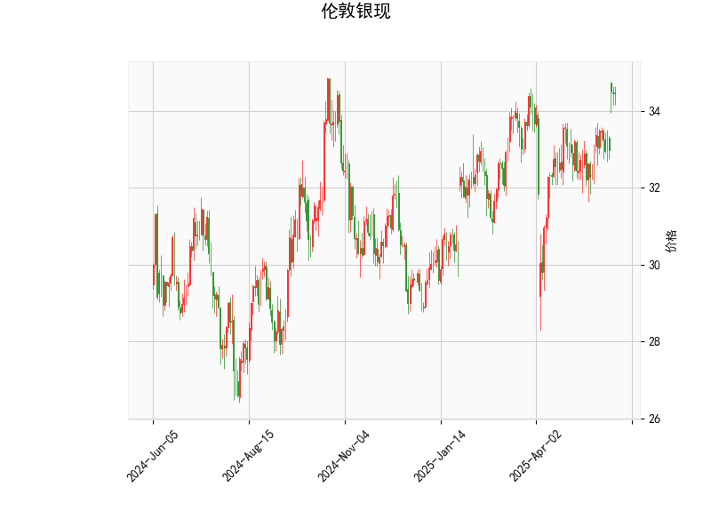

### 伦敦银现的技术分析结果解读

#### 1. 整体技术指标分析
基于提供的伦敦银现数据，我们可以从多个角度对当前市场状况进行评估。当前价格为34.457，显示银价处于相对较高的位置，但结合其他指标，我们可以看到一些潜在的风险和机会。

- **RSI（相对强弱指数）分析**：  
  RSI值为62.88，这表明市场处于中性偏强状态。RSI通常以70作为超买阈值和30作为超卖阈值。目前的RSI水平接近70，暗示银价可能已经有些“过热”，短期内存在回调风险。如果RSI继续上升，可能进一步确认上涨趋势；反之，如果回落至50以下，则可能预示修正。

- **MACD（移动平均收敛散度）分析**：  
  MACD线值为0.377，信号线值为0.216，MACD直方图值为0.161。这些指标显示MACD线处于信号线上方，这是一个典型的看涨信号，表明短期内多头力量占优。直方图的正值进一步支持价格可能继续上涨。然而，MACD的差距并不太大，表明上涨动能可能正在减弱，如果直方图开始缩小或转为负值，可能会触发反转。

- **布林带分析**：  
  当前价格（34.457）接近上轨（34.885），而中轨和下轨分别为32.968和31.052。这表明银价正处于布林带的扩张期，通常代表市场波动性增加。上轨附近的价格位置暗示潜在的上行压力，但也增加了回调风险。如果价格突破上轨，可能引发进一步上涨；反之，如果回落至中轨以下，则可能进入修正阶段。

- **K线形态分析**：  
  提供的K线形态包括CDLDOJI、CDLHIGHWAVE、CDLLONGLEGGEDDOJI、CDLMATCHINGLOW和CDLSPINNINGTOP。这些形态整体显示市场不确定性较高：  
  - CDLDOJI和CDLLONGLEGGEDDOJI表示价格走势犹豫，可能预示反转或盘整。  
  - CDLHIGHWAVE显示高波动性，市场可能正处于动荡期。  
  - CDLMATCHINGLOW暗示潜在支撑位，可能阻止进一步下行。  
  - CDLSPINNINGTOP表示多空均衡，短期方向不明。  
  总体而言，这些形态偏向中性或轻微看涨，但缺乏强烈趋势信号，建议投资者警惕突发反转。

综合以上指标，伦敦银现当前处于一个“强势但脆弱”的状态。RSI和MACD支持短期上涨，但布林带上轨的逼近和K线形态的不确定性增加了回调可能性。市场可能在短期内继续上行，但需防范波动风险。

#### 2. 近期可能存在的投资或套利机会和策略
基于上述分析，伦敦银现市场存在一些潜在的投资机会，特别是针对短期交易者。但由于K线形态显示不确定性，风险管理至关重要。以下是针对近期市场的判断和建议策略：

- **投资机会判断**：  
  - **看涨机会**：MACD的看涨信号和价格接近布林带上轨表明，短期内银价可能进一步上涨（例如突破34.885）。如果全球经济数据（如通胀或工业需求）利好贵金属，这将放大机会。RSI虽接近超买，但尚未过度，因此适合激进投资者考虑买入。  
  - **回调机会**：如果RSI超过70或K线形态出现更多反转信号（如更多DOJI形态），银价可能回落至中轨（32.968）附近，提供低吸机会。这对保守投资者更友好。  
  - **套利机会**：伦敦银作为大宗商品，现货市场与期货市场的价差套利是常见策略。如果当前现货价格（34.457）高于期货价格，或存在季节性波动（如工业需求季节），可以考虑跨市场套利。同时，基于布林带的波动率套利（如在上下轨之间进行买卖）也值得关注，但需监控全球事件（如地缘政治风险）以避免突发冲击。

- **投资策略建议**：  
  - **买入策略**：  
    - 条件：在MACD直方图保持正值且价格突破布林带上轨（34.885）时入场。目标位可设为36.0（基于历史波动）。  
    - 风险控制：设置止损在34.0以下，防止RSI超买导致的回调。适用于短期交易者。  
  - **卖出策略**：  
    - 条件：如果RSI升至70以上或K线形态显示更多犹豫（如连续DOJI），考虑在当前价位附近卖出或做空。目标位可设为中轨（32.968）。  
    - 风险控制：使用Trailing Stop（跟踪止损）以锁定利润，避免波动性放大损失。适用于风险厌恶者。  
  - **套利策略**：  
    - 基于价差：在现货和期货市场之间，如果现货溢价明显（例如现货高于期货10%以上），进行反向套利（卖出现货、买入期货）。短期内，若布林带收窄，波动率套利（如在下轨买入、上轨卖出）可作为辅助策略。  
    - 整体建议：结合宏观因素（如美联储政策或银矿供应），优先选择低风险策略。资金管理原则：每笔交易仓位不超过总资金的5%，并定期复盘K线形态以调整。

总之，近期伦敦银现的投资机会以短期看涨为主，但不确定性较高。投资者应密切关注RSI和MACD的动态变化，并结合全球经济环境制定策略，以最大化收益并最小化风险。