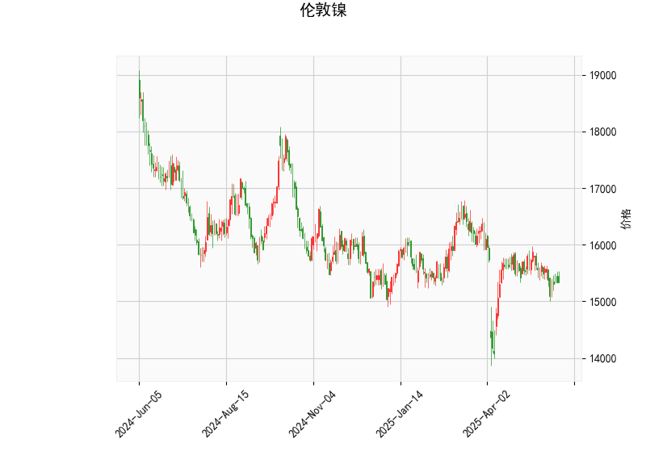

### 伦敦镍技术分析结果详解

#### 1. 对技术分析结果的分析
基于提供的伦敦镍技术指标数据，我们可以从多个维度对当前市场状况进行解读。以下是对关键指标的逐一分析：

- **当前价格（Current Price）**：当前价格为15330.0，处于相对稳定的区间。这表明镍价近期未出现剧烈波动，但从整体趋势看，它位于布林带的中下部（具体见下文），暗示潜在的下行压力。

- **RSI（Relative Strength Index，相对强弱指数）**：RSI值为45.29。这是一个中性水平（RSI通常在30-70区间为中性），但已接近超卖区域（低于50）。这可能表示市场卖方力量稍占上风，短期内存在进一步回调的风险，但尚未出现极端超卖情况。如果RSI跌破30，可能会触发反弹。

- **MACD（Moving Average Convergence Divergence，移动平均收敛散度）**：MACD值为-77.14，信号线为-55.79，柱状图（MACD Hist）为-21.35。这是一个明显的看跌信号，因为MACD线低于信号线，且柱状图为负值。这表明短期动量向下，卖方主导市场。投资者应关注MACD线是否进一步远离信号线，这可能强化下行趋势。

- **布林带（Bollinger Bands）**：上轨为16628.66，中轨为15634.98，下轨为14641.30。目前价格15330.0位于中轨和下轨之间，距离中轨较近。这显示价格处于一个收缩的波动区间，市场可能缺乏方向性。但如果价格进一步接近或跌破下轨（14641.30），可能会引发反弹；反之，如果向上突破中轨，则可能逆转趋势。

- **K线形态**：形态为“CDLMATCHINGLOW”（匹配低点）。这是一个典型的看跌形态，通常表示价格可能在短期内形成双底或测试更低水平，暗示卖方力量增强。这与MACD的看跌信号相呼应，整体上反映出市场偏向弱势。

综合而言，当前技术指标显示伦敦镍处于弱势状态。RSI和布林带表明市场尚未极端，但MACD和K线形态的看跌信号主导了短期前景。价格可能继续下探，但若出现逆转信号（如RSI反弹或MACD金叉），则需警惕潜在反弹。

#### 2. 近期可能存在的投资或套利机会和策略判断
基于上述分析，伦敦镍的短期市场环境偏向弱势，但也存在一定的机会。以下是对潜在投资或套利机会的判断，以及相应的策略建议：

- **可能的机会**：
  - **看跌机会**：MACD和K线形态的看跌信号暗示价格可能进一步下行，尤其是如果RSI跌向30以下或价格跌破布林带下轨（14641.30）。这为做空策略提供基础。短期内，镍价可能测试14500-15000的支撑位。
  - **反弹机会**：如果价格接近布林带下轨并出现RSI超卖（低于30），市场可能迎来技术性反弹。RSI当前的中性水平表示下跌空间有限，这为逢低买入提供潜在窗口。
  - **套利机会**：镍作为工业金属，其价格与全球经济周期（如制造业需求）和相关商品（如铜或铝）高度相关。当前弱势可能与全球经济放缓有关，因此存在跨商品套利机会，例如在镍价格低迷时，通过镍与铜的价差套利（如如果铜价相对坚挺）。但需监控宏观因素，如中国需求或全球库存变化。

- **投资策略建议**：
  - **做空策略**：适合短期交易者。如果MACD柱状图继续扩大（更负值），可考虑在当前价位附近做空镍，目标设在布林带下轨附近（14600左右）。风险控制：设置止损在中轨以上（15800），以防意外反弹。
  - **逢低买入策略**：针对中长期投资者，如果RSI跌破45并接近30，可在价格触及下轨时小仓位买入，期待技术反弹。目标位可设在中轨（15600以上）。这是一种逆势操作，需结合基本面（如镍矿供应或电动车需求回暖）确认。
  - **套利策略**：利用镍与其他金属的价差进行无风险或低风险套利。例如，如果镍相对铜价格过低，可在镍市场买入、在铜市场卖出（或反之），锁定价差收益。建议使用衍生品（如期货合约）执行，并监控全球库存数据（如LME库存变化）。
  - **风险管理与总体建议**：市场波动性较高，建议结合基本面分析（如地缘政治或需求数据）避免单纯技术驱动。采用分批入场和动态止损（如基于布林带波动），并保持仓位控制在总资金的20-30%。如果无明确信号，观望可能是最佳选择，等待RSI或MACD的逆转确认。

总体上，近期伦敦镍的投资机会以看跌为主，但潜在反弹不可忽视。策略应以风险优先，结合市场动态调整。