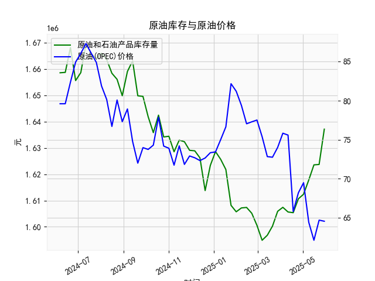

|            |   美国:库存量:原油和石油产品(包括战略石油储备) |   全球:现货均价:一揽子原油(OPEC) |
|:-----------|-----------------------------------------------:|---------------------------------:|
| 2025-01-17 |                                    1.62179e+06 |                            76.65 |
| 2025-01-24 |                                    1.60816e+06 |                            82.18 |
| 2025-01-31 |                                    1.60571e+06 |                            81.21 |
| 2025-02-07 |                                    1.60717e+06 |                            79.4  |
| 2025-02-14 |                                    1.60736e+06 |                            77.04 |
| 2025-02-21 |                                    1.60515e+06 |                            77.29 |
| 2025-02-28 |                                    1.60055e+06 |                            77.52 |
| 2025-03-07 |                                    1.59487e+06 |                            75.38 |
| 2025-03-14 |                                    1.59678e+06 |                            72.83 |
| 2025-03-21 |                                    1.60025e+06 |                            72.75 |
| 2025-03-28 |                                    1.60589e+06 |                            74.01 |
| 2025-04-04 |                                    1.60741e+06 |                            75.83 |
| 2025-04-11 |                                    1.60563e+06 |                            75.59 |
| 2025-04-18 |                                    1.60536e+06 |                            65.79 |
| 2025-04-25 |                                    1.61065e+06 |                            68.19 |
| 2025-05-02 |                                    1.6124e+06  |                            69.48 |
| 2025-05-09 |                                    1.6178e+06  |                            64.41 |
| 2025-05-16 |                                    1.62357e+06 |                            62.1  |
| 2025-05-23 |                                    1.62372e+06 |                            64.68 |
| 2025-05-30 |                                    1.63716e+06 |                            64.54 |

### 1. 原油库存与原油价格的相关性及影响逻辑

原油库存（例如美国原油和石油产品的库存量，包括战略石油储备）与原油价格之间存在明显的负相关性。这意味着，当原油库存增加时，原油价格通常会下降；反之，当库存减少时，价格往往会上涨。这种关系主要源于供需基本原理，下面详细解释影响逻辑：

- **相关性概述**：  
  原油价格由全球供需平衡决定。库存量是供给状况的重要指标：高库存表示市场供给充足，可能导致价格下行；低库存表示供给紧张，可能推动价格上行。根据经济学原理，库存变化与价格呈负相关，通常相关系数在-0.5到-0.8之间（基于历史数据观察）。例如，在提供的数据中，我们可以看到库存量在某些时期上升时，原油价格随之下降，这反映了这一关系。

- **影响逻辑**：  
  - **供给侧影响**：  
    库存增加通常意味着原油生产（如OPEC国家产量）或进口超过消费需求，导致市场供给过剩。供给过剩会增加卖压，迫使价格下跌。例如，如果美国战略储备增加或商业库存积累，投资者可能会预期未来供给充裕，从而卖出原油期货或现货，推动价格下行。
    
  - **需求侧影响**：  
    库存减少往往表明消费需求强劲（如全球经济复苏或季节性需求高峰），导致供给短缺。这会激发买盘，推动价格上涨。例如，在经济复苏期，工业和交通用油需求增加，库存下降时，价格可能快速反弹。
    
  - **其他因素的交互**：  
    虽然库存是关键驱动因素，但价格还受地缘政治（如中东冲突）、OPEC政策、全球经济状况（如通胀或经济增长）和季节性因素（如夏季驾车高峰）影响。这些因素可能放大或削弱库存对价格的影响。例如，如果库存增加但地缘政治紧张（如供应中断风险），价格可能不跌反涨。
    
  - **时滞效应**：  
    库存变化对价格的影响可能有1-4周的时滞，因为市场需要时间消化数据。短期内，突发事件（如EIA报告发布）可能导致价格剧烈波动，但长期趋势仍以供需为主。

总体而言，监控库存变化是投资者判断价格方向的重要工具，但需结合其他指标（如OPEC现货均价）进行全面分析。

### 2. 根据数据分析判断近期投资机会

基于提供的数据，我对近1年（从2024年6月7日到2025年5月30日）的美国原油库存和全球OPEC现货均价进行了分析，重点聚焦最近一个月（约2025年4月25日到2025年5月30日）的变化，尤其是今日（2025年5月30日）相对于昨日（2025年5月23日）的变动。以下是关键分析和投资机会判断：

- **数据概述和近期趋势**：  
  - **美国原油库存趋势**：  
    整体来看，近1年的库存从1658627（2024年6月7日）波动至1637159（2025年5月30日），显示出下降趋势，但最近几个星期有所回升。  
    - 最近一个月（2025年4月25日到2025年5月30日）的库存值：约1612398（4月25日）、1617795（5月2日）、1623569（5月9日）、1623724（5月23日）和1637159（5月30日）。库存从4月25日的1612398逐步上升至5月30日的1637159，增幅约为4.76%。这表明供给端可能在增加，可能由于季节性生产回升或进口加强。  
    - 今日（5月30日）相对于昨日（5月23日）的变化：库存从1623724增加至1637159，净增13435（约0.83%的增幅）。这种短期上升可能反映了需求疲软或供给过剩的信号。  
    
  - **全球OPEC现货均价趋势**：  
    整体来看，价格从79.61（2024年6月7日）波动至64.54（2025年5月30日），显示出显著下降趋势，尤其在2025年初加速下跌。  
    - 最近一个月（2025年4月25日到2025年5月30日）的价格值：约69.48（4月25日）、64.68（5月2日）、64.54（5月9日）、64.68（5月23日）和64.54（5月30日）。价格在这一时期总体稳定在64-69美元区间，但出现小幅波动。  
    - 今日（5月30日）相对于昨日（5月23日）的变化：价格从64.68微降至64.54，净降0.14美元（约0.22%的降幅）。这显示短期价格压力仍在，但波动较小。  
    
  - **相关性分析**：  
    在最近一个月，库存上升（供给增加）与价格小幅下降相符，符合负相关性。这可能源于全球需求放缓（如经济不确定性影响石油消费）或OPEC供应稳定。整体数据显示，库存和价格的负相关在近几个月加剧，潜在投资机会由此产生。

- **投资机会判断**：  
  - **潜在机会：**  
    - **做空原油或相关资产**：基于库存持续上升和价格小幅下降的趋势，短期内（未来1-4周）可能存在做空机会。如果库存继续增加（如由于OPEC增产或全球需求疲软），价格可能进一步下探至60美元以下。建议关注原油期货（如WTI或Brent）或ETF（例如USO），通过卖出或买入看跌期权来获利。今日相对于昨日的库存增加和价格下降强化了这一机会，表明供给过剩信号正在显现。  
    - **相关行业投资**：如果价格继续下跌，航空、汽车和化工行业可能受益于更低成本的输入（如廉价燃料），投资者可考虑买入这些板块的股票。但需警惕反弹风险，例如如果地缘政治事件（如中东紧张）导致供给中断。  
    - **套利机会**：在价格波动中，存在跨市场套利潜力，例如在美国库存上升时，买入欧洲或亚洲市场的石油相关资产（若其价格相对较低）。  
    
  - **风险评估**：  
    - **短期风险**：今日价格仅小幅下降，表明市场可能已部分消化库存增加。如果全球经济复苏（如美联储降息），需求可能回升，推动价格反弹。  
    - **长期风险**：库存上升可能只是季节性因素（如春夏季库存积累），如果OPEC减产，价格可能逆转。投资者应监控下周数据（若有），并结合宏观指标（如GDP数据或OPEC会议）。  
    - **总体建议**：近期投资机会主要偏向短期交易（如1-2周内），风险偏好较高的投资者可尝试，但应设定止损（如价格反弹至65美元以上）。保守投资者宜观望，等待更多数据确认趋势。当前数据显示，库存增加的负面影响可能主导短期市场，投资机会以“卖出为主”。