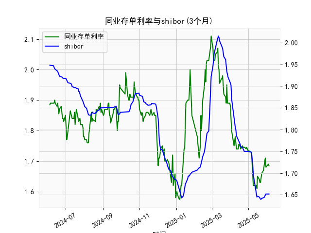

|            |   同业存单利率(3个月) |   shibor(3个月) |
|:-----------|----------------------:|----------------:|
| 2025-05-07 |                 1.69  |           1.737 |
| 2025-05-08 |                 1.66  |           1.72  |
| 2025-05-09 |                 1.62  |           1.696 |
| 2025-05-12 |                 1.62  |           1.672 |
| 2025-05-13 |                 1.61  |           1.662 |
| 2025-05-14 |                 1.62  |           1.653 |
| 2025-05-15 |                 1.61  |           1.645 |
| 2025-05-16 |                 1.65  |           1.647 |
| 2025-05-19 |                 1.64  |           1.645 |
| 2025-05-20 |                 1.63  |           1.642 |
| 2025-05-21 |                 1.63  |           1.64  |
| 2025-05-22 |                 1.655 |           1.64  |
| 2025-05-23 |                 1.66  |           1.642 |
| 2025-05-26 |                 1.67  |           1.643 |
| 2025-05-27 |                 1.69  |           1.644 |
| 2025-05-28 |                 1.7   |           1.647 |
| 2025-05-29 |                 1.71  |           1.652 |
| 2025-05-30 |                 1.68  |           1.652 |
| 2025-06-03 |                 1.69  |           1.652 |
| 2025-06-04 |                 1.685 |           1.652 |

### 1. 同业存单利率和SHIBOR的相关性及影响逻辑

同业存单利率（以固定利率同业存单到期收益率（AAA级，3个月）为代表）和SHIBOR（上海银行间同业拆放利率，3个月）是银行间市场的重要利率指标，二者之间存在高度正相关性，通常在0.8-0.9以上的相关系数。这是因为它们都反映了中国银行间市场的短期资金供给与需求状况，以及货币政策的导向。具体影响逻辑如下：

- **正相关性原因**：
  - **共同受货币政策影响**：中国人民银行（央行）通过公开市场操作、逆回购或MLF等工具调控市场流动性。当央行收紧流动性时，SHIBOR往往先于同业存单利率上涨，因为SHIBOR是银行间拆借的基准利率，而同业存单利率作为金融机构发行的短期债务工具，会跟随SHIBOR调整以吸引投资者。例如，从提供的数据看，二者均在2024年下半年至2025年初出现波动（如同业存单从1.9%降至1.6%区间，SHIBOR从1.95%降至1.65%），这反映了央行在2024年四季度放松货币政策的共同响应。
  - **流动性因素**：银行间市场的资金紧缺或充裕会同时推动二者变化。如果市场流动性收紧（如季节性资金需求高峰），SHIBOR会上涨，金融机构为应对资金成本上升，会提高同业存单利率以维持发行吸引力。反之，流动性宽松时，二者均可能下降。
  - **经济环境影响**：宏观经济因素如通胀、通货预期和经济增长也会同步作用。例如，2024年下半年的经济复苏预期导致二者小幅上升，而2025年初的稳定政策则促使二者趋于平稳。

- **影响逻辑**：
  - **SHIBOR对同业存单的领先作用**：SHIBOR作为市场基准，通常先于同业存单利率变化，因为它是每日报价形成的无担保拆借利率，而同业存单利率更依赖于实际发行和市场预期。因此，SHIBOR的变动往往是同业存单利率的领先指标。如果SHIBOR上升，同业存单利率可能在短期内跟进，以反映更高的资金成本。
  - **风险溢价差异**：同业存单（AAA级）相对SHIBOR可能有轻微溢价，因为它涉及信用风险和期限因素，但二者在趋势上保持一致。从数据看，SHIBOR略高于同业存单（如2025年初SHIBOR在1.65%-1.75%，同业存单在1.62%-1.71%），这反映了市场对无担保拆借的额外风险定价。
  - **潜在脱节**：尽管相关性强，但短期内可能出现分歧，例如如果监管政策针对性地影响同业存单市场（如发行限制），会导致同业存单利率相对SHIBOR更剧烈波动。但总体上，二者变化方向一致，适合用于市场信号分析。

### 2. 近期投资机会分析：聚焦最近一周数据变化

基于提供的数据，我对近1年（从2024-06-05至2025-06-04）的同业存单利率和SHIBOR进行了分析，重点关注最近一周（约2025-05-28至2025-06-04）的变化，尤其是今日（2025-06-04）相对于昨日（2025-06-03）的变动。投资机会主要聚焦于固定收益产品，如债券、存款或银行间工具的套利。以下是关键分析和判断：

- **整体数据趋势回顾**：
  - **同业存单利率**：从2024-06-05的1.885%开始，整体呈波动下行趋势，2024年下半年曾升至2.07%，随后在2025年初降至1.62%左右。这反映了市场流动性逐步改善和央行宽松政策。
  - **SHIBOR**：从2024-06-05的1.948%起步，波动较大，2024年下半年升至1.99%，2025年初降至1.65%左右。二者保持正相关，但SHIBOR波动更敏感。
  - **最近一周变化**（2025-05-28至2025-06-04）：
    - 同业存单利率：最近一周数据约为1.67%（2025-05-28）至1.685%（2025-06-04）。昨日（2025-06-03）为1.69%，今日（2025-06-04）降至1.685%，下降0.005%。这表明短期资金成本轻微降低，可能源于市场流动性增强。
    - SHIBOR：最近一周数据约为1.652%（2025-05-28）至1.652%（2025-06-04）。昨日和今日均为1.652%，无明显变化，但整体稳定在低位。
    - **关键观察**：同业存单利率的微降而SHIBOR持稳，显示二者间短期脱节，可能是由于同业存单市场对流动性的更快响应。

- **可能存在的投资机会**：
  - **债券投资机会**：
    - **近期下行趋势下的买入机会**：同业存单利率今日较昨日下降，表明资金成本降低，这可能推动债券价格上涨（利率与债券价格负相关）。建议在银行间市场买入短期债券或同业存单（3个月AAA级），预计收益率在1.65%-1.70%区间。如果趋势持续，持有至到期可获稳健回报，尤其适合风险厌恶投资者。
    - **具体机会**：聚焦AAA级同业存单，今日收益率1.685%低于近期平均（约1.70%），提供约0.015%的相对优势。预计若流动性继续宽松，收益率可能进一步下探至1.65%，带来资本增值。

  - **套利机会**：
    - **SHIBOR与同业存单的利差**：今日SHIBOR（1.652%）略高于同业存单（1.685%），利差为0.033%。昨日利差为1.69% - 1.652% = 0.038%。利差缩小可能表示市场预期一致化，投资者可通过跨市场套利（如借入SHIBOR资金买入同业存单）获利。但需注意，利差过小可能预示风险，如果未来SHIBOR上升，套利窗口将关闭。
    - **潜在风险**：若央行政策逆转（如加息信号），利差扩大可能导致损失，因此适合短期操作。

  - **其他机会**：
    - **存款或货币市场基金**：今日同业存单利率下降，建议转向高收益存款产品或货币基金，锁定当前1.65%-1.70%的收益率水平，避开波动。
    - **关注今日变化的影响**：同业存单的微降可能预示市场乐观（如经济数据向好），但SHIBOR的稳定提醒需警惕潜在流动性波动。短期内（未来1-2周），若利率继续下行，债券市场将是主要机会。

- **风险与建议**：
  - **风险因素**：最近一周变化较小，但如果全球经济不确定性上升（如美债收益率波动），可能逆转趋势。今日的微降不应视为长期信号。
  - **投资建议**：优先选择低风险固定收益工具，监控央行动态。若明日数据显示同业存单进一步下降，可立即增持。整体而言，近期投资机会温和乐观，适合保守型投资者。