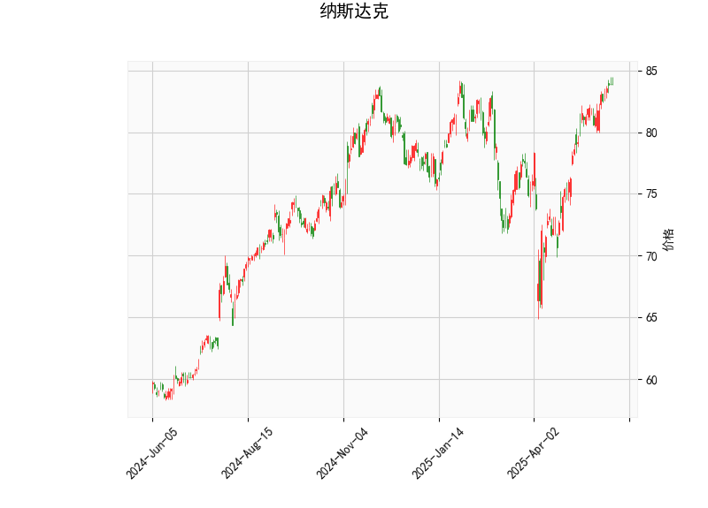

### 1. 对纳斯达克指数的技术分析结果进行分析

纳斯达克指数当前的技术指标显示出市场可能处于相对强势但潜在风险增加的状态。以下是对关键指标的详细解读：

- **当前价格（83.87）**：  
  当前价格位于布林带的上半部分（上轨85.84和中轨77.07之间），表明指数短期内表现出强势，但距离上轨仅一步之遥。这可能暗示价格已接近短期阻力位，潜在回调风险上升。如果价格突破上轨，可能进一步上行；反之，若回落，可能测试中轨水平。

- **RSI（69.97）**：  
  RSI值接近70的超买阈值，表明市场可能过度买入。RSI高于70通常被视为卖出信号，暗示短期内可能出现修正或回调。结合当前市场环境，这反映出投资者情绪较为乐观，但也增加了逆转的风险，尤其在缺乏新催化剂的情况下。

- **MACD指标（MACD: 1.89, MACD Signal: 1.87, MACD Hist: 0.01）**：  
  MACD线略高于信号线，且直方图值为正小值，显示出短期看涨信号。但差距较小（0.01），表明多头动能正在减弱，可能即将出现交叉或转向。MACD的这一形态往往预示着动量放缓，如果后续直方图转为负值，将强化看跌观点。目前，这显示市场可能从强势转为震荡。

- **布林带（Upper Band: 85.84, Middle Band: 77.07, Lower Band: 68.30）**：  
  价格接近上轨，表明指数处于高波动区间。布林带的收缩或扩张通常反映市场波动性：当前上轨作为阻力位，如果价格无法突破，可能引发回调至中轨或下轨。整体布林带显示市场处于相对高位，潜在下行压力增加，尤其在RSI超买的背景下。

- **K线形态（CDLDOJI, CDLGRAVESTONEDOJI, CDLHIGHWAVE, CDLLONGLEGGEDDOJI, CDLMATCHINGLOW, CDLSPINNINGTOP）**：  
  这些形态主要反映市场不确定性和潜在逆转信号：  
  - CDLDOJI、CDLLONGLEGGEDDOJI和CDLSPINNINGTOP表示市场犹豫和波动性增加，常出现于趋势转折点。  
  - CDLGRAVESTONEDOJI和CDLHIGHWAVE暗示看跌压力，可能预示顶部形成。  
  - CDLMATCHINGLOW是相对看涨信号，但整体组合显示多空博弈激烈。  
  这些形态 collectively 表明短期内市场可能从强势转向震荡或回调，投资者需关注后续K线确认。

总体而言，技术指标显示纳斯达克指数短期强势（RSI和MACD支持），但超买和K线不确定性增加了逆转风险。市场可能正处于顶部区域，需警惕外部因素（如经济数据或地缘事件）引发调整。

### 2. 分析判断近期可能存在的投资或套利机会和策略

基于上述分析，纳斯达克指数短期内存在潜在回调风险，但也可能延续强势。以下是针对近期投资或套利的判断和策略建议，强调风险控制和机会捕捉：

- **可能存在的投资机会**：  
  - **回调买入机会**：RSI超买和价格接近布林上轨暗示短期回调可能（目标至中轨77.07附近）。如果K线形态出现确认性看涨信号（如突破上轨或CDLMATCHINGLOW强化），投资者可考虑在回调低点（如78-80区间）买入ETF或相关股票，目标上看向85以上。  
  - **强势延续机会**：MACD保持看涨，若指数突破85.84上轨，可能触发进一步上涨。适合激进投资者在当前价位附近布局多头头寸，但需设置止损。  
  - **风险点**：如果K线形态转向更多看跌（如连续Doji后出现阴线），可能引发更大回调，建议观望。

- **可能存在的套利机会**：  
  - **期权套利**：利用指数的波动性进行期权策略。例如，买入看跌期权（Put Option）作为对冲，针对RSI超买风险；或构建牛市价差套利（Bull Call Spread），在当前价位买入近月看涨期权并卖出更高行使价期权，捕捉小幅上涨。当前布林带窄幅可能导致IV（隐含波动率）上升，提供套利空间。  
  - **期货或差价套利**：如果纳斯达克期货与现货价格出现偏差（如期货折价），可进行期货-现货套利。结合K线不确定性，建议在波动率高的时段（如美股开盘后）操作，利用MACD交叉信号作为进场时机。  
  - **相关资产套利**：纳斯达克与科技股（如FAANG股票）高度相关，可通过统计套利（如配对交易）捕捉价差。例如，如果指数回调而某科技股相对强势，可卖出指数相关产品并买入个股，实现相对价值套利。

- **推荐策略**：  
  - **保守策略**：优先观望，等待RSI回落至60以下或K线出现明确信号再入场。使用布林中轨作为支撑位，设置止损（如82以下出局），以规避超买风险。  
  - **中性策略**：采用区间震荡策略，在83-86区间高卖低买，利用波动性获利。结合MACD信号，短期内可尝试轻仓多头。  
  - **激进策略**：如果相信强势延续，进行杠杆交易（如期货或期权），但必须严格止损（如跌破中轨）。  
  - **风险管理**：所有策略均需考虑整体市场环境（如美联储政策或经济数据），保持仓位不超过总资金的30%，并监控K线形态变化以及时调整。

总之，近期纳斯达克指数的投资机会以回调后买入为主，套利机会聚焦于期权和价差交易。但市场不确定性较高，建议投资者保持谨慎，结合基本面因素（如企业财报）验证信号，避免过度追涨。