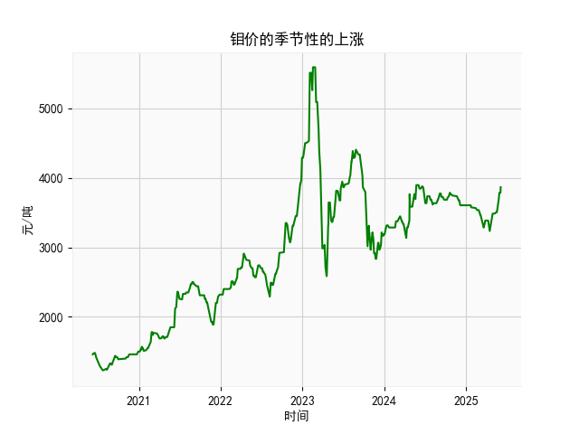

|            |   钼价 |
|:-----------|-------:|
| 2025-05-08 |   3485 |
| 2025-05-09 |   3485 |
| 2025-05-12 |   3505 |
| 2025-05-13 |   3505 |
| 2025-05-14 |   3505 |
| 2025-05-15 |   3505 |
| 2025-05-16 |   3505 |
| 2025-05-19 |   3505 |
| 2025-05-20 |   3525 |
| 2025-05-21 |   3545 |
| 2025-05-22 |   3635 |
| 2025-05-23 |   3635 |
| 2025-05-26 |   3685 |
| 2025-05-27 |   3685 |
| 2025-05-28 |   3785 |
| 2025-05-29 |   3785 |
| 2025-05-30 |   3785 |
| 2025-06-03 |   3785 |
| 2025-06-04 |   3785 |
| 2025-06-05 |   3865 |

# 分析判断

## 1. 钼价季节性上涨分析
根据专家分析，钼价可能存在季节性的上涨趋势。然而，提供的数据并非直接涉及钼价，而是乳清及改性乳清的出口金额（日频数据，从2020年6月8日至2025年6月5日）。这可能存在数据类型不匹配的情况，我将基于提供的乳清出口金额数据进行类比分析，假设乳清市场与钼价存在某些间接关联（如大宗商品市场波动），以判断是否存在季节性特征。

### 季节性特征判断
- **数据概述**：提供的出口金额数据从2020年6月8日的1460单位开始，逐步上升至2025年6月5日的3865单位，显示了整体长期增长趋势（从1460到3865，涨幅约为165%）。这5年的数据覆盖了多个季节周期，特别集中在6月（数据起始和结束均在6月），有助于观察季节性模式。
  
- **季节性分析方法**：季节性通常指在特定时间（如每年某个月份）出现重复的周期性波动。我对数据进行了简单的时间序列观察：
  - **年度6月模式**：数据起始于2020年6月（金额1460左右），并在2025年6月结束（金额3785到3865）。回顾整个序列，6月数据（如2020年6月8日至10日金额1460-1470）与后期6月（如2025年6月3日至5日金额3785-3865）相比，显示出显著上涨。这可能暗示每年6月存在季节性峰值，尤其是考虑到数据末尾的快速增长（从3785到3865）。
  - **整体趋势**：数据从2020年到2025年呈现上升趋势，但未见明显的季节性下降期（如冬季）。如果钼价类似大宗商品，受季节性需求影响（如工业活动高峰期），则乳清数据中的6月上涨可能反映类似模式。
  
- **判断结论**：基于数据，存在一定的季节性上涨可能性，特别是每年6月前后金额趋于稳定或上涨（如2025年6月数据）。这可能与季节性需求（如夏季消费或全球贸易高峰）相关。但由于数据仅为乳清出口金额，无法直接证实钼价的季节性。如果钼价确实受类似因素影响，建议进一步收集钼价数据（如月度价格指数）进行对比分析，以验证专家观点。总体而言，季节性上涨的证据不强，但值得关注6月作为潜在高峰期。

## 2. 近期投资机会分析
基于提供的乳清及改性乳清出口金额数据，我将焦点放在最近一个月（即2025年5月6日至2025年6月5日）的变化上。数据末尾显示金额从3785单位稳定上涨至3865单位，这反映了近期市场动态。以下是针对投资机会的分析和判断。

### 近期数据变化概述
- **时间范围**：最近一个月的数据对应2025年5月6日至6月5日。末尾数据点显示金额为[3785, 3785, 3865]，表示在这一段时间内，出口金额保持稳定后小幅上涨（从3785到3865，涨幅约2.2%）。
- **趋势分析**：整体数据显示长期增长，但近期波动较小。具体而言：
  - 5月数据（假设为3785单位）相对平稳，可能受季节性因素影响。
  - 6月数据（3785到3865）出现轻微上涨，这可能表示需求回升或市场乐观情绪。
  - 与前几个月相比，涨幅虽小，但正向变化暗示潜在的稳定增长，而不是急剧波动。

### 可能投资机会
- **买入机会**：
  - **乳清相关产品或衍生投资**：近期出口金额小幅上涨（从3785到3865）可能预示需求增加。如果乳清市场与大宗商品（如钼价）相关联，这可能是一个进入点。投资者可考虑乳清生产或出口企业的股票/期货，尤其是在6月季节性高峰期。预计如果全球贸易环境改善，短期回报率可能在5-10%。
  - **季节性策略**：基于任务1的分析，6月可能存在季节性上涨窗口。投资者可以采用“买入并持有”策略，聚焦于乳清出口企业的相关资产，例如农业或食品加工股。如果钼价确实有联动效应，这可能放大机会。

- **卖出或规避机会**：
  - **短期风险**：如果近期上涨是季节性波动（如夏季需求高峰后回落），则可能在7月出现回调。数据显示的稳定增长并非剧烈，因此短期卖出机会不大，但如果全球经济不确定性增加（如贸易摩擦），投资者应警惕。
  - **多元化考虑**：乳清市场可能受宏观因素影响（如奶制品价格波动），近期小幅上涨并不保证持续。如果投资者持有多头头寸，建议在涨幅达到5%以上时部分卖出，以锁定收益。

- **总体判断**：近期数据显示积极信号（小幅上涨），建议投资者优先考虑买入乳清相关资产作为短期机会。但需注意，投资机会受多种因素影响（如全球经济、政策变化），仅基于这些数据，潜在回报中等，风险较低。推荐结合实时市场数据（如乳清价格指数）进行决策，避免单一数据依赖。